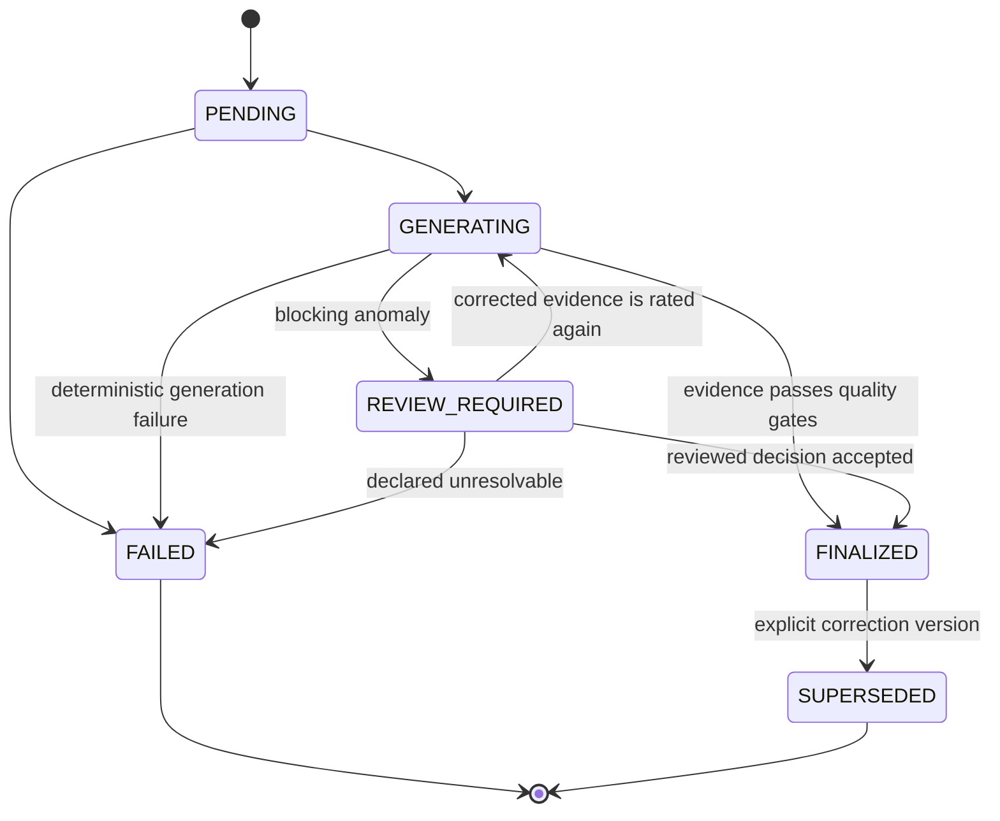

# Charge Detail Record State Machine

**Status:** Phase 7 implemented baseline  
**Owner:** Charging; Billing owns later financial claims and documents

A Charge Detail Record (CDR) is a versioned, content-hashed statement of finalized charging evidence and rating output. It is not an invoice, receipt, or payment record.

Generation snapshots the session identity, accepted UTC start/stop evidence, Wh and seconds, tariff snapshot/hash, anomaly flags, calculation breakdown, currency, and integer minor-unit amounts. The canonical JSON snapshot is SHA-256 hashed. A finalized CDR cannot be edited or deleted; a correction creates a new version and supersedes the prior record.

Meter reset, missing/invalid meter evidence, conflicting transaction identity, and similar blocking anomalies route the session and CDR to review. Review records actor, reason, notes, before/after measurements, and decision. `complete`, `estimated`, and `unbillable` are evidence-quality outcomes; they do not imply payment or invoice state.

## Unresolved decisions

- Jurisdiction-specific CDR fields, legal retention, and signed-meter requirements.
- Approval thresholds and dual control for high-value manual adjustments.
- Whether a Billing-owned correction must always supersede a CDR after an invoice is issued.

