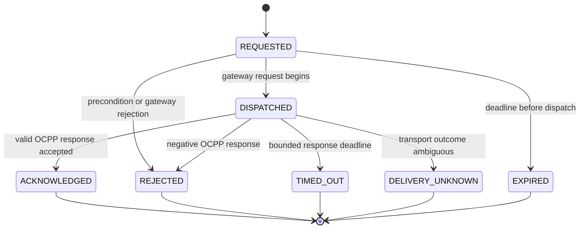

# Charger Command State Machine

**Status:** Phase 7 implemented baseline  
**Owner:** Charging

Charger commands describe delivery of an intent to the OCPP gateway. They never assert a physical charging fact. Each command is tenant-owned, identified by a ULID, correlated to one session and connector, protected by a tenant-unique idempotency key, and has an explicit UTC expiry.

`ACKNOWLEDGED` means only that the protocol peer returned an accepted response. A remote-start command cannot transition a session to `CHARGING`; `StartTransaction` for 1.6J or `TransactionEvent(Started/Updated)` evidence for 2.0.1 is required. A remote-stop timeout does not prove whether the transaction stopped.

The encrypted authorization token payload is decrypted only at the gateway client boundary and is never returned by the API or written to logs/events. Requested commands emit `charging.command.requested.v1`; dispatch emits `charging.command.dispatched.v1`; acknowledged outcomes emit `charging.command.completed.v1`; all negative terminal outcomes emit `charging.command.failed.v1` with the exact terminal state and safe reason.

The scheduled `charging:expire-operations` workflow re-checks persisted state under a tenant context. It expires undispatched commands, times out dispatched commands, and separately expires an acknowledged start whose physical start deadline elapsed.

## Unresolved decisions

- Retry policy for `DELIVERY_UNKNOWN`, including which OCPP actions are safe to replay.
- Production gateway service credential and command transport topology.
- Per-operator command deadlines and maximum outstanding commands per charger.

