# Charging Session State Machine

**Status:** Phase 7 implemented canonical baseline; charger certification profiles remain open  
**Owner:** Charging

## 1. Purpose

The canonical charging session represents one physical charging transaction attempt at one connector. It is protocol-neutral and separate from:

- charger/connector connectivity and availability;
- Assets lifecycle/operational restriction state;
- remote-command delivery state;
- tariff/rating, payment, invoice, and settlement state; and
- the consumer app's screen state.

A session has a tenant-owned ULID, charger/EVSE/connector references, source/origin, authorization evidence, source/received timestamps, measurements in Wh/W/seconds, and an append-only transition/evidence history.

## 2. Canonical States

| State | Meaning | Terminal |
| --- | --- | --- |
| `REQUESTED` | A session intent or charger-originated transaction has been identified | No |
| `AUTHORIZING` | Core authorization/payment/access checks are in progress | No |
| `AUTHORIZED` | Start is permitted for the recorded authorization and validity window | No |
| `STARTING` | A start has been requested or physical start evidence is being established | No |
| `CHARGING` | Energy-transfer/transaction evidence indicates an active non-suspended transaction | No |
| `SUSPENDED_BY_EV` | Transaction remains active but the EV is not taking energy | No |
| `SUSPENDED_BY_EVSE` | Transaction remains active but the charger/platform has suspended energy | No |
| `STOPPING` | Stop has been requested/observed but final stop evidence is not complete | No |
| `FINALIZING` | Physical transaction ended; measurements, duration, reason, and quality are being finalized | No |
| `REVIEW_REQUIRED` | Finalization cannot safely complete without an operator/policy decision | No |
| `COMPLETED` | Session is finalized with an outcome and data-quality classification | Yes |
| `FAILED` | The attempt ended before a valid physical transaction could be established | Yes |
| `CANCELLED` | The request was intentionally cancelled before physical start | Yes |
| `EXPIRED` | The start/authorization window elapsed before physical start | Yes |

`COMPLETED` does not always mean billable. It carries `finalization_outcome` such as `complete`, `estimated`, or `unbillable` and data-quality/review evidence. Exact estimation and billing policies remain open.

Authorization result is also recorded as evidence (`pending`, `approved`, `denied`, `charger_local`, `unknown`) because a charger-originated or offline transaction can begin before the core sees a normal online authorization flow. Canonical session state must not falsely assert approval.

## 3. State Diagram

```mermaid
stateDiagram-v2
    [*] --> REQUESTED
    REQUESTED --> AUTHORIZING: core authorization begins
    REQUESTED --> STARTING: charger-originated start evidence
    REQUESTED --> CANCELLED: cancelled
    REQUESTED --> EXPIRED: request deadline elapsed

    AUTHORIZING --> AUTHORIZED: checks approve
    AUTHORIZING --> STARTING: start observed before result
    AUTHORIZING --> FAILED: checks deny or terminal error
    AUTHORIZING --> CANCELLED: cancelled before start
    AUTHORIZING --> EXPIRED: authorization/start expires

    AUTHORIZED --> STARTING: start requested or observed
    AUTHORIZED --> CANCELLED: cancelled before start
    AUTHORIZED --> EXPIRED: validity window elapsed

    STARTING --> CHARGING: transaction/energy transfer established
    STARTING --> SUSPENDED_BY_EV: active but EV suspended
    STARTING --> SUSPENDED_BY_EVSE: active but EVSE suspended
    STARTING --> STOPPING: stop requested before confirmation
    STARTING --> FINALIZING: stop arrives after start evidence
    STARTING --> FAILED: start definitively failed
    STARTING --> CANCELLED: cancelled before physical start
    STARTING --> EXPIRED: physical-start deadline elapsed

    CHARGING --> SUSPENDED_BY_EV: EV suspends
    CHARGING --> SUSPENDED_BY_EVSE: EVSE suspends
    CHARGING --> STOPPING: stop requested or stopping observed
    CHARGING --> FINALIZING: terminal transaction evidence

    SUSPENDED_BY_EV --> CHARGING: energy transfer resumes
    SUSPENDED_BY_EV --> SUSPENDED_BY_EVSE: suspension source changes
    SUSPENDED_BY_EV --> STOPPING: stop requested or observed
    SUSPENDED_BY_EV --> FINALIZING: terminal transaction evidence

    SUSPENDED_BY_EVSE --> CHARGING: energy transfer resumes
    SUSPENDED_BY_EVSE --> SUSPENDED_BY_EV: suspension source changes
    SUSPENDED_BY_EVSE --> STOPPING: stop requested or observed
    SUSPENDED_BY_EVSE --> FINALIZING: terminal transaction evidence

    STOPPING --> CHARGING: stop rejected and transaction remains active
    STOPPING --> SUSPENDED_BY_EV: stop rejected; EV suspended
    STOPPING --> SUSPENDED_BY_EVSE: stop rejected; EVSE suspended
    STOPPING --> FINALIZING: terminal transaction evidence

    FINALIZING --> COMPLETED: evidence and quality resolved
    FINALIZING --> REVIEW_REQUIRED: missing, conflicting, or invalid evidence
    REVIEW_REQUIRED --> FINALIZING: new evidence or reviewed correction
    REVIEW_REQUIRED --> COMPLETED: authorized final decision

    COMPLETED --> [*]
    FAILED --> [*]
    CANCELLED --> [*]
    EXPIRED --> [*]
```



An active session does not transition to `FAILED` merely because the charger disconnects or a stop command times out. It remains in its last evidenced physical state, gains connectivity/exception metadata, and enters `FINALIZING` only when a documented closure condition is met.

## 4. Transition Rules

| Transition group | Required evidence/guards | Side effects/facts |
| --- | --- | --- |
| Create `REQUESTED` | Active tenant; known connector or valid charger-originated identity; unique request/source key | `charging.session.requested.v1` |
| → `AUTHORIZING` | Authorization workflow accepted; no established physical transaction | Record policy/version references and deadline |
| → `AUTHORIZED` | Approved identity/access/asset/tariff/payment policy results; validity interval | `charging.session.authorized.v1`; authorization cannot be silently reused outside scope/window |
| → `STARTING` | Correlated remote/local start attempt or trustworthy protocol start evidence | Record origin, command/protocol IDs and source/received time |
| → `CHARGING` | Supported transaction update/status/meter evidence; connector belongs to session asset/tenant | `charging.session.started.v1` once; update live projection |
| → suspended state | Active transaction plus canonical suspension evidence | `charging.session.suspended.v1`; duration remains session duration, not energy duration |
| Suspended → `CHARGING` | Canonical resumed/energy-transfer evidence | `charging.session.resumed.v1` |
| → `STOPPING` | Authorized stop request or non-terminal stopping indication | `charging.session.stopping.v1`; command state tracked separately |
| → `FINALIZING` | Trustworthy terminal transaction evidence or approved missing-stop closure policy | Freeze physical end candidate; begin meter/duration/quality checks |
| → `REVIEW_REQUIRED` | Missing/conflicting start/stop meter, negative/implausible delta, currency/tariff ambiguity, duplicate connector overlap, or unresolved protocol identity | `charging.session.flagged_for_review.v1`; block automatic billing as policy requires |
| → `COMPLETED` | Start/end/duration/energy/stop reason and quality outcome resolved; immutable tariff reference selection evidence | `charging.session.completed.v1`; downstream rating/payment/billing may proceed by policy |
| → `FAILED` | No valid physical transaction established and terminal authorization/start failure is proven | `charging.session.failed.v1`; cancel/review unused payment authorization |
| → `CANCELLED` | Actor/policy cancels before physical start and no conflicting start evidence | Failure/cancel fact; downstream release workflow |
| → `EXPIRED` | Deadline elapsed before physical start; race checked against received/persisted start evidence | Expiry fact; downstream release workflow |

State change and outbox/audit entry commit in one Charging transaction. Invalid transitions are rejected and recorded as safe operational anomalies where relevant.

## 5. Core Invariants

- Exactly one tenant owns a session for its lifetime.
- A session references exactly one charger/EVSE/connector identity at a time; a replacement creates corrected evidence or a new session, not silent reassignment.
- One physical source transaction maps to at most one canonical session per charger/protocol identity. Duplicate messages update the same session idempotently.
- At most one non-terminal physical transaction should occupy a connector. Conflicts go to review; they are not merged by guessing.
- `started_at` and `stopped_at` are UTC instants derived from source and received evidence; source time is retained separately.
- `duration_seconds >= 0`, `energy_wh >= 0`, and final `stopped_at >= started_at` unless review evidence explicitly marks invalid clocks.
- Meter register values and computed session energy are distinct. Rollover/reset/phase aggregation rules must be profile-defined before automatic use.
- Raw protocol evidence is immutable or content-addressed under retention policy; normalized corrections are versioned with reason/actor.
- A terminal state never reopens. Late evidence creates a correction/review workflow and new downstream calculation/document versions rather than rewriting history.
- Session state never directly marks an invoice paid, payment captured, charger commissioned, or work order closed.

## 6. Commands Versus Session State

Remote command states are independent and are detailed in `charging-command-state-machine.md`:

```text
REQUESTED → DISPATCHED → ACKNOWLEDGED | REJECTED | TIMED_OUT | DELIVERY_UNKNOWN
```

A remote-start acknowledgement does not prove the session started. A remote-stop timeout does not prove charging continued or stopped. Only normalized transaction/status/meter evidence advances physical session state.

Commands use ULID, tenant, target, requested action, expected precondition, actor/reason, requested/deadline UTC times, idempotency key, and correlation. Retrying reuses the same idempotency intent unless policy deliberately creates a new command.

## 7. OCPP Mapping Guidance

Mappings are profile-specific and contract-tested:

- **OCPP 1.6:** `Authorize`, `StartTransaction`, `StopTransaction`, `StatusNotification`, `MeterValues`, and remote command call/result evidence can contribute to canonical transitions. A `StartTransaction.conf` acceptance and a command response have protocol meanings that must not be generalized beyond the specification/profile.
- **OCPP 2.0.1:** `TransactionEvent` (`Started`, `Updated`, `Ended` plus charging state), `StatusNotification`, `Authorize`, and request/response messages contribute to canonical transitions.
- A protocol event maps to evidence first. The Charging state transition applies only after tenant/asset/source identity, idempotency, ordering/version, unit conversion, and state guards pass.
- `DataTransfer`, vendor fields, inferred stop reasons, and nonstandard meter units are rejected/quarantined or handled only by an approved vendor profile.

The implemented core consumer supports the normalized 1.6J and 2.0.1 transaction, meter, status, and authorization contracts published by the gateway. Certification cases, offline authorization policy, and message-retention rules remain open.

## 8. Meter and Data-quality Finalization

Finalization evaluates at least:

- start/end transaction identity and timestamps;
- start/end energy register readings and normalized `energy_wh`;
- intermediate sample order, measurand, phase/location/context, unit conversion, reset/rollover, and plausibility;
- elapsed `duration_seconds` from accepted instants;
- stop reason/source and charger/connector association;
- overlapping sessions, missing messages, clock skew, duplicate/conflicting evidence;
- immutable selected tariff version and applicability evidence; and
- manual correction actor, reason, source evidence, and approval if used.

Possible quality codes include `complete`, `missing_start_meter`, `missing_stop_meter`, `clock_skew`, `meter_reset`, `conflicting_transaction`, `estimated`, and `unbillable`. Exact estimation methods and billability rules require product/market approval; no vendor-specific values are invented.

## 9. Timeouts and Late Messages

- Request, authorization, command, heartbeat, inactivity, and finalization deadlines are explicit UTC instants with policy/version references.
- Time passage schedules a re-evaluation; it does not itself prove a charger fact.
- Late duplicate evidence is acknowledged idempotently.
- Late non-duplicate evidence for a non-terminal session may advance it if valid.
- Late evidence after terminal completion is stored/linked and may raise review/correction; it never destructively rewrites issued financial evidence.
- Races use persisted source IDs/timestamps and aggregate version checks, not arrival order alone.

## 10. Open Decisions

- Supported OCPP versions/profiles and charger certification matrix.
- Offline/local authorization, guest charging, reservations, Plug & Charge, smart charging, and roaming.
- Exact timeout/closure, clock-skew, meter aggregation/reset/rollover, estimation, and billability rules.
- Whether and how a stopped incomplete session can be automatically completed after late data.
- Tariff selection instant, session overlap handling, and maximum session duration.
- Protocol evidence and meter sample retention/partition/archive policies.
