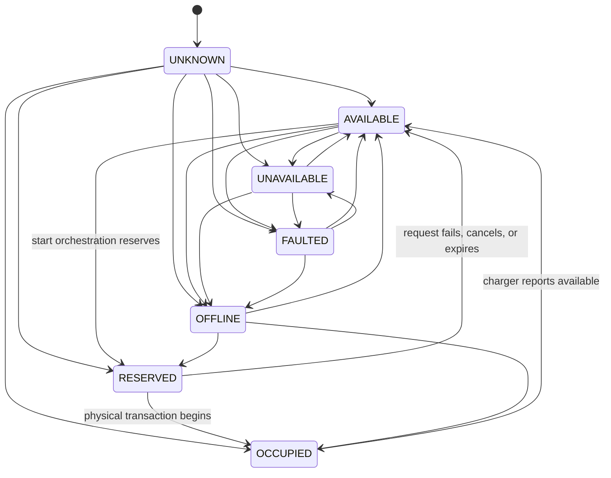

# Connector Availability State Machine

**Status:** Phase 7 implemented projection  
**Owner:** Charging; Assets retains equipment lifecycle ownership

Connector availability is a tenant-scoped, timestamped operational projection. It does not change commissioning, maintenance, or retirement state.

Remote start locks the latest projection and accepts only a fresh `AVAILABLE` connector. It creates a database-enforced single open reservation and transitions to `RESERVED` atomically. A physical transaction releases the orchestration reservation and transitions to `OCCUPIED`. A failed, cancelled, or expired pre-start workflow restores `AVAILABLE` only when the current projection is still `RESERVED` and no other unexpired reservation exists. Later charger facts always remain authoritative evidence.

Every change appends transition evidence and emits `charging.connector.status_changed.v1`. Staleness is calculated from UTC `observed_at` and `stale_after_seconds`; stale data must not be presented as live availability.

