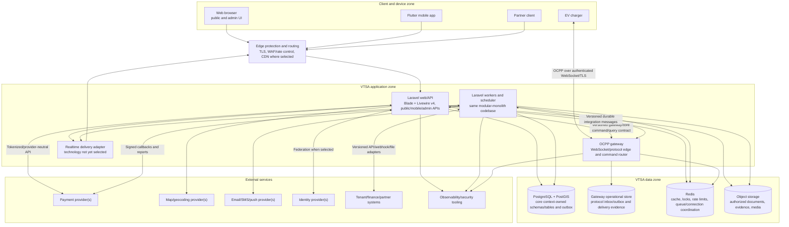

# Container Architecture

**Status:** Phase 0 baseline  
**Style:** Laravel modular monolith plus separately deployable OCPP gateway

## 1. Container View



Logical containers are deployment/runtime responsibilities, not necessarily one process or host. Edge, realtime, object storage, and observability products remain undecided.

## 2. Container Responsibilities

### Laravel web/API

- Hosts public marketing/map endpoints, Blade/Livewire v3 operator/admin UI, mobile APIs, partner API ingress, and provider webhook ingress.
- Authenticates identities, resolves tenant and resource scope, authorizes actions, validates contracts, and invokes owning module use cases.
- Reads/writes PostgreSQL only through the owning bounded context.
- Does not hold long-lived OCPP connections or run unbounded reports/imports inline.

### Laravel workers and scheduler

- Runs the same modular-monolith modules in background execution mode.
- Dispatches transactional outbox records, consumes integration events, sends notifications, processes verified callbacks, builds projections, and performs bounded/resumable imports, exports, reconciliation, and scheduled workflows.
- Restores and verifies tenant/actor/correlation context from the job envelope.
- Uses idempotent consumers; Redis queue delivery alone is never evidence of a durable business fact.

### Laravel module layout

Each context has four conceptual layers:

```text
Modules/<Context>/
├── Domain/          # aggregates, policies, value objects, domain events
├── Application/     # commands, queries, DTOs, ports, transaction orchestration
├── Infrastructure/  # Eloquent, external adapters, queue/outbox implementations
└── Presentation/    # HTTP, Livewire, console, event consumers
```

The exact namespace is selected at scaffolding time. Dependency direction is Presentation/Infrastructure → Application → Domain. Domain code does not depend on Laravel UI, provider SDKs, or another module's Eloquent model.

### OCPP gateway

- Terminates and authenticates charger WebSocket connections and negotiates approved OCPP subprotocols.
- Parses protocol frames, validates schema/action/size, correlates calls/results/errors, enforces heartbeat/message/connection controls, and normalizes protocol messages to versioned core contracts.
- Routes core-issued commands to the current connection owner and returns correlated acknowledgement, rejection, timeout, or delivery uncertainty.
- Owns short-lived connection state and durable protocol delivery/inbox/outbox evidence needed for safe retry/recovery.
- Does not authorize a driver, calculate tariffs, decide payment, own the canonical session, or write core tables.

The phase-six implementation uses asynchronous Python, FastAPI/Uvicorn, the maintained `ocpp` package, Redis leases/deduplication, and Redis Streams normalized events. See [`ocpp-gateway.md`](ocpp-gateway.md). Separate deployment and contract ownership remain governed by ADR-0002.

### PostgreSQL/PostGIS core store

- Authoritative durable store for Laravel bounded contexts, audit records, module inbox/outbox records, and geospatial location data.
- Uses one database technology with context-owned tables/schemas and prohibited direct cross-context writes.
- Supports transactional integrity, tenant-aware constraints, geospatial indexing, backups, and point-in-time recovery according to future operational decisions.

### Gateway operational store

- Is logically owned by the gateway and inaccessible for core business writes.
- Stores protocol message identity/correlation, normalized delivery status, command delivery evidence, and bounded store-and-forward records—not canonical sessions, tariffs, payments, or asset configuration.
- No gateway PostgreSQL schema is implemented in phase 6. Redis contains only bounded coordination, response replay, authorization request/reply, and the initial event transport. A durable broker/inbox-outbox and protocol-evidence store remain production release decisions; Redis is not canonical Charging truth.

### Redis

- Provides disposable cache entries, rate-limit counters, distributed coordination/locks, queue transport, presence/connection routing hints, and short-lived realtime/session acceleration.
- Every key is namespaced by environment and, where applicable, tenant/context.
- Does not own balances, session truth, stock, audit, or delivery evidence that cannot be reconstructed.

### Object storage

- Stores authorized invoice artifacts, exports, imports, maintenance/support evidence, and CMS media.
- Database records own metadata, tenant, classification, checksum, lifecycle, and access policy.
- Access uses short-lived, purpose-specific delivery rather than public buckets except explicitly published CMS media.
- Malware scanning and provider selection remain open release gates.

### Flutter mobile app

- Presents driver journeys and maintains a replaceable local projection/cache.
- Calls versioned APIs, uses secure OS storage for refresh/session material, and receives push/realtime hints before refreshing authoritative API state.
- Persists only an account-scoped active-session ULID pointer for process recovery; charging, tariff, metering, and payment facts remain server-owned.
- Treats remote-command acceptance, realtime messages, and push notifications as non-authoritative until the versioned API confirms canonical Charging and Payments state.
- Never contains provider secrets, tenant administration logic, authoritative tariff/payment calculations, or charger credentials.

## 3. Communication Rules

| From → To | Mechanism | Rule |
| --- | --- | --- |
| Clients → Laravel | HTTPS versioned endpoints | Authenticate/authorize server-side; idempotency for retried mutations |
| Charger → Gateway | Approved OCPP over authenticated TLS WebSocket | Validate and bind connection to registered asset |
| Laravel → Gateway | Versioned command/query API | Mutual service authentication; tenant/asset/command correlation; bounded timeouts |
| Gateway → Laravel | Durable versioned messages/API | Inbox/outbox, idempotency, schema compatibility, backpressure |
| Module → same module | In-process application contract | May be transactionally consistent |
| Context → context | Public application contract or integration event | No direct table/model writes; event for facts, command for requested action |
| Outbox → consumers | At-least-once async delivery | Consumer dedupe; ordering only per documented aggregate partition |
| Laravel → external provider | Adapter port | Timeouts, circuit breaker/retry policy, safe logging, provider IDs |
| Realtime → client | WebSocket/SSE/push hint | Non-authoritative; client resynchronizes through API |

## 4. Data and Transaction Boundaries

- A database transaction may atomically change only records owned by the current context plus its outbox/audit entries.
- A use case requiring another context either calls a narrow synchronous contract before its local transaction or commits intent/state and coordinates with events. It never holds a transaction open across network calls.
- Distributed workflows use explicit state, deadlines, compensating actions, and reconciliation rather than distributed database transactions.
- Read models may join/copy cross-context fields only when designated as projections; they cannot accept operational writes.

## 5. Scaling Model

- Scale web/API instances horizontally behind edge routing; instances remain stateless beyond disposable cache/session acceleration.
- Scale workers by queue/work type so charging and financial callbacks are isolated from large reports/imports.
- Scale gateway connection capacity independently using deterministic connection ownership/leases and command routing.
- Partition workload and apply per-tenant quotas to reduce noisy neighbors.
- Evaluate PostgreSQL read replicas, table partitioning, archive, and gateway sharding only from measured capacity—not as default complexity.

## 6. Failure Behavior

| Failure | Expected behavior |
| --- | --- |
| Redis unavailable | Gateway readiness fails and charger coordination/event operations fail closed; no process-local ownership fallback outside tests |
| Core unavailable to gateway | Maintain protocol-safe connection behavior, bounded durable buffering, backoff, and visible degradation; do not invent authorization outcomes |
| Gateway unavailable | Chargers reconnect with protocol behavior; core commands end as failed/timeout/unknown, never false success |
| Provider timeout | Mark result ambiguous/pending, retrieve/reconcile by idempotency/provider reference before retrying financial effect |
| Worker crash | Uncommitted work retries; committed inbox/dedup prevents duplicate business effect |
| Realtime failure | Client polls/refetches authoritative API state; no business state is lost |
| Object scan/delivery failure | Keep file quarantined/unavailable, preserve metadata and retry/escalate |
| Reporting lag | Operational flows continue; reports disclose freshness |

## 7. Deployment Units and Environments

Minimum independently deployable units are the Laravel artifact (run as web, worker, and scheduler roles), OCPP gateway, and Flutter app. Database migrations and contract compatibility are coordinated but must permit rolling deployment. Environment count, cloud, cluster, regions, network topology, CI/CD product, domains, certificates, and credentials remain undecided.

## 8. Architecture Fitness Checks

Future CI should prove:

- no prohibited cross-module namespace/model/database dependency;
- event/API/gateway schemas remain backward compatible within the supported window;
- every tenant table and cache/job/object path follows tenant rules;
- no floats in money/energy/power/duration domain types;
- no raw payment instrument fields or secrets exist in contracts/log fixtures;
- outbox consumers and external callbacks are idempotent;
- state transitions are exhaustively tested; and
- public identifiers are ULIDs and timestamps are timezone-aware UTC instants.

## 9. Open Decisions

- Production gateway/core durable transport, replay, and service identity.
- Realtime delivery technology and fallback intervals.
- Queue topology and whether Redis transport is sufficient for accepted scale/recovery needs.
- Physical database/schema isolation, RLS rollout, read replicas, partitioning, and archive.
- Object storage, file scanning, CDN/WAF, maps, identity, notifications, and observability providers.
- Deployment topology, service identity, secret manager, regions, SLOs, and disaster recovery.
