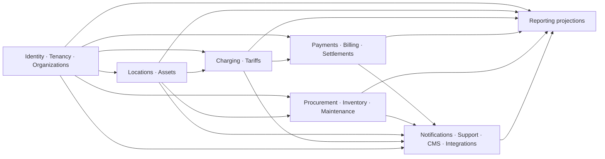

# Data Ownership and Bounded Contexts

**Status:** Normative architecture baseline  
**Rule:** A durable concept has exactly one context authorized to change it.

## 1. Ownership Rules

1. The owning context defines the concept's invariants, schema, lifecycle, write API, and emitted facts.
2. Other contexts do not import its Eloquent models, write its tables, or recreate a competing source of truth.
3. Cross-context references use stable ULIDs and, where tenant-scoped, the same `tenant_id`. Database foreign keys across context boundaries are avoided unless an ADR proves lifecycle/deployment coupling is acceptable.
4. A synchronous application/query contract is used when the caller needs an immediate decision. An integration event is used to publish a committed fact.
5. Replicated fields are projections: they carry source ID, source version/event ID, and freshness and are never written back as source facts.
6. Reporting and search projections may combine context data but are read-only.
7. Audit evidence records who/what caused a change; it does not transfer ownership.

## 2. Canonical Types

| Type | Owner/representation |
| --- | --- |
| Tenant ID and public IDs | ULID |
| Identity subject ID | ULID owned by Identity |
| Money | `amount_minor` integer/bigint + `currency` ISO 4217 |
| Energy | integer `*_wh` |
| Power | integer `*_w` |
| Duration | integer `*_seconds` |
| Instant | UTC timezone-aware timestamp; ISO 8601 with offset in contracts |
| Local schedule | local date/time rule + IANA timezone; resolved occurrence in UTC |
| Geospatial point | PostGIS WGS 84 SRID 4326 |

## 3. Ownership Matrix

| Context | Owns and may change | May reference/read through contract | Must not own |
| --- | --- | --- | --- |
| **Identity** | Subjects, authenticators, password/SSO links, MFA, sessions, recovery, machine credentials | Tenant/membership status for sign-in authorization | Organization roles, driver sessions, payment tokens |
| **Tenancy** | Tenant lifecycle, entitlements, tenant policy defaults, locale/default settings | Identity actor for audit, commercial subscription reference if later adopted | Organization hierarchy, users' credentials, tenant business records |
| **Organizations** | Organization hierarchy, memberships, role assignments, teams, delegated scopes | Identity subject, tenant lifecycle/entitlements | Login credentials, locations, business transaction data |
| **Locations** | Site/address, geometry, timezone, access/hours, amenities, publication state | Owning organization, asset/public availability projections | Charger identity/configuration, live connector state, tariffs |
| **Assets** | Charger/EVSE/connector/component identity and hierarchy, capabilities, serial/model, commissioning, location/custody history, lifecycle/operational state | Location, organization, Inventory serial handoff, Maintenance recommendations | Live connections, sessions, work orders, stock balances |
| **Charging** | Connection/status projection, charging authorization, protocol-normalized readings, connector reservations, commands, sessions, anomaly review, immutable CDR evidence | Identity/organization access, Assets capabilities/state, tariff eligibility/version/snapshot, payment authorization outcome | Asset lifecycle, tariff definitions, provider payments, invoices |
| **Tariffs** | Tariff, immutable published versions/components/discounts, applicability, schedules, effective periods, deterministic rating semantics and breakdown | Location/asset/org applicability | Sessions, CDRs, invoices, payments, tax registration facts |
| **Payments** | Provider/customer/token references, payment intent/attempt, authorization/capture/refund/dispute state, webhook receipt evidence | Payer identity, billable reference, currency/amount request | Raw PAN/CVV, invoice numbering, payout allocation |
| **Billing** | Rated charge, account balance entries, invoice/receipt/credit note, document numbering after market rules | Session final facts, tariff version/calculation, payment allocation/reference, organization seller/buyer snapshot | Payment execution, tariff definitions, tax registration source until defined |
| **Settlements** | Provider report/import, reconciliation match/exception, fee/payout evidence, beneficiary allocation and statement | Payments/refunds/disputes, Billing records, organization/commercial rule snapshot | Provider payment execution, bank credentials, source invoice/session edits |
| **Procurement** | Supplier, requisition, approval, purchase order/revision, expected receipt/return | Organization, requester/approver identity, item references, warehouse destination | On-hand stock, stock ledger, supplier banking credentials unless separately designed |
| **Inventory** | Item catalog, warehouse/bin, lot, serialized stock custody before commissioning, stock ledger/balance projection, reservation, transfer, count | Purchase order expectation, maintenance work order, asset handoff | Purchase approval/commitment, operational asset lifecycle, work order state |
| **Maintenance** | Fault report, work order, schedule, assignment, checklist, service evidence, labor/part-use reference, service history | Asset/location/current restriction, identity/team, Inventory reservation/issue | Asset lifecycle state, stock balance, charger session state |
| **Notifications** | Template/version, preference, notification request, rendering, channel delivery attempt/status | Recipient address through minimal Identity/Organizations query, source record deep link | Source workflow outcome, support correspondence, provider credentials in content |
| **Support** | Support ticket, ticket message, participant link, queue/assignee, category/priority/status, escalation evidence, correspondence/attachment metadata (`support_tickets`, `support_ticket_messages`) | Masked identity and linked operational/financial records | Refunds, payments, remote command outcome, identity credential changes |
| **Reporting** | Projection/checkpoint, governed metric definition, saved report, schedule, export metadata | Events/query contracts from all approved source contexts | Operational source records or mutation APIs |
| **CMS** | Page/navigation/content revision, localization, publish schedule, public media metadata/reference | Published Location/Asset/Tariff projections | Operational location or availability truth, untrusted executable content |
| **Integrations** | Partner/API client registration, scopes, webhook subscription/delivery, import/export job, mapping/version, integration health | Owning context contracts for approved data/actions | Another context's business facts, plaintext reusable secrets |

## 4. High-risk Boundary Clarifications

### Asset, Charging, and Maintenance state

- Assets owns whether equipment is commissioned, in service, restricted, retired, or decommissioned.
- Charging owns its observed connectivity/availability projection and individual session state. An OCPP status does not silently change asset lifecycle.
- Maintenance owns fault/work state. It requests an Assets restriction or return-to-service decision; Assets emits the resulting fact.

### Tariff, Billing, Payments, and Settlements

- Tariffs owns price definitions and deterministic rating semantics/version evidence.
- Billing owns the financial claim/document derived from a finalized session and frozen calculation.
- Payments owns provider-side collection/refund/dispute state; it does not make an invoice paid by editing Billing tables.
- Billing consumes payment allocation facts and maintains account balance/document status through its own contract.
- Settlements proves expected versus provider-reported money and beneficiary allocations; it never fixes differences by altering source payments or invoices.
- Phase 8 enforces these boundaries with `FinalizedChargeDetailRecordQuery`, `PaymentFactsQuery`, `ChargingPaymentCollector`, and `ProviderFinancialGateway`. Cross-context IDs are retained without foreign keys; the owning context validates and changes its own records through these contracts.

### Procurement, Inventory, Assets, and Maintenance

- Procurement approves an expected purchase/receipt; Inventory posts what physically arrived.
- Inventory owns stock custody until a serialized item is commissioned/handed off; Assets owns operational identity thereafter. Removal back to stock is another explicit custody handoff.
- Maintenance reserves and consumes parts through Inventory contracts; typed notes are not stock movements.

### Identity, Organizations, and Tenancy

- Identity proves who/what authenticated.
- Organizations determines what a tenant member may do and where, using Identity subject IDs.
- Tenancy determines whether the tenant/capability is active. Neither Organizations nor Tenancy stores passwords/authenticators.

### CMS, Locations, and public discovery

- CMS owns editorial prose and presentation structure.
- Locations/Assets/Tariffs/Charging own operational facts. A public projection composes safe fields; editors cannot overwrite availability or price truth.
- Phase 5 public station discovery is a read-only composition of published Location facts, active/public Asset facts, and a Charging-owned connector-status projection. The projection carries UTC observation time and an explicit stale threshold; absent or stale evidence is never represented as live availability.
- Operator and site-host records remain Organizations-owned typed records; Locations stores only their stable references on a Site.

## 5. Permitted Dependency Directions

This diagram shows common information dependency, not permission to import internal code. Where workflows run both directions, each direction uses a public contract or event and preserves ownership—for example Maintenance requests an asset restriction and Assets publishes the decision.

## 6. Transaction and Reference Policy

- Local invariant changes use one owning-context transaction plus outbox/audit records.
- Cross-context synchronous validation must be narrow, side-effect explicit, timeout-bounded, and must not hold a database transaction across external network calls.
- A captured snapshot (for example seller legal name on an invoice) is Billing-owned historical evidence, not a replacement for the current Organizations record.
- Deleting a source entity does not break historical references. Use lifecycle status, retention rules, tombstone-safe identifiers, and display snapshots.
- Events contain the minimum stable facts consumers need. Consumers fetch details through authorized contracts when appropriate.

## 7. Schema and Repository Enforcement

Future implementation should use context-prefixed tables or PostgreSQL schemas, context-local repositories, and architecture tests that reject:

- imports of another module's internal Domain/Infrastructure/Eloquent namespaces;
- writes or migrations targeting another context's tables;
- generic polymorphic writes that evade ownership;
- reporting/CMS/support code that mutates linked operational records; and
- duplicated ownership of customer balance, charger status, or stock quantity.

## 8. Open Decisions

- PostgreSQL schema-per-context versus naming-prefix convention.
- Which cross-context checks need synchronous contracts versus event-driven coordination.
- Whether selected cross-context foreign keys are valuable inside the monolith without blocking future extraction.
- How legal organization/tax snapshots are sourced once launch markets are known.
- Search/index technology and projection refresh method at expected scale.

## 9. Phase 12 Procurement and Inventory Contracts

Procurement and Inventory remain independently owned even though both execute inside the modular monolith:

- Procurement exposes purchase-order receipt validation through `PurchaseOrderReceiptContract`; Inventory cannot update ordered quantities or approval evidence.
- Inventory reports accepted and rejected receipt quantities to Procurement through the contract after posting physical custody evidence.
- Supplier return dispatch is Inventory-owned movement evidence exposed through `SupplierReturnContract`; credit notes and supplier financial settlement are not inferred.
- Maintenance references a work-order ULID when reserving, issuing, or returning parts, but can change stock only through `StockReservationService` and `WorkOrderPartsService`.
- Procurement accounting export uses `VendorInvoiceAccountingAdapter`. The local fake adapter records no credentials, and production provider selection remains an integration decision.
- Reporting consumes accessible warehouse and stock-ledger query contracts. It does not write inventory or cache an authoritative stock balance.

Cross-context references use tenant-owned ULIDs and are revalidated inside the transaction. No gateway, import, report, Filament action, or queue job may write another context's tables directly.

## 10. Phase 13 Maintenance Contracts

- Charging calls Maintenance's `FaultObservationContract` only after tenant, protocol envelope, and enrolled connector mapping are validated. Maintenance stores normalized safe evidence, never raw OCPP credentials or frames.
- Maintenance calls Assets' `AssetMaintenanceContract` to validate site ownership and request restriction/return-to-service. Assets alone changes `lifecycle_status` and emits the owner fact.
- Maintenance calls Inventory's `StockReservationService` and `WorkOrderPartsService` for every reservation, issue, and unused return. Maintenance records references and quantities only after the Inventory owner succeeds.
- Preventive runtime/session/energy checks are read-only Charging queries. Maintenance stores the generated checkpoint and cannot edit source sessions.
- Maintenance dashboard queries combine owned evidence and read-only Inventory movements. They do not become an authoritative stock, asset, or Charging projection.

ADR 0013 makes these directions durable. Cross-context calls stay narrow and local in the modular monolith; no external network call occurs inside their database transaction.
