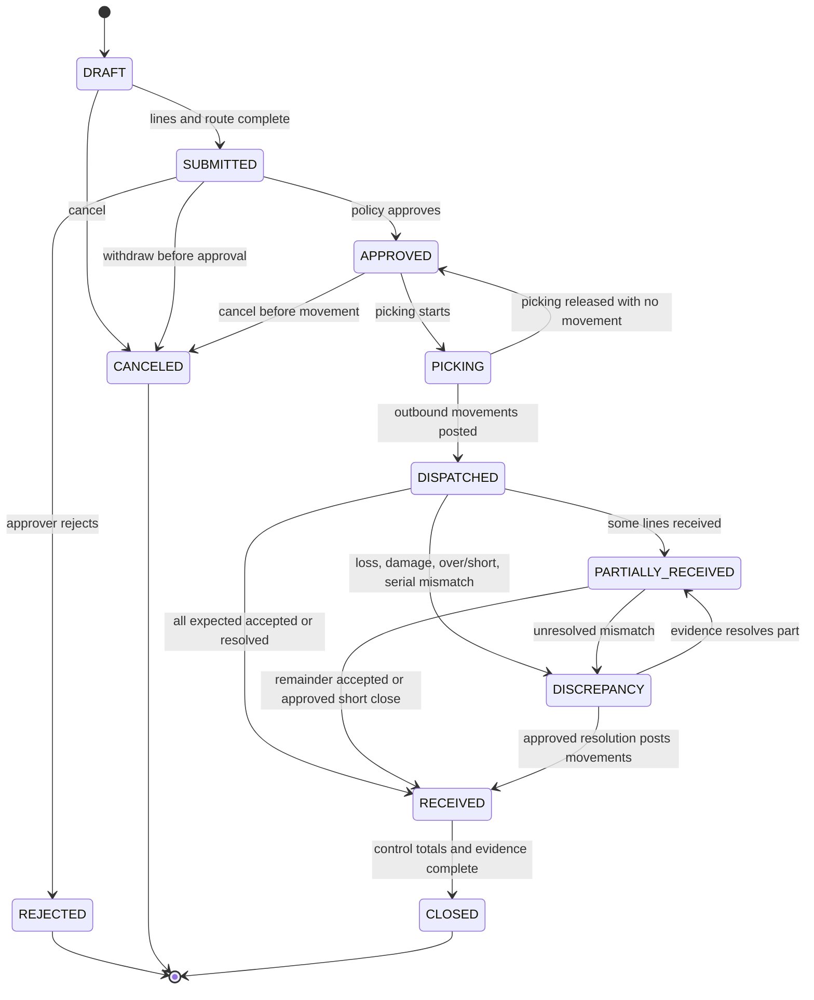
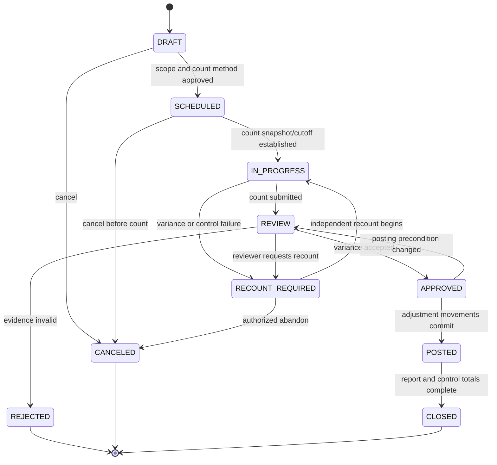
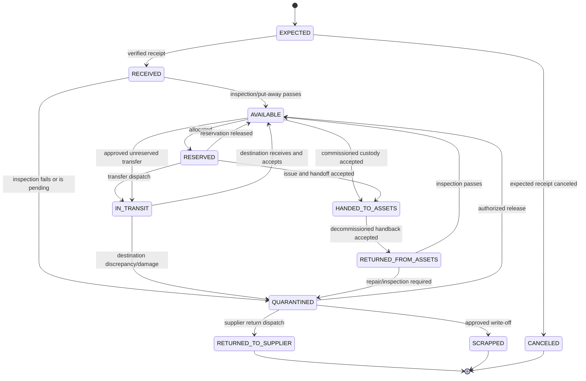

# Inventory State Machines

**Status:** Normative lifecycle baseline; costing and approval thresholds remain undecided  
**Owner:** Inventory (with Procurement and Assets handoff boundaries)

## 1. Ledger-first Model

On-hand and available quantities are projections of an immutable stock ledger, not editable fields. Every posted movement has a ULID, tenant, item, unit of measure, from/to custody/location accounts, signed quantity in the item's base unit, condition/lot/serial where applicable, reason, source document, actor/service, correlation, and UTC posting time.

```text
on_hand = opening + posted receipts + posted inbound/returns
          - posted issues/outbound/write-offs

available = usable_on_hand - active_reservations
```

Quarantined and in-transit custody are distinct from usable on-hand. A correction posts a linked compensating movement. Posted ledger movements never change status back to draft and are never deleted.

Money, if later used for inventory valuation, is integer minor units/currency. Quantity uses integer base units unless a specific fractional stock requirement approves fixed-precision decimal and conversion rules.

## 2. Stock Reservation Lifecycle

Reservations protect stock for a maintenance work order or another approved purpose without changing physical custody.

```mermaid
stateDiagram-v2
    [*] --> REQUESTED
    REQUESTED --> RESERVED: full quantity allocated
    REQUESTED --> PARTIALLY_RESERVED: partial allowed and allocated
    REQUESTED --> REJECTED: policy or availability denies
    REQUESTED --> CANCELED: requester cancels

    PARTIALLY_RESERVED --> RESERVED: remaining quantity allocated
    PARTIALLY_RESERVED --> PARTIALLY_CONSUMED: some allocated stock issued
    PARTIALLY_RESERVED --> RELEASED: remaining allocation released
    PARTIALLY_RESERVED --> EXPIRED: deadline passes
    PARTIALLY_RESERVED --> CANCELED: before consumption

    RESERVED --> PARTIALLY_CONSUMED: partial issue
    RESERVED --> CONSUMED: full issue
    RESERVED --> RELEASED: no issue; allocation released
    RESERVED --> EXPIRED: deadline passes
    RESERVED --> CANCELED: before issue

    PARTIALLY_CONSUMED --> CONSUMED: remaining allocation issued
    PARTIALLY_CONSUMED --> RELEASED: unused remainder released
    PARTIALLY_CONSUMED --> EXPIRED: unused remainder expires

    REJECTED --> [*]
    CANCELED --> [*]
    RELEASED --> [*]
    EXPIRED --> [*]
    CONSUMED --> [*]
```



Rules:

- Reservation, item, stock location, and purpose record must share a tenant.
- Allocation uses a transaction/lock strategy that prevents the same available quantity being reserved twice.
- Lot/serial selection obeys quarantine, expiry, condition, compatibility, and picking policy when those are configured.
- Negative availability is denied unless an explicit approved exception policy exists.
- `CONSUMED` means all reserved quantity was posted as issue movements; consumption cannot be asserted by state alone.
- Expiry uses an explicit UTC deadline and race-checks an in-progress issue.
- A rejected or partial reservation can emit a shortage event for Procurement/Maintenance; it does not create a purchase order automatically without an approved workflow.

## 3. Stock Transfer Lifecycle

A transfer moves physical custody between warehouses/bins. A transfer document controls intent; posted ledger movements prove dispatch and receipt.



Rules:

- Approval thresholds and separation of duties are tenant policy.
- Dispatch posts from source usable custody to in-transit custody; receipt posts from in-transit to destination usable/quarantine custody.
- Once any dispatch movement is posted, the transfer cannot be canceled. Returns/reversals use explicit compensating transfer movements.
- Partial receipt retains expected, dispatched, received, rejected, damaged, and outstanding quantities separately.
- Serial identity cannot be substituted silently. A mismatched/unexpected serial enters `DISCREPANCY`/quarantine.
- `RECEIVED` means every dispatched quantity is accepted, rejected/returned, lost/written off, or explicitly short-closed by authorized resolution.

## 4. Stock Count Lifecycle

A count compares observed stock with the ledger without editing balances directly.



Rules:

- Scope includes tenant, warehouse/bin, item/lot/serial set, expected snapshot/cutoff, blind/non-blind method, and responsible counters.
- Concurrent movement is either operationally frozen or adjusted against the snapshot with a deterministic cutoff; the method is recorded.
- Count observations are append-only evidence. Corrections require a new observation/recount, not overwrite.
- Approval posts one linked adjustment batch with control totals. A failed atomic post leaves the count `APPROVED` or returns it to `REVIEW` according to the recorded error; partial line posting is prohibited.
- Posted adjustments use reason/evidence and may require an independent approver above thresholds.

## 5. Serialized Stock Lifecycle

Serialized units track custody and condition before operational commissioning:



Rules:

- Serial number uniqueness is enforced within the required manufacturer/item/tenant scope; the precise real-world uniqueness rule is a catalog decision.
- State changes require matching ledger/custody evidence. A UI status cannot move a physical unit by itself.
- `HANDED_TO_ASSETS` occurs only after Assets accepts an explicit custody/identity contract. From then, Assets owns operational lifecycle; Inventory retains historical movement evidence.
- Handback creates a new custody event and inspection; it does not erase the Asset history.
- Installed consumable/non-serialized parts use issue movements, not a fabricated serial lifecycle.

## 6. Goods Receipt and Purchase-order Boundary

Procurement owns purchase-order approval, revision, cancellation, supplier, ordered amounts, and expected quantities. Inventory owns receipt observations and stock movements.

A receipt progresses conceptually:

```text
DRAFT → INSPECTING → POSTED | DISCREPANCY | CANCELED
DISCREPANCY → INSPECTING | POSTED_WITH_EXCEPTION | REJECTED_RETURN
```

- Receipt lines reference an issued PO/version but preserve actually observed item/serial/lot/quantity/condition.
- Over/under/damaged/unexpected receipt never edits the PO; it raises a Procurement/Inventory discrepancy.
- `POSTED` atomically writes the receipt, stock ledger, serialized state, and outbox events.
- Supplier returns use outbound stock movements and a Procurement reference; supplier credit/payment behavior is outside Inventory.

## 7. Maintenance Integration

1. Maintenance requests reservation with work-order/item/quantity/location/needed-by evidence.
2. Inventory returns `RESERVED`, partial, or failed state; Maintenance cannot reserve by changing its own work-order field.
3. Issue to a technician/work order posts a custody/consumption movement and advances reservation consumption.
4. Used parts remain consumed and are referenced by the work order.
5. Unused parts return through inspection and a compensating stock-return movement.
6. Removed components enter an approved return/quarantine/scrap/repair path; warranty/vendor behavior is not assumed.

## 8. Concurrency, Idempotency, and Corrections

- Every external/scan/import mutation has an idempotency key scoped by tenant/source/action.
- Reservation, issue, dispatch, receipt, and count posting use database transactions and row/advisory locking proven by concurrency tests.
- Duplicate scans or retries return the original result; they do not post another movement.
- Posted records are immutable. Corrections reference the original and reverse/replace through balanced movements.
- Events are emitted through the transactional outbox and consumers dedupe by event ULID.

## 9. Audit and Safety Controls

Audit all approval/rejection, override, negative-stock exception, quarantine release, serial substitution resolution, dispatch/receipt, count observation/approval/post, write-off/scrap, and asset custody handoff. Record actor, tenant, reason, scope, safe before/after quantities, source, correlation, and UTC time.

High-value/safety-critical items may require barcode/QR scan, independent verification, photo/document evidence, or dual control only after policy and privacy decisions.

## 10. Open Decisions

- Whether any stock supports fractional fixed-precision quantities; Phase 12 accepts integer base-unit quantities only.
- Landed costs, currency conversion, and production accounting integration. Phase 12 supports per-item moving-average or standard-cost valuation in integer minor units.
- Warehouse/bin hierarchy, lot/expiry rules, barcode standards, and serial uniqueness scope.
- Negative stock policy, reservation priority/expiry, allocation/picking strategy, and approval thresholds.
- Ownership of repairable spares, loan units, warranty returns, and supplier repair loops.
- Count freeze versus movement-adjusted snapshot method.
- Asset commissioning/handoff acceptance data and decommissioned return policy.

## 11. Phase 12 Implementation Profile

- There is no mutable quantity-on-hand column. `inventory_stock_movements` is the source of custody truth and a PostgreSQL trigger rejects update or delete attempts.
- Movement quantities are positive integer base units. Custody direction is represented by `from_bin_id` and `to_bin_id`; corrections are new compensating movements.
- Available stock includes only bins classified as available and subtracts active reservations. Quarantine, returns, rejected, and in-transit custody do not satisfy reservations.
- Transfer dispatch moves stock from the source bin to an explicit in-transit bin. A partial destination receipt moves only the accepted quantity onward and leaves the remainder visibly in transit.
- Goods receipt inspection atomically records accepted/rejected observations, stock movements, audit evidence, and transactional outbox events.
- Count sheets record a ledger snapshot and support blind observation, recount request, approval, and an approved adjustment that posts one movement per variance.
- Maintenance integration is exposed through reservation, issue, and unused-part-return application contracts using a work-order ULID. Maintenance workflow state remains owned by the later Maintenance phase.
- The implementation-selected valuation methods are moving average and standard cost. Landed costs, fractional quantities, and currency conversion remain unresolved.
