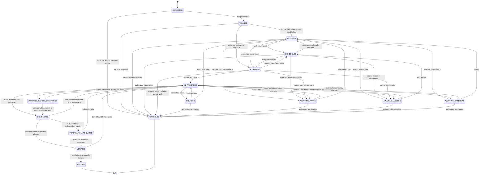
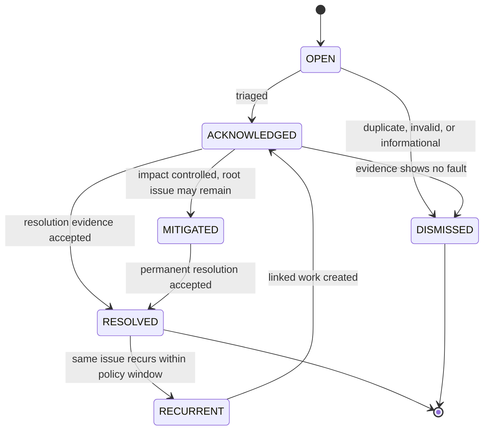

# Maintenance State Machine

**Status:** Implemented Phase 13 baseline; tenant policies and production integrations remain open  
**Owner:** Maintenance

## 1. Scope

Maintenance owns fault reports, work orders, preventive schedules, assignments, labor/parts references, diagnostic/action/evidence history, and service outcomes. Assets owns the asset lifecycle and current restriction/return-to-service decision. Inventory owns parts custody and movements. Charging owns live connectivity/session facts.

A fault is observed evidence and may be linked to zero, one, or multiple work orders over time. A work order is the controlled unit of planned/executed work.

## 2. Work-order States

| State | Meaning | Terminal |
| --- | --- | --- |
| `REPORTED` | Work need/fault has been captured but not triaged | No |
| `TRIAGED` | Validity, severity, ownership, and immediate safety action assessed | No |
| `PLANNED` | Scope, skills, checklist, parts, access, and estimated effort are defined sufficiently | No |
| `SCHEDULED` | A work window/team is reserved | No |
| `ASSIGNED` | Responsible technician/team accepted assignment | No |
| `IN_PROGRESS` | Work has begun | No |
| `ON_HOLD` | Work paused for a general controlled reason | No |
| `AWAITING_PARTS` | Work paused pending Inventory/Procurement | No |
| `AWAITING_ACCESS` | Work paused pending site/customer/access conditions | No |
| `AWAITING_EXTERNAL` | Work paused pending vendor/utility/third party | No |
| `AWAITING_SAFETY_CLEARANCE` | Work cannot continue/return to service until safety condition is met | No |
| `COMPLETED` | Technician has submitted actions, measurements, parts, and completion evidence | No |
| `VERIFICATION_REQUIRED` | Independent/policy verification is pending | No |
| `VERIFIED` | Completion evidence/tests are accepted | No |
| `CLOSED` | Administrative/service resolution is finalized | Yes |
| `CANCELED` | Work will not proceed for an authorized reason | Yes |

Priority, SLA clock, asset restriction, warranty, and fault severity are attributes/related states—not substitutes for work-order state.

## 3. State Diagram

If an issue recurs after closure, create a new `REPORTED` work order linked to the closed order. The closed aggregate remains terminal and immutable; reopening history by changing `CLOSED` back to an active state is prohibited.

## 4. Transition Guards and Evidence

| Transition | Minimum guard/evidence |
| --- | --- |
| Create `REPORTED` | Tenant, fault/work source, asset/location, observed UTC time, description/category, reporter/service, idempotency/source key |
| → `TRIAGED` | Valid/duplicate decision, severity/priority, responsible scope, immediate safety/asset restriction assessment, triager |
| → `PLANNED` | Scope, required capability/checklist, parts/tools/access, dependency/risk assessment, planner |
| → `SCHEDULED` | UTC window plus location timezone display, team capacity/access assumptions |
| → `ASSIGNED` | Active authorized technician/team with scope/capability; assignment acceptance policy |
| → `IN_PROGRESS` | Assignee, actual start UTC, asset/site safety/access check; required asset restriction requested/confirmed |
| → waiting/hold | Enumerated reason, owner, next review/deadline, asset safety state, reservations retained/released decision |
| → `COMPLETED` | Diagnosis, work performed, labor duration seconds, test/checklist results, parts movement references, attachments, outstanding risks, completion UTC |
| → `VERIFICATION_REQUIRED` | Policy identifies independent verifier/checklist and required evidence |
| → `VERIFIED` | Authorized verifier, acceptance outcome, test/evidence, UTC; return-to-service request/decision separately referenced |
| → `CLOSED` | Resolution code, fault disposition, all material/labor/evidence reconciled, follow-up/preventive actions linked, asset state acknowledged |
| → `CANCELED` | Allowed source state, reason, authorizer, no unaccounted issued parts/labor/unsafe asset; downstream releases complete or tracked |

Each transition uses optimistic concurrency/version checking and commits transition history, audit, and outbox event atomically.

## 5. Core Invariants

- Work order, asset/location reference, assignment, inventory requests, and evidence belong to the same tenant.
- A work order does not directly update charger lifecycle/availability or inventory quantity.
- Labor uses integer `duration_seconds`; parts use Inventory movement ULIDs and base-unit quantities.
- Cost rollups accept only the work order's three-letter ISO currency; the platform never infers a currency conversion.
- Actual start/completion/verification/closure are UTC instants; local schedule retains the location's IANA timezone and DST resolution.
- State history is append-only with actor/service, reason, correlation, and version.
- Completed work cannot be verified without the evidence required by the work type/policy version.
- A technician cannot verify their own safety-critical work when separation-of-duty policy applies.
- Closed/canceled work is immutable. Follow-up creates a new ULID linked by relationship/reason.
- Attachments are authorized, quarantined/scanned, classified, retained, and never treated as proof merely because upload succeeded.

## 6. Fault Lifecycle

Fault state is distinct from work state:

Multiple telemetry alerts can deduplicate into one fault according to an approved signature/window. A work order can address several related faults. Recurrence opens a new active fault/work relationship and preserves prior resolution.

## 7. Asset Restriction and Return to Service

Assets owns operational state. Maintenance interactions are commands with explicit outcomes:

1. Triage or field safety check calls `AssetMaintenanceContract::restrictForMaintenance` with asset type/ULID, work-order ULID, reason, actor context, and correlation.
2. Assets validates tenant/site ownership and current lifecycle, applies/declines restriction, and emits `assets.asset.restricted.v1` on success.
3. Charging consumes the Assets fact and applies safe authorization/command/public-projection behavior.
4. Completion/verification calls `AssetMaintenanceContract::returnToService` with work-order and verification evidence.
5. Assets applies or declines return to service and retains its own state/audit.

Closing a work order never implies the asset is in service. An asset can remain restricted after work closure due to another fault, external clearance, or policy.

## 8. Inventory Integration

- `PLANNED` may request parts availability/reservation; only Inventory can confirm it.
- `AWAITING_PARTS` records requested/reserved/short quantities and expected resolution, not a fabricated stock balance.
- Starting work verifies required serialized/controlled parts are issued to the correct work order/technician custody.
- Completion references posted consumption and unused return movements. A typed quantity alone cannot decrement stock.
- Removed parts/components enter quarantine/return/scrap/repair through Inventory/Assets contracts.
- Canceled/closed work must release unused reservations and reconcile issued parts or leave a visible exception.

## 9. SLA and Priority

Suggested priority names (`critical`, `high`, `normal`, `low`) are labels only until a tenant/market policy defines them. SLA clocks should record:

- policy/version and applicable calendar/timezone;
- reported, acknowledged, response, mitigation, resolution, and pause instants;
- pause reason and whether the policy permits stopping a clock;
- target UTC instants and breach evidence; and
- priority changes with actor/reason.

The state machine must not embed invented response/repair times.

## 10. Preventive Maintenance

Maintenance owns effective-dated plans triggered by a due UTC date, runtime seconds, charging-session count, or energy delivered in watt-hours. A due occurrence creates one reported preventive work order for an immutable checkpoint. Charging remains the source for runtime/session/energy facts; Maintenance never edits a session to make a plan due. Component usage triggers fail closed until an owned counter contract exists.

Date recurrence uses configured integer seconds and a stored UTC next-due instant. Business calendars, holiday rules, DST-local recurrences, grace windows, regulatory checks, and a generation horizon remain open.

## 11. Permissions and Audit

Dedicated permissions cover triage, planning, scheduling, assignment, work execution, evidence correction, completion, verification, cancellation, reopen/follow-up, priority/SLA override, part request, asset restriction request, and return-to-service request.

Audit high-risk actions with original/effective actor, tenant, asset/work, safe before/after, reason, evidence reference, UTC time, and correlation. Emergency work may permit assignment/planning shortcuts but not missing identity, safety, parts, evidence, or after-the-fact review.

## 12. Phase 13 Implementation Profile

- `maintenance_work_orders` stores the current projection and optimistic `aggregate_version`; `maintenance_work_order_transitions` is append-only evidence.
- `maintenance_incidents` deduplicates active selected OCPP faults by SHA-256 fingerprint. `maintenance_incident_observations` deduplicates normalized source events and is immutable.
- `FaultObservationContract` is called only after Charging validates a normalized gateway event and maps it to an enrolled connector.
- Work-order creation, transition, assignment, evidence, and cost rollup are explicit application workflows. Model observers do not hide business transitions.
- SLA targets are effective-dated, UTC instants. Controlled hold states store pause start/accumulated seconds, and automation persists breach-notification evidence.
- Inventory references are materialized only after `StockReservationService` and `WorkOrderPartsService` post or update owner-controlled evidence.
- Attachments are private, type/size constrained, SHA-256 identified, and created in `pending` scan state.
- Technician and operator surfaces use the same policies and site-scoped base queries as the API. Filament filters are not the security boundary.
- Automated work runs via `maintenance:run-automation` under one service tenant context per active tenant.
- ADR 0013 records the append-only evidence and cross-context contract decision.

## 13. Open Decisions

- Fault taxonomy/severity, deduplication/recurrence windows, priority labels, and SLA policies.
- Work types/checklists, skill/certification validation, independent verification, and safety sign-off.
- Preventive triggers, calendars/timezones, grace periods, and usage-counter reliability.
- Warranty/vendor dispatch, remote diagnostics, firmware/configuration work, and external service portals.
- Technician offline/mobile experience, location tracking, attachment/file scanner, and evidence retention.
- Labor/cost accounting, contractor access, removed-part custody, and asset return-to-service authority.
