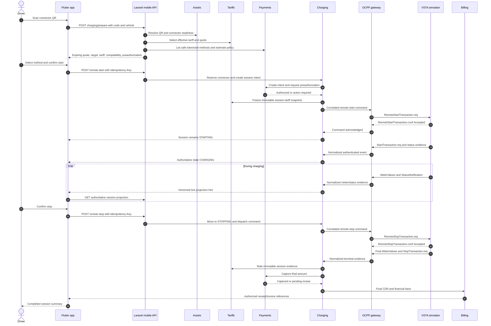

# Proposed Mobile QR Charging and Transaction Flow

**Status:** Proposed for review; no implementation is authorized by this document  
**Scope:** Flutter consumer app → Laravel CSMS → OCPP gateway → VSTA simulator → charging finalization → fake payment provider → billing  
**Primary owners:** Assets, Charging, Tariffs, Payments, Billing, Notifications, Support, and Integrations

## 1. Purpose

This document defines the proposed local end-to-end experience for a driver who scans a QR code, starts a simulated charger through VTSA CSMS, monitors energy delivery, stops charging, completes payment, and receives charging and financial records.

It is the design and acceptance baseline for a later implementation phase. It does not add routes, migrations, credentials, QR labels, payment rules, or charger-specific behavior.

The flow must preserve these platform conventions:

- money is an integer number of minor units plus an ISO 4217 currency code;
- energy is stored in watt-hours;
- power is stored in watts;
- durations are stored in integer seconds;
- timestamps are UTC instants; and
- public and cross-context identifiers are ULIDs.

## 2. Current readiness

| Capability | Current status | Consequence |
| --- | --- | --- |
| Flutter QR/manual-code, tariff review, start-pending, live-session, stop, payment-processing, history, and receipt UI | Implemented against application ports and test repositories | UI behavior can be tested, but it is not connected to complete customer-owned Laravel endpoints |
| Customer mobile charging API under `/api/v1/mobile/charging/*` | Contract proposed; server endpoints missing | This is the main release blocker |
| Laravel Charging state machines, connector reservation, remote commands, meter processing, CDR, and review workflow | Foundational implementation exists | Must be exposed through a new customer-owned orchestration boundary, not the workforce API |
| Tariff selection, snapshotting, and rating | Foundational implementation exists | Preparation/start orchestration must bind the selected effective tariff safely |
| Payment abstraction, fake provider, authorization/capture/refund foundations, ledger, and billing artifacts | Foundational implementation exists | A charging-specific orchestration policy still needs to connect preauthorization to final capture |
| Separate OCPP 1.6J/2.0.1 gateway and Laravel stream consumers | Implemented and locally testable | Requires an enrolled simulator identity for tenant-bound events |
| VSTA simulator at port 3100 | OCPP 1.6J client implemented | Can represent the physical charger for local tests |
| Automatic Assets-to-gateway charger enrollment projection | Not complete | Unenrolled simulator events are quarantined and cannot update tenant sessions |
| Canonical signed QR issuance/replacement format | Open decision | Current mobile parser supports an opaque code or `vtsa:///charge/{code}` only |
| Production payment, push, certificate, and realtime providers | Not selected | Local UAT must use fakes/adapters and must not invent credentials |

Existing `/api/v1/charging-sessions` endpoints are workforce operations. The mobile app must not reuse them because their actor, ownership, tenant, and permission semantics are different.

## 3. Actors and system responsibilities

| Participant | Responsibility |
| --- | --- |
| Driver | Authenticates, selects vehicle/payment method, scans and confirms, requests stop, reviews result |
| Flutter app | Presents server facts, manages permission UX, sends idempotent commands, and recovers authoritative state |
| Identity/Tenancy | Derives the customer, active account, tenant/operator relationship, and permitted scope from the Sanctum token |
| Assets/Locations | Resolves QR identity, station, EVSE, connector, OCPP charge point identity, lifecycle, and public/operational eligibility |
| Charging | Owns reservation, authorization orchestration, commands, canonical session, meter evidence, anomalies, and CDR |
| Tariffs | Selects the effective tariff, creates the immutable snapshot, estimates and calculates charges |
| Payments | Owns token references, payment intent, preauthorization, capture/void/refund, callbacks, and reconciliation state |
| Billing | Owns rated charges, balanced ledger postings, receipt/invoice, credit notes, and revenue allocation evidence |
| OCPP gateway | Authenticates the simulator, translates OCPP, owns connection/correlation evidence, and publishes normalized events |
| VSTA simulator | Behaves as an OCPP 1.6J charge point and emits charger-side protocol evidence |
| Notifications | Sends safe hints for start, stop, fault, payment, and completion; never acts as authoritative state |
| Support | Accepts an issue linked to the driver's authorized session |

## 4. Recommended QR model

### 4.1 Payload

For local implementation, the recommended application payload is:

```text
vtsa:///charge/{opaque_qr_identifier}
```

The mobile app already accepts this form and a raw 6–120 character code for manual entry. The QR must not contain tenant IDs, internal database IDs, payment information, credentials, tariff amounts, or a direct OCPP WebSocket address.

The preferred QR identifies one connector because remote start must target one physical outlet. If a station-level QR is retained, preparation must return a connector-selection step and revalidate the selected connector before reservation. That choice must be approved before implementation.

### 4.2 Identity mapping

```text
QR identifier
    -> Assets connector (preferred) or station
    -> EVSE and charging station
    -> globally unique charge_point_identity
    -> authenticated live OCPP gateway connection
```

The QR identifier and OCPP charge point identity are different concepts. The server performs the mapping; the app must never derive or trust it locally.

### 4.3 Simulator mapping

For a local test charger:

- the simulator `charge_point_id` must match the CSMS charging station's `charge_point_identity`;
- its CSMS base URL is `ws://host.docker.internal:9002/ocpp`;
- the simulator appends its charge point ID to that base URL; and
- the gateway must enroll and authenticate that identity before its messages can change tenant-owned Charging data.

The QR code comes from the CSMS Assets record, not from the simulator's connection URL.

## 5. End-to-end happy path

### 5.1 High-level sequence



### 5.2 Detailed stages

#### Stage A — Scan and prepare

1. The driver signs in with a verified, active first-party account.
2. The app explains camera usage before requesting permission. Manual code entry remains available.
3. The app parses only an opaque code or `vtsa:///charge/{code}`. Parsing does not establish authorization or asset identity.
4. The app calls `POST /api/v1/mobile/charging/prepare` with the scanned code and optional owned vehicle ULID.
5. The API derives the customer and tenant/operator relationship from authentication. It ignores client-supplied ownership expansion.
6. Assets resolves the globally unique QR and verifies station/EVSE/connector lifecycle and OCPP mapping.
7. Charging checks availability freshness, active-session conflicts, operational restrictions, and reservation eligibility.
8. Vehicle compatibility is advisory unless an approved safety policy makes it blocking.
9. Tariffs selects the applicable effective version using server time and returns an expiring quote.
10. Payments returns safe tokenized method summaries and a server-calculated estimated preauthorization. The app never calculates or submits the monetary amount.
11. The app presents the exact station, connector, maximum power, status age, tariff components, tax presentation, estimated authorization, payment method, and quote expiry.

If the connector is occupied, unavailable, faulted, stale, retired, or otherwise restricted, preparation returns a stable reason and remote start remains disabled.

#### Stage B — Confirm, reserve, and preauthorize

1. The app generates one idempotency key for this confirmed start attempt and reuses it for retries.
2. `POST /api/v1/mobile/charging-sessions/remote-start` references the quote ULID, connector ULID, payment-method token reference, and optional vehicle ULID.
3. Charging locks the connector's current reservation/session scope and revalidates the quote, availability, ownership, and active-session policy.
4. Charging creates a `REQUESTED` session intent and bounded connector reservation.
5. Payments creates a tenant/customer-owned payment intent. Provider network work occurs outside an open database transaction.
6. The fake local provider returns a deterministic authorization outcome. If provider action is required, the app uses an approved hosted/tokenized handoff and resumes by fetching verified server state.
7. On authorization success, Tariffs freezes an immutable snapshot on the session.
8. Charging generates a short-lived, single-purpose charger authorization token and creates the remote-start command.
9. A failure before dispatch releases or expires the reservation and voids/releases unused authorization according to provider policy.

The exact preauthorization amount, expiry, incremental-authorization policy, and overage behavior remain product/payment decisions and must not be guessed during implementation.

#### Stage C — Remote start and physical confirmation

1. Laravel dispatches the command to the gateway using the versioned internal API, service authentication, command ULID, correlation ULID, tenant/charger binding, expected state, and deadline.
2. The gateway routes `RemoteStartTransaction` to the currently authenticated OCPP 1.6 simulator connection.
3. The simulator returns `Accepted` or `Rejected`.
4. An accepted command changes the command to `ACKNOWLEDGED`; it does not change the session to `CHARGING`.
5. The simulator then sends charger-originated transaction evidence such as `StartTransaction`, followed by relevant status and meter messages.
6. The gateway validates and normalizes the evidence. The Laravel consumer deduplicates it and verifies tenant, charger, connector, token, protocol transaction, ordering, and state.
7. Only valid physical transaction evidence moves the canonical session from `STARTING` to `CHARGING` or an explicit suspended state.
8. The app remains on **Start pending** until the authoritative session read reports that transition.

If the command is accepted but no valid transaction begins before the UTC deadline, the session becomes `EXPIRED` or `FAILED` according to proven evidence, the reservation is released, and unused payment authorization is voided/released. It must never be shown as a completed charge.

#### Stage D — Live charging

The authoritative mobile projection contains:

- session ULID and aggregate version;
- canonical state;
- station, EVSE, and connector presentation data;
- UTC start time and last-observed time;
- energy in Wh, converted for display only;
- current power in W when trustworthy;
- elapsed duration in seconds;
- server-calculated estimated cost in integer minor units and currency;
- freshness/staleness and safe anomaly codes; and
- payment state without provider secrets.

Realtime messages and push notifications are hints containing only safe routing information. On every hint, app resume, reconnect, or ambiguity, the app calls the authorized HTTPS session endpoint. A projection with a lower aggregate version cannot replace a newer one.

The app persists only `owner_id`, `session_id`, and `saved_at` for recovery. It does not persist tariff, payment, meter, or document data as authority.

#### Stage E — Stop

1. The driver confirms stopping the identified connector and session.
2. The app sends `POST /api/v1/mobile/charging-sessions/{sessionId}/remote-stop` with a stable idempotency key.
3. Charging verifies customer ownership, canonical stoppable state, and the known OCPP transaction ID.
4. Charging changes the session to `STOPPING` and dispatches `RemoteStopTransaction`.
5. Command acceptance does not complete the session.
6. The simulator sends final meter evidence and `StopTransaction`.
7. Valid terminal evidence moves the session to `FINALIZING`.

A local charger stop follows the same terminal-evidence path without requiring a mobile command. The app must discover it through the authoritative projection.

#### Stage F — Finalization and CDR

Charging validates:

- source transaction identity and connector ownership;
- start/end UTC evidence;
- start, intermediate, and stop energy registers;
- ordering, duplicates, clock skew, meter reset/rollover, and plausible deltas;
- nonnegative duration and energy;
- stop reason and disconnection evidence; and
- the immutable tariff snapshot.

The tariff engine calculates final cost using Wh, seconds, tariff components, effective rules, promotion evidence, caps/floors, and integer minor-unit rounding rules. Charging creates an immutable finalized CDR or moves the session to `REVIEW_REQUIRED` when evidence is unsafe or incomplete.

#### Stage G — Capture, billing, and completion

1. Payments captures the approved final amount against the authorized intent.
2. Any unused authorization remainder is released according to the provider contract; no behavior is invented locally.
3. If the final amount exceeds authorization, the approved incremental/recovery policy applies. Until defined, the item enters finance review rather than silently over-capturing.
4. Verified delayed or out-of-order webhooks advance payment idempotently. The app remains **Payment processing** while the result is pending or unknown.
5. Billing creates the rated-charge evidence, balanced ledger transaction, receipt, and invoice where applicable.
6. Revenue share and settlement inputs are created from immutable financial facts; they do not delay the driver's completed-session view unless product policy explicitly requires it.
7. The app retrieves short-lived, customer-authorized receipt/invoice links and displays the final session summary.

`COMPLETED` charging state and `CAPTURED` payment state are related but independent. Neither state machine may falsely advance the other.

## 6. Required customer API contract

These endpoints are the proposed customer boundary already identified in the mobile charging contract:

| Method and route | Use |
| --- | --- |
| `POST /api/v1/mobile/charging/prepare` | Resolve QR/manual code and return an expiring server quote |
| `POST /api/v1/mobile/charging-sessions/remote-start` | Start the idempotent reservation/payment/command orchestration |
| `GET /api/v1/mobile/charging-sessions/active` | Recover the customer's current pending/live/finalizing session |
| `GET /api/v1/mobile/charging-sessions` | Cursor-paginated customer history |
| `GET /api/v1/mobile/charging-sessions/{sessionId}` | Retrieve the authoritative versioned projection |
| `POST /api/v1/mobile/charging-sessions/{sessionId}/remote-stop` | Request an idempotent stop |
| `POST /api/v1/mobile/charging-sessions/{sessionId}/cancel` | Cancel an eligible pre-physical start |
| `POST /api/v1/mobile/charging-sessions/{sessionId}/refund-requests` | Request reviewed refund handling |
| `POST /api/v1/mobile/support/issues` | Report an issue for an owned session |

All mutation responses return the original semantic result for a duplicate idempotency key used by the same actor and intent. Every error includes a safe machine code, message, correlation ID, and field errors where applicable.

## 7. State alignment

| Mobile phase | Charging session | Charger command | Payment intent | Meaning to driver |
| --- | --- | --- | --- | --- |
| Reviewing | none | none | none | Target, tariff, compatibility, and estimate are being reviewed |
| Submitting start | `REQUESTED` / `AUTHORIZING` | none or `REQUESTED` | created/authorization pending | Server is reserving and checking payment |
| Start pending | `AUTHORIZED` / `STARTING` | dispatched/acknowledged | authorized | Command may be accepted, but charging is not physically confirmed |
| Live | `CHARGING` or suspended | terminal command result | authorized | A charger transaction is established |
| Stop pending | `STOPPING` | requested/dispatched/acknowledged | authorized | Stop requested; terminal charger evidence is pending |
| Finalizing | `FINALIZING` / `REVIEW_REQUIRED` | terminal | authorized/capture pending | Physical charging ended; evidence and cost are being finalized |
| Payment processing | `COMPLETED` | terminal | capture pending/unknown | Charging record is final; verified payment outcome is pending |
| Completed | `COMPLETED` | terminal | captured or approved no-payment outcome | Final totals and authorized documents are available |
| Failed/cancelled/expired | matching terminal state | rejected/timed out/expired/unknown | voided/released/failed as applicable | No successful physical charging claim is made |

## 8. Failure and recovery behavior

| Condition | Required behavior |
| --- | --- |
| Duplicate scan or start taps | Reuse the same idempotency key while the intent is active; return the original session |
| Connector becomes unavailable after preparation | Start revalidation fails safely; no duplicate session or uncancelled authorization remains |
| App closes during start or charging | On relaunch, read `/active`, then the session projection; server remains authoritative |
| User signs in on another device | Both devices resolve the same owned active session; policy decides whether multiple simultaneous sessions are allowed |
| Mobile network loss | Preserve last confirmed values as stale; disable new start/stop submission until safe connectivity returns |
| Realtime connection loss | Poll authorized HTTPS projection with bounded backoff |
| Simulator disconnects while charging | Keep the last physical state, mark connectivity stale, and wait for reconnect/terminal evidence; do not invent a stop |
| Remote start accepted but no transaction starts | Expire/fail after race-safe deadline evaluation; release reservation and unused payment authorization |
| Stop command times out | Treat delivery as unknown; do not resend blindly or claim that charging stopped |
| Delayed or duplicate payment webhook | Deduplicate and process by verified provider event; app stays payment-processing until authoritative resolution |
| Out-of-order meter value | Retain evidence, order by validated source/received facts, and reject regressive projection updates |
| Meter reset or implausible delta | Flag anomaly and enter review according to policy; never fabricate billable energy |
| Final capture fails | Preserve immutable charging/CDR evidence, open finance review, and show a safe payment issue state |
| Revoked mobile token | Immediately deny reads and mutations; require reauthentication |

## 9. Security and tenancy controls

- QR possession is not authorization. Every preparation and session operation requires server validation.
- The Sanctum token identifies the driver; tenant, customer, payment owner, and session owner are derived server-side.
- Policies and tenant-scoped queries enforce ownership independently of UI filtering.
- The gateway accepts tenant events only from an enrolled authenticated charge point. Development quarantine events cannot start or update canonical sessions.
- Payment methods are provider token references and safe labels only. PAN and CVV never enter VTSA CSMS.
- The app and logs must not expose authorization tokens, provider secrets, raw card data, or unrestricted document URLs.
- Start, stop, payment, refund, role, override, and manual-review changes are audited with actor, tenant, IP, user agent, action, entity, before/after where safe, and correlation ID.
- All jobs preserve verified tenant and correlation context.
- External payment calls occur outside database transactions and reconcile through idempotent state transitions.

## 10. Proposed implementation order

No step below should begin until the decisions in Section 12 that affect it are approved.

1. Approve connector-versus-station QR behavior, customer tenancy policy, concurrent-session policy, and local payment/preauthorization rules.
2. Define and validate OpenAPI schemas for the customer mobile endpoints without changing workforce routes.
3. Implement an Assets-owned QR resolver and safe simulator enrollment/configuration projection.
4. Implement the mobile preparation query with connector freshness, vehicle compatibility, tariff quote, and payment summaries.
5. Implement charging start orchestration across reservation, payment authorization, tariff snapshot, authorization token, and gateway command.
6. Implement customer-owned active/detail/history/stop/cancel projections and policies.
7. Connect verified OCPP 1.6 simulator events to the tenant-owned canonical session.
8. Connect CDR rating, fake-provider capture, ledger, receipt/invoice, and app payment-processing recovery.
9. Add authorized realtime/polling behavior and local fake notifications.
10. Run adversarial tenant, idempotency, ordering, disconnect, payment-delay, and app-lifecycle UAT before enabling the feature flag.

## 11. Test and acceptance plan

### Automated coverage

- QR parser tests for raw code, deep link, malformed, unknown, replaced, and revoked codes.
- Tenant/policy tests proving one customer cannot prepare, view, start, stop, or download another customer's resources.
- Connector locking tests for concurrent starts and stale preparation quotes.
- Idempotency tests for duplicate start, stop, callback, event, and app retry.
- Payment tests for authorization success/failure/action-required, capture failure, delayed callback, void, and amount mismatch.
- Gateway contract tests for authenticated 1.6 boot, remote start/stop, transaction, meters, duplicate frames, reconnect, and timeout.
- State-machine tests proving command acknowledgment alone cannot mark a session charging or completed.
- Meter tests for Wh/W normalization, out-of-order values, reset, clock skew, and implausible deltas.
- Billing tests proving final minor-unit totals and balanced ledger entries.
- Flutter unit/widget/integration tests for permission, scan, review, pending, live, recovery, stop, finalization, and receipt states.

### Local UAT happy path

1. Start the platform, gateway, consumers, fake payment provider, Flutter app, and VSTA simulator.
2. Enroll one fictional simulator charge point and connector in the demo tenant.
3. Configure the simulator charge point ID to match the CSMS `charge_point_identity` and connect it to `ws://host.docker.internal:9002/ocpp`.
4. Confirm accepted boot and fresh available connector evidence.
5. Display or print a synthetic connector QR containing the approved `vtsa:///charge/{code}` payload.
6. Sign in as the fictional demo driver and select an owned fictional vehicle and fake tokenized payment method.
7. Scan, review the server quote, and confirm start once.
8. Confirm the app remains start-pending after command acknowledgment and becomes live only after simulator transaction evidence.
9. Send increasing Wh/W meter samples and compare simulator trace, gateway logs, CSMS evidence, and mobile projection.
10. Stop from the app and confirm the simulator emits terminal evidence.
11. Verify final energy Wh, duration seconds, immutable tariff snapshot, final minor-unit amount/currency, CDR, captured fake payment, balanced ledger, and authorized receipt/invoice.
12. Relaunch the app and confirm history/detail recover the same public session ULID.

### Acceptance checklist

- [ ] QR resolves the intended connector without trusting tenant or asset data from the client.
- [ ] Stale, occupied, faulted, restricted, or retired targets cannot start.
- [ ] The displayed tariff and preauthorization are server-calculated and expire explicitly.
- [ ] One start confirmation creates at most one reservation, session, payment intent, and command.
- [ ] The simulator is enrolled and authenticated; its events are not on the quarantine stream.
- [ ] Remote-start acceptance leaves the session in `STARTING`.
- [ ] Valid `StartTransaction` evidence is required before `CHARGING`.
- [ ] Live energy is persisted in Wh, power in W, duration in seconds, and time in UTC.
- [ ] App termination and network/realtime loss recover from the server without duplicate actions.
- [ ] Remote-stop acceptance does not complete the session without terminal charger evidence.
- [ ] Final cost uses the immutable tariff snapshot and integer minor units.
- [ ] Payment capture and charging completion remain independently truthful.
- [ ] The financial ledger balances and documents are customer-authorized.
- [ ] Tenant leakage, revoked tokens, duplicate events, delayed callbacks, disconnects, and meter anomalies are covered.
- [ ] Logs and events contain correlation IDs without secrets, PAN, CVV, or unnecessary personal data.

## 12. Decisions required before implementation

1. Whether QR codes identify connectors directly or stations followed by connector selection. Connector-level QR is recommended.
2. Canonical QR versioning, signing, issuance, replacement, revocation, and printable label workflow.
3. How a consumer identity is related to one or multiple operator tenants.
4. Whether a driver may have more than one concurrent non-terminal charging session.
5. Local-demo preauthorization amount policy and production policy ownership.
6. Behavior when final cost exceeds authorization and whether incremental authorization is initially enabled.
7. Tariff selection instant and quote lifetime.
8. Supported payment action-required flow and return/deep-link behavior.
9. Exact start, inactivity, disconnect, stop, and finalization timeouts.
10. OCPP 1.6 simulator enrollment credential workflow and registry synchronization mechanism.
11. Realtime transport and mobile subscription authorization.
12. Receipt/invoice terminology, legal content, and document-link lifetime.
13. Refund-request eligibility and operational SLA.
14. Feature-flag rollout, UAT tenant, and rollback criteria.

No bank credentials, payment-provider secrets, tax registration details, production infrastructure credentials, or charger-specific custom behavior are selected here.

## 13. Related documentation

- [Mobile charging contract boundary](mobile-charging-contract.md)
- [Charging session state machine](charging-session-state-machine.md)
- [Charger command state machine](charging-command-state-machine.md)
- [Connector availability state machine](connector-availability-state-machine.md)
- [Charge Detail Record state machine](charge-detail-record-state-machine.md)
- [Payment state machine](payment-state-machine.md)
- [Financial implementation](financial-implementation.md)
- [OCPP gateway architecture](ocpp-gateway.md)
- [OCPP simulator testing runbook](../local/OCPP-SIMULATOR-TESTING.md)
- [Mobile development runbook](../runbooks/mobile-development.md)
