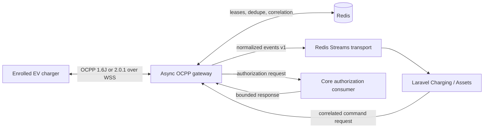

# OCPP Gateway Architecture

**Status:** Phase 6 implemented baseline  
**Owner:** Integrations protocol edge; normalized facts are consumed by Charging/Assets through versioned contracts

## Runtime boundary

The Python gateway is an independently deployable asynchronous service. Laravel never hosts charger sockets, and the gateway never imports Laravel code or connects to Laravel-owned PostgreSQL tables.

Redis Streams is the approved phase-six event transport, not canonical business storage. A production durability/replay decision remains open. The core must deduplicate normalized events by `event_id`, validate tenant/charger enrollment, and use its own inbox/state guards before changing canonical Charging state.

## Connection flow

1. Negotiate exactly `ocpp2.0.1` or `ocpp1.6`; otherwise close with protocol error.
2. Require TLS outside the explicit local-development mode.
3. Validate the path identity syntax and bind it to the injected Assets registry projection.
4. Authenticate with an enrolled client-certificate SHA-256 fingerprint or Argon2-backed per-device Basic credential. Disabled/unknown chargers fail closed.
5. Claim the latest Redis lease for the charger identity. A new local connection closes the previous socket; an old remote owner loses its next lease renewal and closes.
6. Publish a connected fact and route version-specific calls through schema-validated adapters.
7. On disconnect, release only the matching lease; a stale socket cannot delete a newer connection's ownership.

Unauthenticated local-development identities are never placed on the tenant event stream. They publish to the quarantine stream with null tenant/charger identifiers.

## Message processing

For each charger CALL, `(authenticated charge_point_identity, OCPP unique_id)` is claimed in Redis. A completed response is cached for the configured replay horizon. A duplicate receives the exact cached CALLRESULT/CALLERROR; an in-flight duplicate waits briefly and receives `OccurrenceConstraintViolation` if the first response is still unavailable. Claims and cached responses survive reconnects and work across gateway nodes.

Raw logging happens after the size check and JSON envelope parse. Logs contain direction, protocol, message type, unique ID, action, byte size, and recursively redacted payload. Authorization credentials, tokens, passwords, certificate fields, and security-event technical information are redacted by default. Normalized authorization events contain only the resulting status; raw tokens stay in the controlled request/reply channel.

Protocol timestamps remain evidence. The gateway calculates signed skew relative to gateway UTC, flags samples beyond the configured threshold, and never rewrites the charger timestamp. Energy and power are normalized to Wh and W; non-integral or malformed values are retained for downstream quality rejection rather than silently rounded.

## Adapter boundary

The version adapters translate only protocol structure:

- 1.6 `StartTransaction`/`StopTransaction` and 2.0.1 `TransactionEvent` become normalized protocol facts;
- 1.6 integer transaction IDs are gateway-only wire correlation;
- driver/token authorization is a bounded request to the core and defaults to `Invalid` on timeout/error;
- DataTransfer is vendor-denied by default;
- inbound firmware, diagnostics/log, and security statuses are transported as evidence;
- remote firmware/diagnostics and all other commands are disabled by the empty command allowlist;
- no tariff, fee, tax, payment, settlement, inventory, or session state rule exists in this service.

The shared normalized schema is `packages/contracts/events/gateway-ocpp-normalized.v1.schema.json`. Event delivery is at least once. Every event has a ULID, UTC timestamp, tenant/charger binding when enrolled, connection/node IDs, correlation/causation, protocol version, and normalized payload.

## Core consumption implemented in Phase 7

Laravel consumes the normalized stream with `charging:consume-ocpp-events`, persists an idempotent inbox record before applying state, and quarantines invalid tenant, charger, protocol, unit, and state evidence. The core maps 1.6J `StartTransaction`, `StopTransaction`, and `MeterValues`, plus 2.0.1 `TransactionEvent`, into the canonical Charging state machine. It reconstructs a missing non-terminal session after reconnect with an explicit anomaly and never treats a gateway command response as physical-start evidence. Authorization requests use the separate `charging:consume-ocpp-authorizations` request/reply consumer; generated start tokens remain hashed at rest and are revealed only at the command transport boundary.

## Commands

The internal command endpoint requires a bearer service credential. The core supplies a ULID command/correlation ID, target protocol identity, action, action-specific payload, and timeout. The gateway checks the action deployment allowlist, maps it to the negotiated version, uses the command ULID as the OCPP unique ID, and returns one of `completed`, `rejected`, `timed_out`, `not_connected`, or `failed`.

`completed` means a valid protocol response arrived. It does not prove contactor movement, energy flow, or canonical session completion. Charging advances from later trusted status/transaction/meter facts.

## Health and observability

- `/health/live` proves the process can answer HTTP.
- `/health/ready` proves Redis is reachable and reports TLS mode and active local connections.
- `/internal/metrics` exposes connection gauges, message/duplicate/event/clock-skew/command counters, and command latency.
- structured logs carry request, correlation, tenant, charger, connection, node, action, and direction where applicable.

Readiness fails when Redis is unavailable because identity-wide ownership, deduplication, event publication, and authorization cannot be made safe. The gateway does not silently fall back to process memory outside explicitly injected tests.

## Failure behavior

| Failure | Behavior |
| --- | --- |
| Unsupported subprotocol | WebSocket close `1002` before acceptance |
| Unknown/disabled/bad credential | WebSocket close `1008` with non-disclosing reason |
| Oversized/malformed frame | Reject and close; no downstream event |
| Duplicate completed call | Replay the byte-equivalent cached response |
| Duplicate in flight | Bounded wait, then protocol error |
| New connection for same charger | Latest connection owns lease; stale owner closes |
| Redis unavailable | Readiness unavailable; operations fail closed |
| Core authorization absent/late | Protocol authorization status `Invalid` |
| Charger command timeout | Correlated `timed_out`; no false success |
| Core unavailable after event publish failure | Connection handler fails visibly; no business result is invented |

## Assumptions and open decisions

Assumptions: each production charger is enrolled to one Assets charger ULID/tenant; TLS terminates either in this process or at a trusted edge that preserves the security boundary; Redis Streams is acceptable for the phase-six transport; the core implements idempotent event consumption and authorization response handling.

Open decisions: production broker/durable inbox-outbox and replay retention; service-to-service credential technology; certificate authority/enrollment protocol and required OCPP security profiles by charger capability; edge versus in-process TLS termination; per-device rate limits and capacity SLOs; deployment draining; multi-region/fencing topology; OCPP conformance/certification targets; vendor DataTransfer adapters; signed meter/firmware support; protocol evidence retention and privacy classification.
