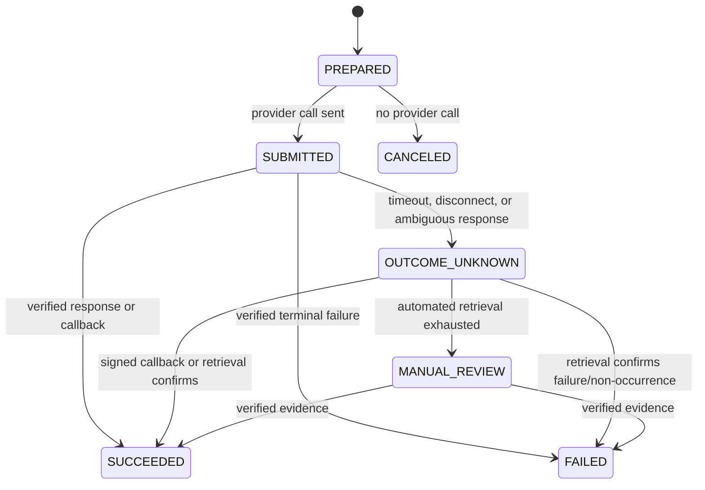

# Payment State Machine

**Status:** Provider-neutral normative baseline; provider/market policy remains undecided  
**Owner:** Payments

## 1. Aggregate Model

A payment intent represents the platform's intent to collect a bounded amount in one currency for a tenant-owned billable reference. Provider attempts, authorizations, captures, refunds, and disputes are child records with their own immutable evidence.

The aggregate does not store raw PAN or CVV. It stores ULIDs, integer `amount_minor`, ISO 4217 `currency`, provider/account codes, opaque customer/payment-method/provider references, idempotency keys, status history, UTC timestamps, safe failure categories, and correlation.

Billing owns the claim/invoice and allocation. Settlements owns reconciliation/payout evidence. Payments owns provider-side money movement state.

## 2. Intent States

| State | Meaning | Terminal for collection |
| --- | --- | --- |
| `CREATED` | Intent exists and request invariants are valid | No |
| `REQUIRES_PAYMENT_METHOD` | No usable provider-tokenized method is attached | No |
| `AUTHORIZATION_PENDING` | An authorization/setup request is in flight or outcome is ambiguous | No |
| `REQUIRES_ACTION` | Provider requires customer action with a safe, expiring continuation reference | No |
| `AUTHORIZED` | Provider authorization is confirmed for an amount/expiry | No |
| `CAPTURE_PENDING` | Capture request is in flight or outcome is ambiguous | No |
| `PARTIALLY_CAPTURED` | Confirmed captures are greater than zero and below the permitted target | No/conditional |
| `CAPTURED` | Required collection is confirmed captured | Yes for collection; refund/dispute may follow |
| `CANCEL_PENDING` | Authorization cancellation/void is in flight or ambiguous | No |
| `CANCELED` | Intent/remaining authorization was canceled and no further collection is allowed | Yes |
| `FAILED` | A terminal collection failure occurred and this intent will not be retried | Yes |
| `EXPIRED` | Intent/authorization expired before permitted collection | Yes |
| `REFUND_PENDING` | One or more requested refunds have unresolved provider outcomes | No |
| `PARTIALLY_REFUNDED` | Confirmed refunds are greater than zero and below captured amount | Yes/conditional |
| `REFUNDED` | Confirmed refunds equal the refundable captured amount | Yes |

Provider capability determines whether separate authorization, partial capture, multiple capture, cancellation, or partial refund is supported. The adapter must declare capabilities and reject unsupported workflows; the core does not emulate them by guessing.

## 3. State Diagram

```mermaid
stateDiagram-v2
    [*] --> CREATED
    CREATED --> REQUIRES_PAYMENT_METHOD: tokenized method absent or declined as unusable
    CREATED --> AUTHORIZATION_PENDING: submit authorization
    CREATED --> CANCELED: cancel before provider effect
    CREATED --> EXPIRED: intent deadline elapsed

    REQUIRES_PAYMENT_METHOD --> AUTHORIZATION_PENDING: attach method and submit
    REQUIRES_PAYMENT_METHOD --> CANCELED: cancel
    REQUIRES_PAYMENT_METHOD --> EXPIRED: deadline elapsed

    AUTHORIZATION_PENDING --> REQUIRES_ACTION: provider requires customer action
    AUTHORIZATION_PENDING --> AUTHORIZED: verified authorization success
    AUTHORIZATION_PENDING --> FAILED: verified terminal failure
    AUTHORIZATION_PENDING --> CANCEL_PENDING: cancellation requested

    REQUIRES_ACTION --> AUTHORIZATION_PENDING: action submitted or provider status retrieval
    REQUIRES_ACTION --> AUTHORIZED: signed callback or verified retrieval confirms
    REQUIRES_ACTION --> FAILED: action definitively fails
    REQUIRES_ACTION --> CANCEL_PENDING: cancellation requested
    REQUIRES_ACTION --> EXPIRED: action window expires with verified state

    AUTHORIZED --> CAPTURE_PENDING: capture requested
    AUTHORIZED --> CANCEL_PENDING: void/cancel requested
    AUTHORIZED --> EXPIRED: provider authorization expiry confirmed

    CAPTURE_PENDING --> PARTIALLY_CAPTURED: partial capture confirmed
    CAPTURE_PENDING --> CAPTURED: required capture confirmed
    CAPTURE_PENDING --> AUTHORIZED: capture definitively failed and authorization remains usable
    CAPTURE_PENDING --> FAILED: terminal failure with no usable authorization

    PARTIALLY_CAPTURED --> CAPTURE_PENDING: additional capture requested if supported
    PARTIALLY_CAPTURED --> CAPTURED: required cumulative capture confirmed
    PARTIALLY_CAPTURED --> REFUND_PENDING: refund requested

    CANCEL_PENDING --> CANCELED: cancellation confirmed
    CANCEL_PENDING --> AUTHORIZED: cancellation definitively failed; authorization remains
    CANCEL_PENDING --> CAPTURED: provider confirms capture won race

    CAPTURED --> REFUND_PENDING: refund requested
    REFUND_PENDING --> PARTIALLY_REFUNDED: partial refund confirmed
    REFUND_PENDING --> REFUNDED: full refundable amount confirmed
    REFUND_PENDING --> CAPTURED: refund failed; no prior refund
    REFUND_PENDING --> PARTIALLY_CAPTURED: refund failed; original state was partial capture
    REFUND_PENDING --> PARTIALLY_REFUNDED: refund failed; prior refunds remain
    PARTIALLY_REFUNDED --> REFUND_PENDING: another refund requested

    CANCELED --> [*]
    FAILED --> [*]
    EXPIRED --> [*]
    REFUNDED --> [*]
```



`CAPTURED` and `PARTIALLY_REFUNDED` are stable but not immutable terminal endpoints because a refund or dispute may occur. A failed refund attempt does not erase confirmed captures/refunds; the aggregate returns to the confirmed cumulative-money state and retains the failed attempt.

## 4. Attempt State Machine

Every provider mutation/retrieval is a separately identifiable attempt:



`OUTCOME_UNKNOWN` is essential: a timeout never authorizes a second financial effect. Retry/status retrieval uses the same provider idempotency key/reference until outcome is known.

## 5. Transition and Amount Guards

- Tenant, payer, billable reference, currency, provider account, and requested maximum are immutable after provider submission.
- `amount_minor >= 0`; all child amounts use the intent currency.
- Cumulative confirmed captures cannot exceed the permitted authorization/target/provider capability.
- Cumulative confirmed refunds cannot exceed cumulative confirmed captures minus already resolved chargeback effects according to the approved accounting policy.
- Only verified provider responses, signature-verified callbacks, or authenticated status/report retrieval confirm external money movement.
- A callback may move state forward even if it arrives before the synchronous response; provider event ID and resource/version ordering are deduplicated.
- Regressive/contradictory provider status is retained as evidence and sent to reconciliation; it does not silently reverse a confirmed fact.
- Cancellation is allowed only before incompatible confirmed capture. Capture/cancel races are resolved from provider truth.
- Changing provider or payment method after submission creates a new attempt/intent as required; it never overwrites history.
- State update, attempt evidence, audit, and outbox event commit atomically after the external call has completed/outcome has been classified.

## 6. Charging Integration

A typical online charging policy may use preauthorization, but the amount, timing, expiry, incremental authorization, final capture, and release rules are open decisions.

The integration contract observes these invariants:

1. Charging asks Payments for a policy-defined authorization using session/billable ULID, amount minor/currency, payer reference, and idempotency key.
2. Payments returns provider-neutral state and safe action information; Charging never calls a provider SDK.
3. A session start decision uses the approved payment/access policy; `AUTHORIZED` payment state does not prove a charger started.
4. After session/rated-charge finalization, Billing/Charging requests capture for an allowed amount.
5. Excess authorization is canceled/released where supported; shortfall enters the approved collection/account workflow.
6. Payment results update Billing through explicit allocation events/contracts, not table writes.

If a session fails before physical start, an unused authorization is canceled according to provider capability/policy. If session data is under review, capture timing follows a documented hold/expiry policy rather than an invented estimate.

## 7. Refunds

- A refund request has its own ULID, amount minor/currency, reason code, requester/approver, idempotency key, source invoice/credit-note/case reference, and provider attempts.
- Finance permissions, maximums, refund window, MFA/approval thresholds, and whether a credit note must precede a refund are market/tenant policies.
- Multiple partial refunds are serialized against the locked aggregate/cumulative balance.
- Failed/unknown refunds remain visible and reconcilable; users cannot repeatedly click to create new effects.
- Refund success produces `payments.refund.succeeded.v1`; Billing and Settlements independently post their owned allocation/reconciliation effects.

## 8. Disputes and Chargebacks

Dispute state is orthogonal to collection/refund state because a captured or refunded payment can still receive a dispute:

```text
NONE → OPEN → WON | LOST | WITHDRAWN
```

A dispute stores provider dispute ULID/reference, capture reference, disputed amount minor/currency, safe reason category, evidence deadline/status, and outcome. `LOST` creates an external financial impact for Billing/Settlements to allocate/reconcile through their own records; it does not rewrite the original capture as if it never occurred.

Evidence submission, representment, fees, reserves, and customer-account impact require provider/market rules.

## 9. Webhooks and Reconciliation

- Verify signature over raw request, timestamp/replay rule, provider account/environment, event/resource identity, and schema before domain processing.
- Persist a safe immutable webhook receipt hash/metadata and dedupe before acknowledgement/processing according to provider timeout guidance.
- Unmapped/invalid-account events are quarantined and alerted; never attach by amount alone.
- Periodic/status reconciliation compares intents/attempts with authenticated provider resources/reports and emits exceptions.
- Manual resolution requires source evidence, dedicated permission, reason, and audit; it cannot assert provider success without proof.

## 10. Security and Privacy

- No raw PAN, CVV, magnetic-stripe data, payment cryptogram, provider secret, or reusable client secret is stored/logged/evented.
- Safe display metadata such as brand/last four/expiry may be stored only if provider and privacy rules allow.
- Client-side payment action secrets are short-lived, purpose-bound, returned only to the authorized client, and excluded from logs/events.
- Provider credentials are environment/account-scoped in an approved secret manager with rotation/revocation and audit.

## 11. Open Decisions

- Provider(s), merchant-of-record, payment methods, currencies/markets, and PCI validation scope.
- Preauthorization amount/timing/expiry, incremental authorization, tipping/adjustments if any, and offline risk.
- Capture timing for complete/review/estimated sessions and collection shortfall behavior.
- Refund/credit-note order, limits, approval, refund window, and customer balance policy.
- Dispute workflow, evidence, fees, reserves, and chargeback allocation.
- Provider failover/routing and whether an intent can ever migrate between provider accounts.
