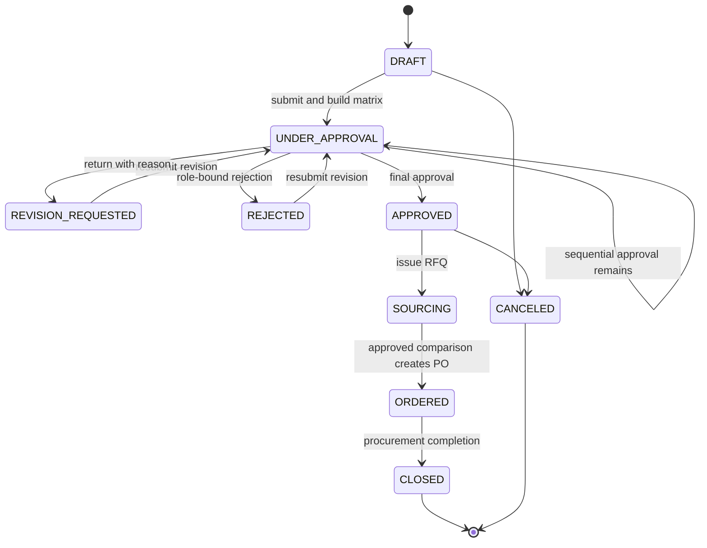
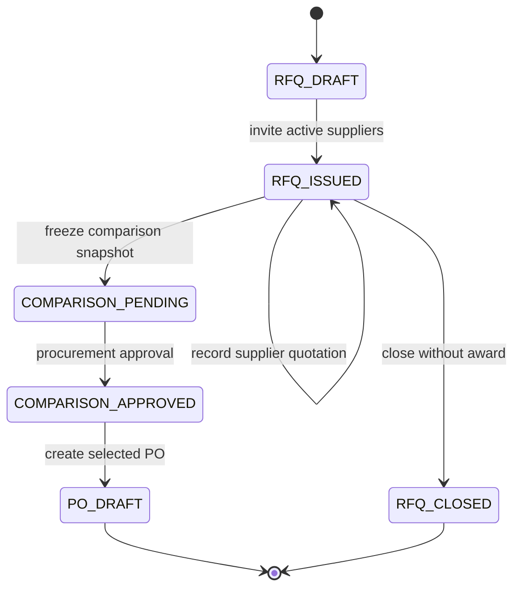
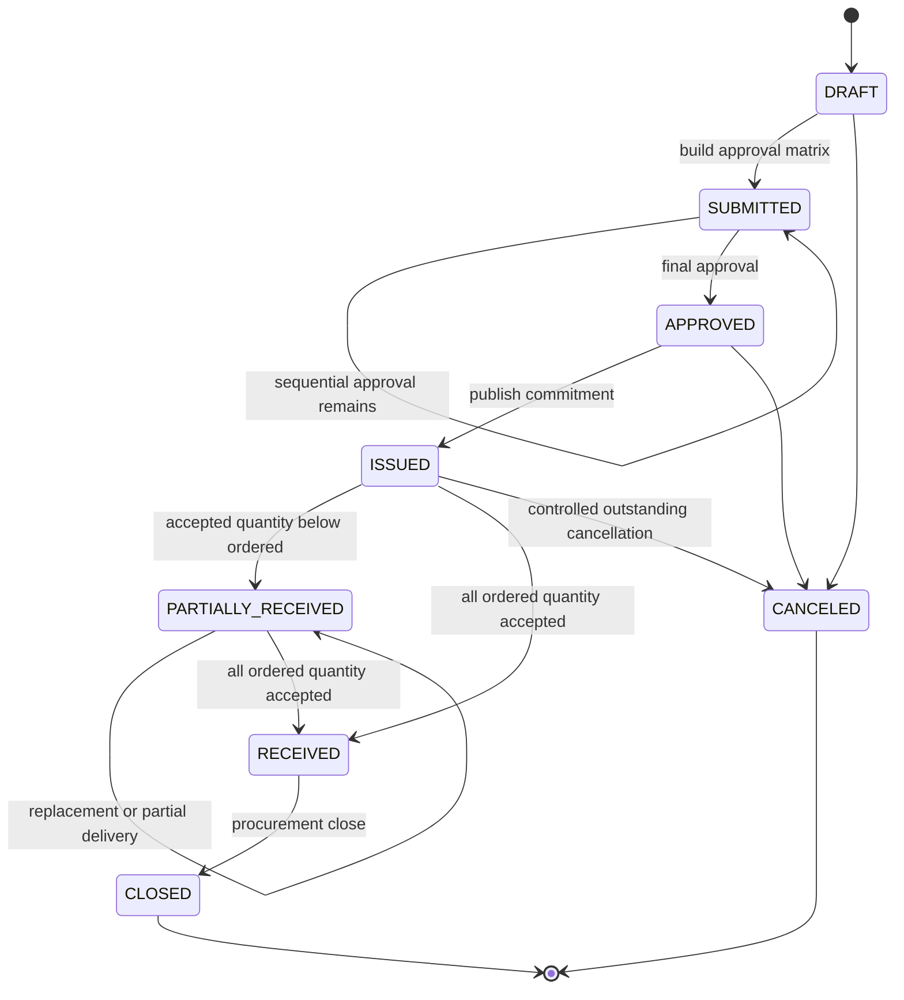
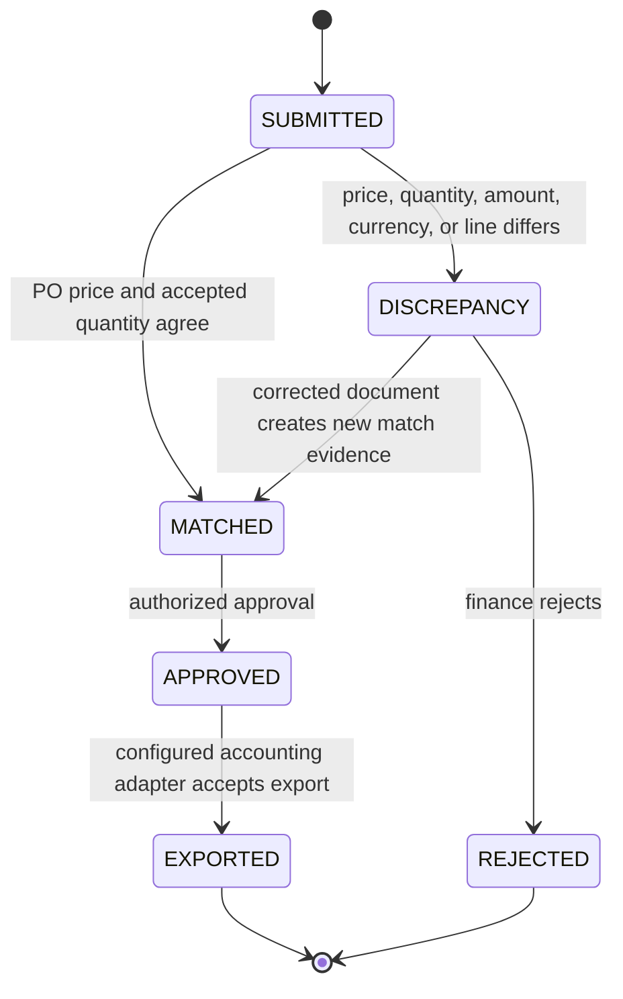

# Procurement State Machines

**Status:** Phase 12 implemented baseline  
**Owner:** Procurement bounded context

## Invariants

- Requisitions, quotations, purchase orders, and vendor invoices use integer minor units plus an ISO 4217 currency.
- An approval decision is retained against the document revision, sequence, role key, actor, reason, and UTC decision time.
- The requesting or preparing actor cannot approve their own requisition or purchase order.
- Approval proceeds in configured sequence and the acting user must hold the exact approval-matrix role in the active tenant.
- Issued purchase orders publish expected-receipt facts; they never post inventory.
- Inventory owns physical receipt, inspection, quarantine, and stock movement. It updates Procurement only through `PurchaseOrderReceiptContract`.
- Three-way-match executions are immutable evidence. A repeat match creates new evidence and supersedes open discrepancies without rewriting the prior match.
- Supplier bank details, payment instructions, tax-registration rules, and production accounting credentials are not modeled.

## Purchase request



Revision requests increment `revision`; approval evidence from earlier revisions remains retained. A request cannot be submitted unless an active approval rule covers its document type, currency, amount, department, and cost center.

## Request for quotation and comparison



The comparison snapshot retains every considered quotation's supplier reference, currency, total minor units, lead time, validity date, and line prices. Selection is explicit and reasoned; lowest price is not assumed to be the winner.

## Purchase order



`received_quantity_base` is cumulative physical delivery and may exceed ordered quantity when rejected goods are replaced. Completion is determined by accepted quantity, not raw delivery quantity.

## Vendor invoice and three-way matching



The default match tolerance is zero minor units. A caller may pass an explicit non-negative tolerance; it is stored in the evidence snapshot. Launch-market tax and landed-cost matching rules remain unresolved.

## Accounting-export state

```text
not_ready -> ready | blocked
blocked -> ready        (after a successful new match)
ready -> exported       (approved adapter export)
```

The local adapter returns deterministic synthetic references only. Production provider credentials and destination configuration remain outside source control.

## Failure behavior

- Duplicate document numbers and idempotency keys are tenant-aware database conflicts.
- Invalid state transitions fail atomically and produce no stock or financial side effect.
- Approval-role mismatch, inactive membership, expiry, or self-approval is denied in the application workflow even if a UI action is forged.
- Notification dispatch occurs after transaction commit.
- Cross-context receipt and supplier-return changes use narrow Procurement-owned contracts; Inventory never writes Procurement tables.

## Open decisions

- Material PO revision thresholds and whether an issued PO amendment retains one number or a new document number.
- Required RFQ supplier count and exception approval.
- Quotation scoring dimensions beyond price and lead time.
- Tax, freight, landed-cost, and partial-invoice allocation rules by launch market.
- Three-way-match tolerances by item/category/supplier and who may override them.
- Accounting adapter payload, retry, reconciliation, and external acknowledgement semantics.
- Supplier onboarding, compliance, performance scoring, and approved-data retention.
