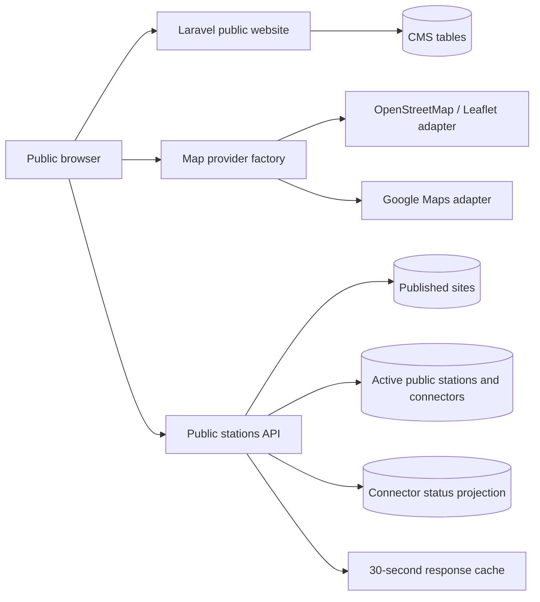

# Public Web and Charging Map

## Scope and ownership

The CMS bounded context owns public pages, reusable sections, FAQs, articles/news, testimonials, partner logos, app-store links, contact details, SEO metadata, and exact-path redirects. Locations owns published site facts and operating hours. Assets owns the station/EVSE/connector hierarchy and connector capabilities. Charging owns the latest connector-status projection exposed by the public map.

The website composes read-only public projections. It never updates Locations, Assets, or Charging records and never treats map visibility as authorization for an operator workflow.

## Delivery path

The API performs bounding-box and distance filtering server-side. Connector, power, availability, operator, site type, and open-now filters are also enforced by the API; UI filtering is not relied upon. Responses include an ETag, a 30-second public cache allowance, and a 120-second stale-while-revalidate window.

## Status and freshness

The Charging context may update `charging_connector_statuses` through a future versioned gateway/core contract. This phase does not define vendor-specific OCPP interpretation. The public aggregate uses these rules:

- any fresh available connector makes the station `available`;
- otherwise occupied or reserved becomes `busy`;
- otherwise faulted takes precedence over offline/unavailable;
- a station with connector observations but no fresh observation is `stale`;
- missing capability or status evidence is `unknown`.

`observed_at` is UTC and `stale_after_seconds` is explicit. A stale signal is never shown as live availability.

## Security and privacy

- Only active, public, published sites and active public stations are projected.
- Public results contain no tenant identifier, SIM details, serial numbers, internal component data, or private organization fields.
- Browser-rendered CMS text is escaped. Baseline JSON-LD is serialized from safe fields.
- Admin CMS access requires `cms.edit`; publication controls require `cms.publish`.
- CMS records are global public content. They do not bypass tenant policies in operator panels.
- Google browser credentials are environment-injected and must be restricted. No map credential belongs in source control or the mobile configuration response.

## Accessibility and failure behavior

The synchronized result list is the canonical accessible fallback. OpenStreetMap is the credential-free default. If a selected provider is not ready, its SDK fails, or its tiles fail, the map factory attempts OpenStreetMap once and always preserves the list. Filters have labels, result status uses a polite live region, cards are keyboard buttons, the detail drawer has an accessible name, and reduced-motion preferences are respected. Loading, empty, error, offline, stale, and unknown states are distinct.

## Assumptions and open decisions

- Operating-hour `day_of_week` uses `0` for Sunday through `6` for Saturday.
- Cross-midnight and holiday exceptions require a future effective-dated schedule design.
- `openstreetmap` and `google` are rendering adapters selected per surface under ADR 0014; neither is a domain dependency.
- Production OpenStreetMap tile capacity and usage policy remain deployment decisions.
- Legal copy, public contact details, app-store URLs, analytics consent, and production social images remain publication decisions.
- The source event/command that updates connector status remains unresolved until the OCPP integration phase.
