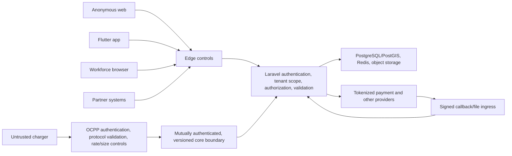

# Security Model

**Status:** Phase 0 security baseline; requires threat-model review per delivery increment  
**Principle:** Treat every client, device, callback, file, tenant, and network boundary as untrusted until authenticated, authorized, validated, and observed.

## 1. Security Objectives

- Prevent access across tenant, organization, resource, and user boundaries.
- Prevent unauthorized charger control and falsified operational/session state.
- Preserve correctness and traceability of payments, billing, settlement, stock, and maintenance records.
- Minimize payment and personal-data scope and prevent secrets from entering application data or telemetry.
- Maintain availability during abuse, dependency failure, retry storms, and compromised edge devices.
- Make privileged and sensitive actions attributable, reviewable, and recoverable where possible.

## 2. Protected Assets

| Class | Examples | Baseline handling |
| --- | --- | --- |
| Restricted secrets | Password hashes, MFA seeds, API/payment provider secrets, charger credentials, signing/encryption keys | Approved secret/credential store, never logged/returned, least access, rotation/revocation |
| Restricted financial | Payment tokens/references, provider transactions, refunds/disputes, invoices, settlements, beneficiary data once defined | Strong resource authorization, encryption, field masking, immutable audit, export controls |
| Restricted personal | Identity/contact, charging/location history, support correspondence, device/push identifiers | Purpose limitation, minimum collection, field/row access, retention/erasure policy, redaction |
| Confidential tenant | Unpublished locations/assets, tariffs, pricing, commercial rules, stock, work evidence, reports | Tenant/resource scope, encryption, audit for sensitive operations |
| Operational safety | Charger identity/status/commands, maintenance restriction and return-to-service evidence | Device/service authentication, state guards, reason/step-up as applicable, end-to-end correlation |
| Public | Published CMS/location/connector/tariff summaries | Explicit publish workflow, sanitization, cache controls, abuse protection; no inference of private fields |

Data classification is attached to fields/contracts, not just tables. A public record can still contain restricted fields that must never be included in a public projection.

## 3. Trust Boundaries



Controls are repeated at boundaries. Network placement alone never grants business authorization.

## 4. Identity and Authentication

### Human identities

- Identity owns a stable ULID subject independent of email/phone/provider identifiers.
- Passwords, if supported, use Laravel's current strong password hashing configuration and rate-limited sign-in/recovery.
- Privileged tenant/platform roles require MFA capability and recent/step-up authentication for defined high-risk actions.
- Recovery must not be weaker than sign-in; recovery/change events revoke or review existing sessions according to policy.
- Workforce SSO may be added through OIDC/SAML after provider/realm decisions. External group claims map only to reviewed application role assignments.
- Driver and workforce identity realm separation/account linking remains open.

### Machine identities

- API clients, services, jobs, gateway nodes, and chargers use distinct non-human identities with owner, environment, scopes, expiry/rotation, and revocation.
- Service-to-service authentication and key/certificate technology are deployment decisions; shared anonymous internal endpoints are prohibited.
- Credentials are never accepted in query strings and never logged.

### Sessions and tokens

- Browser sessions use secure, HTTP-only, same-site cookies and CSRF defenses appropriate to the flow.
- Mobile uses short-lived access and rotated/revocable refresh material held in OS secure storage. Exact token format/provider remains open.
- Token audience, issuer, tenant/subject, scope, expiry, and key rotation are validated; authorization is not inferred solely from a client-provided tenant claim.
- Password/role/tenant suspension and suspected compromise support prompt session revocation.

## 5. Authorization

Authorization evaluates:

```text
authenticated subject
AND active tenant/capability
AND active membership or approved platform access
AND permission
AND organization/resource scope
AND resource relationship and lifecycle state
AND high-risk conditions (MFA freshness, limit, separation of duties, reason)
```

- Deny by default. Policies/application services enforce access server-side for HTTP, Livewire, CLI, job, event, websocket, export, and integration paths.
- Public ULIDs prevent enumeration convenience but are not authorization.
- Queries return not-found/forbidden behavior that avoids cross-tenant existence disclosure.
- A grantor cannot grant permissions or scope they do not possess.
- Platform access is separate from tenant role assignments and uses just-in-time, time-bound, reasoned elevation with review.
- Support data reveal, refunds, remote charger commands, inventory adjustments, tariff publication, settlement approval, and return-to-service have dedicated permissions and audit.

## 6. Tenant Isolation

The controls in [`tenancy-model.md`](tenancy-model.md) apply at database, application, cache, queue, realtime, search/reporting, object, export, and telemetry boundaries. Tenant isolation is tested as a security property. Tenant context cannot be taken from an unvalidated request identifier without membership/resource checks.

## 7. Application and API Security

- Use allow-list DTO/Form Request validation for types, bounds, formats, enum/state values, units, currency, and referential scope.
- Use parameterized Eloquent/query-builder access; never interpolate untrusted SQL, PostGIS expressions, shell arguments, or template code.
- Blade escapes output by default. Sanitization is required for allowed rich CMS/support content; arbitrary scripts and unsafe URLs are prohibited.
- Protect against mass assignment with explicit input mappings, not model-wide permissive fields.
- Enforce CSRF on cookie-authenticated mutations, CORS allow lists, security headers/CSP, safe redirect allow lists, request/body limits, and upload type/size constraints.
- API mutations use idempotency keys where retriable. Per-identity/client/tenant/IP/resource rate controls defend sign-in, map search, charging commands, webhooks, exports, and recovery.
- Error responses contain safe codes and correlation IDs, not stack traces, secrets, SQL, provider bodies, or cross-tenant clues.
- Graph/query flexibility, if added, must enforce field-level authorization and cost/depth limits.

## 8. OCPP and Charger Security

- Enroll every charger protocol identity against an Assets-owned charger ULID and tenant; reject unknown, duplicate-conflicting, disabled, or retired identities.
- Require supported TLS and an approved OCPP security profile. Whether mutual TLS, per-device basic credentials, or both are required depends on charger capabilities and market threat model; credentials are never invented or shared by default.
- Validate WebSocket origin/path/subprotocol as applicable, frame/message size, JSON/protocol schema, action allow list, identifiers, timestamps, and rate.
- Bind messages to the authenticated connection's charger; never trust a payload to select another tenant/asset.
- Commands carry ULID, tenant, target, expected state, actor/reason, deadline, and idempotency/correlation. The gateway reports accepted/rejected/timed-out/unknown delivery separately from charger/domain completion.
- Protect connection ownership/routing against split brain and replay. A charger cannot have two unquestioned authoritative live connections.
- Treat firmware, diagnostics URLs, certificates, DataTransfer/vendor extensions, and remote configuration as high-risk. Phase 6 transports inbound firmware/diagnostic/security status only; vendor DataTransfer and all outbound commands are denied by empty allowlists. Enabling a command or vendor ID requires reviewed authorization, SSRF/signing/retention controls, and targeted conformance tests.
- Record safe protocol metadata and hashes/references needed for evidence; do not log credentials or indiscriminately retain personal payloads.

## 9. Payment and Financial Security

- Use provider-hosted/tokenized payment capture so raw PAN and CVV never enter VTSA systems. Do not render or proxy raw card fields unless a later PCI-reviewed architecture explicitly changes this.
- Payment adapters use least-privilege provider credentials separated by environment/account and stored in the selected secret manager.
- Verify webhook signatures using the raw body, approved algorithm/key, timestamp tolerance, and provider event ID before acknowledging domain processing; deduplicate and retain safe receipt evidence.
- All monetary values use integer minor units and currency checks. Payment actions are idempotent and follow state/amount guards.
- Ambiguous timeouts are reconciled by provider reference/idempotency key before retry; never guess that a charge/refund failed.
- Refund, adjustment, settlement, and export actions require dedicated permission, reason, thresholds, and separation of duties where configured.
- Ledgers and issued documents are corrected by linked compensating entries/documents, not overwritten.
- Provider dashboard access, beneficiary verification, bank instructions, tax registration, and production credentials are outside this baseline.

## 10. Data, Cryptography, and Secrets

- Use current supported TLS for external data in transit and platform-managed encryption for disks/databases/object storage/backups. In the initial Hostinger topology, application-to-data traffic uses the narrow WireGuard overlay defined by ADR 0016; native service TLS remains a valid defense-in-depth addition. Field-level encryption is evaluated for high-risk fields once data inventory is approved.
- Cryptographic choices use maintained framework/platform libraries; no custom cryptography.
- Secret references, not values, appear in configuration. Startup validates required secrets without printing them.
- Keys/secrets have named owner, purpose, environment, creation, rotation, revocation, and incident procedure.
- Backups and replicas retain the source classification, access control, residency, and deletion limitations.
- Lower environments use synthetic/de-identified data and independent credentials.

## 11. Files and Content

- Object paths include tenant/classification ownership but path knowledge does not grant access.
- Uploads are size/type constrained, stored outside executable paths, checksum recorded, quarantined, and scanned by an approved service before general access.
- Downloads use authorization on every request or short-lived single-purpose signed access with safe content disposition.
- CMS rich content is sanitized; public media has a deliberate publish state and contains no embedded secrets/private metadata.
- Export files are encrypted/access-controlled, expire, and create audit records.

## 12. Audit, Detection, and Response

Audit events include UTC timestamp, tenant, effective actor and original platform actor if elevated, action, target, result, safe before/after/change fields, reason, source IP/device where permitted, and correlation ID.

Mandatory audit categories include authentication/recovery, membership/role, privileged access, tenant lifecycle, charger enrollment/commands, tariff publication, payment/refund/dispute, billing correction, settlement approval/exception, purchase approval, stock adjustment/count, maintenance override/return-to-service, support reveal, configuration/secret reference, integration client, and export.

- Ordinary application roles cannot mutate or delete audit records.
- Logs/metrics/traces use structured redaction and never substitute for business audit evidence.
- Alerts cover credential abuse, isolation failures, unusual privileged actions, charger floods/spoofing, webhook signature failures/replays, duplicate financial effects, reconciliation anomalies, and audit pipeline failure.
- Incident plans must support containment by identity, tenant, integration client, provider credential, gateway node, or charger while preserving evidence.

## 13. Secure Development and Supply Chain

- Lock dependencies and review updates; scan dependencies, source, secrets, IaC, and built images in CI.
- Protect branches/releases with review and verified build provenance appropriate to the chosen platform.
- Threat-model each delivery increment and abuse-test tenant access, object references, state transitions, retry/replay, uploads, and provider/gateway inputs.
- Security findings have severity, owner, due date, verification, and an approved exception path; tests are not disabled to hide findings.
- Production debugging never requires exposing secrets or copying unrestricted production data.

## 14. Key Threats and Mitigations

| Threat | Controls |
| --- | --- |
| Cross-tenant IDOR/query leak | Tenant resolution, scoped repositories/policies, RLS rollout, tenant-aware cache/jobs, negative isolation tests |
| Stolen admin session | MFA, short/rotated sessions, step-up, revocation, least privilege, audit/detection |
| Charger impersonation/message replay | Per-device enrollment/authentication, TLS, connection binding, protocol IDs/timestamps, dedup/state guards |
| Unauthorized remote command | Dedicated permission, target/state checks, reason, deadline, service auth, correlation/audit |
| Duplicate payment/refund | Idempotency, provider references, signed webhook dedup, state/amount guards, reconciliation |
| Tariff/invoice manipulation | Immutable published versions/documents, approval, calculation evidence, compensating corrections |
| Malicious upload/content | Quarantine/scan, type/size checks, sanitization, non-executable storage, short-lived access |
| SSRF through integrations/diagnostics | Outbound allow lists/proxy policy, URL validation/DNS protections, disabled vendor URLs by default |
| Queue/event spoofing | Service identity, schema validation, signed/controlled transport, inbox/outbox, tenant/resource authorization |
| Noisy or compromised tenant/device | Layered rate/quota limits, isolation queues, backpressure, containment/revocation |

## 15. Assumptions and Open Decisions

Assumptions: tokenized payment collection, no raw card storage; authenticated TLS external connections; least privilege; synthetic lower-environment data; individual charger enrollment.

Open decisions: target ASVS level and regulatory regimes; identity provider/realms/MFA; required OCPP security profiles, CA and charger certificate enrollment/overlap; secret manager/KMS/service identity; WAF/CDN/SIEM/file scanner; data residency/retention; penetration-test cadence; emergency access; PCI validation scope; mobile attestation/pinning posture; and public-edge network topology.

## 16. Phase 3 Implementation Status

Implemented: stable human subject ULIDs; active tenant and membership checks; tenant/resource-scoped RBAC; grantor-subset enforcement; expiring opaque credentials with hashed verifiers, individual revocation, and subject security-version revocation; non-disclosing API errors; versioned human queue context; and an append-only, per-tenant hash-chained audit ledger. First-party mobile requests use the tenant-bound Sanctum design in ADR-0009. Account/membership lifecycle, invitations, signed verification and recovery, device/browser-session controls, separate panel eligibility, and site/report policies are implemented. See [`../security/phase-3-security-foundation.md`](../security/phase-3-security-foundation.md) and ADR-0007/0008/0009.

Not yet implemented: public self-registration, a production MFA challenge/enrollment provider, step-up, SSO, machine identities, platform emergency access, token refresh/rotation, external audit anchoring/SIEM, PostgreSQL RLS, and business-module resource policies. These remain mandatory before the affected production surfaces are released.

## 17. Phase 12 Procurement and Inventory Controls

- Procurement and inventory permissions are separate (`view`, `operate`, `approve`, `adjust`, and `export` capabilities); policies deny by default and intersect tenant, lifecycle, and warehouse scope.
- Approval steps require the exact configured role at the configured scope. A requester cannot approve the same purchase request, and later steps cannot be completed before earlier steps.
- Posted stock movements and three-way-match evidence reject mutation and deletion. Corrections require linked compensating evidence.
- API idempotency keys, database transactions, row locks, audit records, and transactional outbox entries protect receipt, issue, transfer, return, count, and adjustment workflows from duplicate effects.
- Quarantine, rejected, returns, and in-transit stock never count as available. Negative availability is rejected before a movement posts.
- CSV catalog imports use an explicit header, validated enumerations and identifiers, tenant-aware uniqueness, and transaction rollback. Exports are authorization-scoped and spreadsheet-formula safe.
- Vendor invoices and stock records store integer minor units and references only. Supplier bank credentials, tax-registration assumptions, raw payment data, and production accounting credentials are not collected.
- Every protected approval, receipt, transfer, adjustment, count, match, and export records tenant, actor, correlation, source, and safe before/after or decision evidence through the immutable audit facility.
## Phase 13 Maintenance Controls

- Maintenance permissions are separated into view, dispatch, perform, and verify. APIs, policies, Filament resources, dashboards, and technician pages intersect the tenant context with exact site assignments.
- Required independent verification rejects the completing actor. Closed/canceled work is terminal; follow-up creates a new linked ULID.
- Normalized OCPP fault evidence is allowlist-driven by tenant rules, idempotent by source event, deduplicated by active fault fingerprint, and redacted to a small safe evidence set.
- Attachment uploads are private, limited to approved MIME types and 10 MB, SHA-256 identified, and quarantined in `pending` scan state. Production release requires a selected malware scanner and retention policy.
- Technician skill credentials are tenant-scoped and expiry-checked. A technician assignment also requires a current tenant membership.
- Asset restriction and stock changes cannot bypass their owning contexts. Maintenance contracts validate tenant/site identity before Assets mutation, while Inventory enforces reservations and immutable movement custody.
- SLA, assignment, safety, verification, RMA, cost, asset action, transition, and audit evidence retain actors/correlation without logging raw OCPP frames, access tokens, private attachments, or payment data.
