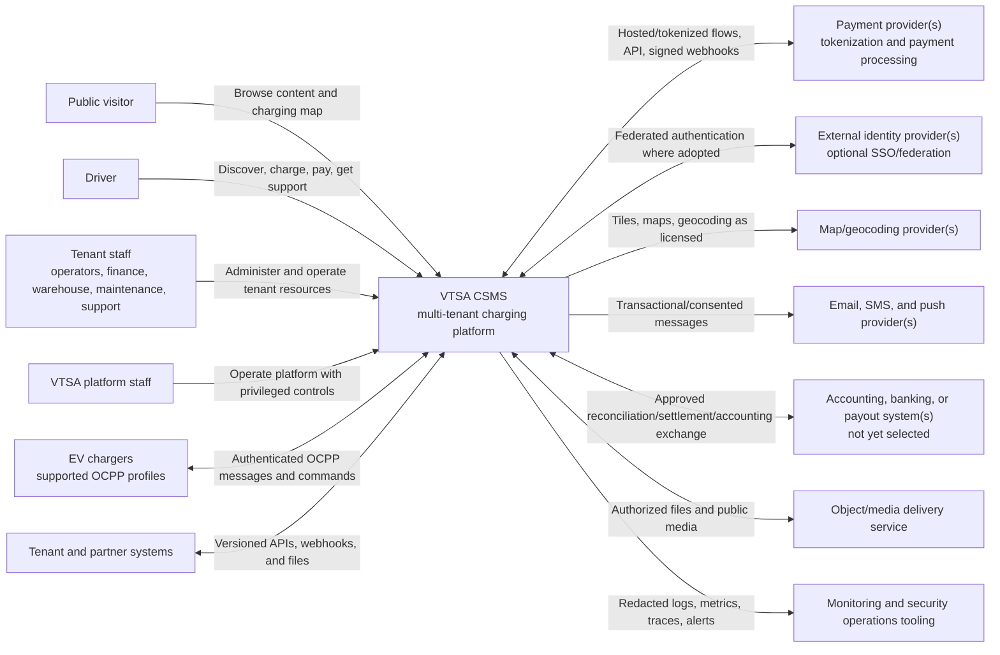

# System Context

**Status:** Phase 0 baseline  
**View:** C4 system context  
**Related:** [`container-architecture.md`](container-architecture.md), [`security-model.md`](security-model.md)

## 1. Purpose and Boundary

VTSA CSMS is the software system responsible for multi-tenant EV charging discovery, operation, customer charging journeys, commercial records, stock/procurement, and maintenance coordination. It is standalone in the sense that its core operating records do not depend on a tenant ERP or charger-vendor cloud being the source of truth. It still integrates with selected payment, mapping, notification, identity, finance, and partner systems through explicit boundaries.

The system does not own the electrical behavior of a charger, card-network/bank processing, mobile operating systems, map source data, message delivery networks, or a tenant's external accounting system.

## 2. Context Diagram

The external providers are capability placeholders, not vendor selections. Provider credentials, merchant/bank identifiers, endpoints, and production topology are intentionally absent.

## 3. People and Responsibilities

| Actor | Uses VTSA CSMS to | Trust posture |
| --- | --- | --- |
| Public visitor | Browse marketing content and published charging locations | Untrusted anonymous client; public, rate-limited data only |
| Driver | Manage their account/payment references, start/monitor/stop their charging, retrieve documents, contact support | Authenticated but untrusted client; own-resource and transaction-scoped access |
| Tenant staff | Operate authorized organizations, sites, assets, finance, stock, maintenance, content, support, and reports | Authenticated workforce; tenant/role/resource scope and separation of duties |
| VTSA platform staff | Provision/support the service and respond to incidents | Privileged separate identities; just-in-time access, reason, audit, review |
| Partner system | Exchange an approved subset of data or actions | Machine identity; explicit tenant/resource/action scopes, version/rate limits |
| EV charger | Report device/transaction facts and receive supported commands | Untrusted edge device even when authenticated; protocol validation and asset binding |

See [`../product/roles-and-personas.md`](../product/roles-and-personas.md) for the detailed role catalog.

## 4. External System Contracts

### EV chargers

- Communicate only through the OCPP gateway using an approved protocol version/profile.
- Are individually enrolled and bound to an Assets-owned charger identity.
- Can be offline, misconfigured, compromised, duplicated, late, or out of order; messages never bypass validation/idempotency/state guards.
- Vendor-specific behavior is unsupported until captured in a tested integration profile.

### Payment providers

- Own hosted/tokenized payment-instrument collection and external payment execution.
- Return opaque customer/payment references and signed callbacks.
- Are isolated behind the Payments adapter contract. No raw PAN/CVV enters VTSA CSMS.
- Merchant-of-record, provider routing, and market configuration remain open decisions.

### Mapping/geocoding providers

- Supply licensed map presentation/geocoding capabilities; PostGIS retains the platform's authoritative location geometry.
- Must not receive unnecessary driver or tenant operational data.
- Vendor, caching, attribution, and acceptable-use terms remain open.

### Notification providers

- Deliver email, SMS, or push requested by Notifications.
- Receive the minimum recipient/template payload required for delivery.
- Delivery callbacks are authenticated, idempotent, and mapped to provider-neutral statuses.

### External identity providers

- May federate workforce/driver identity after provider and realm decisions.
- Authentication proof is translated to an Identity-owned stable subject; provider groups do not directly become unrestricted application permissions.

### Tenant/partner and finance systems

- Integrate only through versioned APIs, signed webhooks, or controlled file jobs owned by Integrations.
- Cannot write database tables, bypass workflows, or silently become authoritative for an existing owned concept.
- Accounting/banking exchange and payout execution require separate security and legal approval.

## 5. Information Flows

### Charging journey

1. Locations/Assets/Tariffs publish safe discovery projections.
2. A driver requests authorization through the mobile/API boundary.
3. Charging coordinates identity/access, tariff, payment policy, and current asset state.
4. The core sends a correlated command through the OCPP gateway where remote start is used.
5. The charger reports protocol events and samples; the gateway normalizes them; Charging advances the canonical session.
6. Tariffs/Billing calculate and freeze charge evidence; Payments completes the selected financial flow.
7. Notifications informs the driver and Reporting projects read models.

### Financial control flow

1. Payments records intents/attempts and verified provider results.
2. Billing produces immutable rated charges and legally configured documents.
3. Settlements compares platform records with provider reports/payouts, allocates commercial shares where defined, and manages exceptions.
4. External bank/accounting execution is not assumed and can occur only through an approved integration.

### Asset service flow

1. Procurement creates approved purchasing commitments.
2. Inventory receives and controls physical stock through ledger movements.
3. Assets accepts commissioned serialized equipment into operational asset identity/custody.
4. Charging reports device/session faults; Maintenance plans work and reserves/consumes Inventory parts.
5. Assets owns restriction and return-to-service decisions invoked through controlled contracts.

## 6. Context-wide Invariants

- Public IDs and cross-system correlation use ULIDs.
- Monetary values use integer minor units with currency; energy Wh; power W; duration seconds; instants UTC.
- Tenant context is resolved before protected data access and propagates across all async/realtime boundaries.
- Source contexts retain authoritative facts; reporting/search/public views are derived projections.
- Commands express an intent and can fail; events state a fact that occurred and are named in past tense.
- Network callbacks and messages are untrusted, authenticated, validated, idempotent, and observable.

## 7. Assumptions and Open Decisions

Assumptions: shared multi-tenant service; intermittent charger/mobile/provider connectivity; tokenized payment instruments; eventual consistency between contexts; optional external identity federation.

Open decisions: launch markets, OCPP profiles, external providers, mobile distribution, identity realms, merchant and settlement model, cloud/region topology, data residency, and numeric SLO/capacity targets. These are not implied by the diagram.
