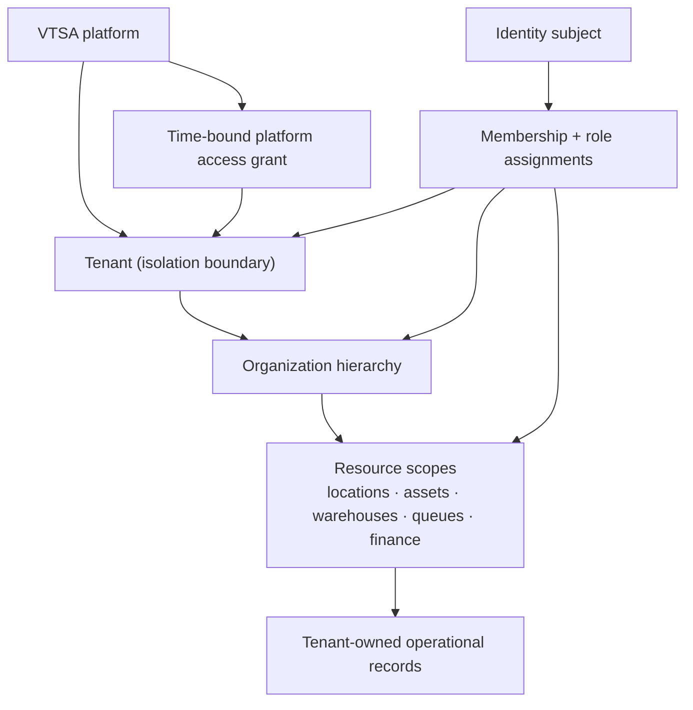

# Tenancy Model

**Status:** Normative baseline; Phase 3 application enforcement implemented, RLS deferred  
**Model:** Shared application and data platform with row-based tenant ownership

## 1. Definitions

| Term | Meaning |
| --- | --- |
| Platform | The VTSA service/operator and platform-global configuration |
| Tenant | The primary contractual and data-isolation boundary, identified by ULID |
| Organization | A tenant-owned legal or operating unit; hierarchy and membership are owned by Organizations |
| Resource scope | A subset such as organizations, locations, asset groups, warehouses, support queues, or finance scopes |
| Subject | A human or machine identity from Identity |
| Membership | A subject's tenant/organization association and scoped role assignments |
| Platform access grant | Separate, time-bounded permission for VTSA staff to operate/support platform or tenant resources |

A tenant is not inferred from an organization name, email domain, hostname, charger-provided field, or client-selected ULID alone.

## 2. Hierarchy and Ownership



- Every operational record belongs to exactly one tenant, including sessions and financial records created through cross-organization journeys.
- Tenant ownership is immutable after creation for transactional records. Moving data between tenants is an audited migration/import-export process, not a field edit.
- Organizations can be reorganized within a tenant if history/scope rules allow; they cannot span tenants.
- Cross-tenant marketplace/roaming views, if later approved, are purpose-built projections/contracts. They do not create shared ownership.

## 3. Platform-global Versus Tenant-owned Data

### Platform-global

Examples are protocol/schema catalogs, supported currency/unit code definitions, platform feature definitions, global CMS content, provider adapter definitions without credentials, platform audit/security configuration, and tenant directory/lifecycle records.

Global records require explicit code paths and platform permissions. A missing `tenant_id` is not by itself proof that a record is safely global.

### Tenant-owned

Organizations, memberships/role assignments, locations, assets, charging records, tariffs, payment/billing/settlement records, suppliers/purchases, inventory, maintenance, notifications, support, tenant CMS, reports/exports, and partner integrations are tenant-owned. Identity subjects can be platform-level so the same person can hold distinct, isolated memberships; their activity and profile projections remain scoped.

## 4. Tenant Resolution

### Public web

- Platform marketing routes are explicit global routes.
- Tenant-branded/public location routes resolve a published tenant/location mapping server-side. Hostname/custom-domain resolution, if adopted, maps to a tenant but does not grant protected access.

### Driver/mobile API

- Authentication identifies a subject; the requested session/location/resource and active membership/customer relationship determine the tenant.
- A client-supplied tenant ID is only a selector and must be verified against the subject and target resource.
- A charging session freezes its tenant owner at authorization/session creation.

### Admin/operator

- The selected tenant is visible and maps to an active membership or platform access grant.
- Each mutation re-resolves the tenant and resource from authoritative data; it does not trust stale UI state.
- Switching tenant invalidates/refreshes permission, cache, selected organization/resource, and realtime subscription state.

### OCPP gateway

- The authenticated connection identity maps server-side to exactly one Assets charger and tenant.
- Payload fields cannot switch tenant/charger identity.
- A registered asset move within a tenant has an explicit effective time; cross-tenant reassignment requires decommission/re-enrollment and historical preservation.

### Partner/integration

- Machine credentials are issued with fixed allowed tenants/actions/resources. Request path/body IDs are checked against that grant.

## 5. Enforcement Layers

### Application layer — mandatory

- Establish an immutable `TenantContext` at every ingress before invoking a tenant use case.
- Tenant-owned repositories require `TenantContext`; no optional/global fallback or ambient default tenant is permitted.
- Policies evaluate tenant, permission, organization/resource scope, relationship, state, and high-risk conditions.
- Cross-context public contracts pass tenant and resource ULIDs explicitly and verify they agree with stored ownership.
- Route model binding, Livewire hydration/actions, CLI commands, queued jobs, event consumers, websocket channels, and exports repeat scope enforcement.

### PostgreSQL layer — defense in depth

- Every tenant table has non-null `tenant_id`, tenant-first indexes for access paths, and tenant-aware unique constraints.
- Foreign/reference relationships within tenant-owned data include or verify tenant consistency; a globally unique ULID never replaces tenant checking.
- PostgreSQL row-level security is the target defense-in-depth control for tenant-owned tables. The connection/session context, pooling reset, migration/worker bypass roles, and test strategy must be proven in an implementation ADR/spike before broad rollout.
- Until a table is protected by verified RLS, application repository scope plus exhaustive isolation tests remains mandatory and the table is not represented as RLS-protected.
- Database maintenance/bypass roles are never used by application runtime identities.

### Redis

Key format is conceptually:

```text
<environment>:<context>:tenant:<tenant_ulid>:<purpose>:<resource>
```

Platform-global keys use an explicit `platform` namespace. Cache tags/indexes, locks, rate limits, idempotency, session acceleration, connection routing, and queues must not collide across tenants. Cached objects retain tenant ID and are verified after retrieval. Redis loss only causes recomputation/retry, never data loss.

### Jobs, events, and scheduler

- Envelopes carry `tenant_id`, event/job ID, correlation/causation, initiating actor/service, schema version, and target reference.
- Workers clear prior context, establish the envelope context, revalidate tenant lifecycle/capability as required, run one scoped unit, and clear context in a guaranteed cleanup path.
- Unknown/missing/mismatched tenant goes to quarantine/failure; never to a global/default tenant.
- Scheduled work enumerates tenants through a platform-owned scheduler and dispatches independent tenant jobs with quotas/checkpoints.

### Realtime and push

- Channel/topic authorization checks subject and current tenant/resource relationship at subscription time and on sensitive action refresh.
- Topic names are opaque/namespaced; guessing a ULID does not grant subscription.
- Push payloads contain minimal non-sensitive hints and the app refetches authorized state from the API.

### Object storage and exports

- Database metadata is authoritative for tenant, classification, checksum, scan/publication status, retention, and access.
- Object paths are tenant-namespaced, but object-path knowledge is not authorization.
- Downloads use an authorized application decision or short-lived purpose-bound URL.
- Exports are scoped at query time, audited, immutable after generation, expire, and cannot be moved to another tenant by editing metadata.

### Reporting, search, and observability

- Projection records include tenant ID sourced from the event/owner, and query policies always apply it plus resource/field security.
- Platform aggregates use deliberately de-identified/approved measures and separate platform permissions.
- Logs never include sensitive business content. Tenant ID may be a controlled correlation dimension, but public telemetry exposure and high-cardinality metrics are restricted.

## 6. Database Conventions

Illustrative tenant table shape:

```sql
-- Illustration only; not an implementation migration.
create table charging_sessions (
    id char(26) primary key,
    tenant_id char(26) not null,
    connector_id char(26) not null,
    status varchar(40) not null,
    started_at timestamptz null,
    stopped_at timestamptz null,
    energy_wh bigint null,
    duration_seconds bigint null,
    unique (tenant_id, id)
);

create index charging_sessions_tenant_status_idx
    on charging_sessions (tenant_id, status, started_at desc);
```

The final ULID storage type, schemas, constraints, partitions, and indexes are selected through migrations and representative query/load tests. `timestamptz` stores instants; local schedules retain IANA timezone separately.

## 7. Authorization Examples

| Attempt | Required checks |
| --- | --- |
| Driver reads session | Auth subject owns/is authorized for session; session tenant resolved; session fields permitted |
| Operator remote-stops session | Active tenant membership; command permission; location/asset scope; session active; reason/step-up if policy |
| Finance user refunds | Tenant/payment scope; refund permission and amount limit; current payment state; separation/approval; reason |
| Technician consumes part | Work assignment/scope; work order and stock same tenant; reservation/available quantity; inventory contract |
| Platform engineer diagnoses tenant | Active time-bound platform grant; approved purpose/ticket; least fields; full original/effective actor audit |

## 8. Tenant Lifecycle

| State | New operations | Existing data |
| --- | --- | --- |
| Provisioning | Platform setup only | Isolated and non-public |
| Active | Allowed by entitlements and permissions | Normal retention/access |
| Suspended | New driver/admin/integration operations blocked except explicit safe/contractual paths | Preserved; privileged incident/export/financial closeout paths policy-controlled |
| Closing | No expansion; controlled export, retention, reconciliation, credential revocation | Legal holds/financial history honored |
| Closed | No routine tenant access; integrations/credentials revoked | Retained, anonymized, or erased according to approved policy |

The transition and reactivation permissions, billing obligations, and time limits require product/legal definition. Hard deletion is not the default lifecycle operation.

## 9. Isolation Test Matrix

Tests must create at least two tenants with deliberately similar data and attempt:

- list, search, direct ULID lookup, nested resource, and route-binding access;
- Livewire hydration/action tampering and cached permission reuse;
- create/update/delete using a related ID from the other tenant;
- job/event replay with missing, forged, stale, or mismatched tenant context;
- cache/lock/idempotency collision and tenant switching in one session;
- realtime subscription and push deep-link access;
- object download/upload completion and export access;
- reporting/search filters, totals, scheduled reports, and platform aggregates;
- OCPP charger identity/message target mismatch;
- provider webhook mapped to a record in a different tenant; and
- platform support access after grant expiry/revocation.

Tests verify non-disclosure as well as denial and confirm the audit/alert outcome for sensitive attempts.

## 10. Noisy-neighbor Controls

Rate and resource policies must be enforceable per tenant, identity/client, charger, IP where appropriate, and work class. Separate queues/concurrency budgets protect charging/payment callbacks from exports, imports, CMS processing, and reporting. Exact limits depend on commercial entitlements and load tests.

## 11. Assumptions and Open Decisions

Assumptions: one shared application/platform; shared PostgreSQL with tenant rows; global Identity subjects with tenant memberships; one immutable owner tenant per transactional record.

Open decisions: dedicated-tenant/database option; schema naming; verified RLS connection design and rollout; cross-tenant operator/roaming use cases; custom domains; tenant keys/encryption; data residency; tenant move/offboarding format; hierarchy depth; quotas; retention/legal hold; and whether some large tenants require physical workload isolation.

## 12. Phase 3 Implementation Note

ADR-0007 implements immutable ingress context, fail-closed Eloquent scopes, guarded ownership writes, tenant-first indexes, tenant-aware uniqueness, composite tenant foreign keys, and versioned queue context with cleanup. ADR-0008 implements scoped role assignments and human token binding. The adversarial verification matrix is recorded in [`../security/phase-3-security-foundation.md`](../security/phase-3-security-foundation.md).

This implementation does not enable PostgreSQL RLS and does not cover channels whose business modules do not yet exist. Each later cache, export, search, object, realtime, CLI, integration, or domain increment must add its own tenant boundary and negative tests before acceptance.

The expanded Phase 3 pass covers Sanctum credentials, device/session metadata, and a minimal Locations site directory. Site API lists, direct access, operator navigation, reports, and CSV exports reuse one tenant- and assignment-scoped query. Organization types distinguish platform, CPO, site host, fleet, vendor, and service contractor records while retaining non-null tenant ownership.

## 13. Phase 12 Warehouse Isolation

Every Procurement and Inventory aggregate carries a non-null immutable `tenant_id`. Tenant-first indexes and composite tenant-aware unique constraints cover document numbers, catalog codes, warehouse codes, idempotency keys, and movement references.

Warehouse access is an additional resource boundary, not a substitute for tenant scope. API, Filament, report, movement-history, reorder, import, and export queries intersect:

1. the current immutable request/job tenant context;
2. an active membership and the required permission;
3. tenant-wide, organization, or explicitly assigned warehouse scope; and
4. the tenant ownership of every referenced item, bin, PO, receipt, reservation, work order, or approval rule.

Cross-tenant route identifiers and related IDs fail closed. Stock availability is calculated only from tenant-scoped movement and reservation rows, so matching item codes or ULIDs in another tenant cannot affect a balance or report.
## Phase 13 Maintenance Isolation

- Every Maintenance aggregate and evidence table carries non-null `tenant_id`, tenant-leading operational indexes, and tenant-aware uniqueness or composite foreign keys.
- `BelongsToTenant` fails closed when tenant context is absent, stamps new rows, and blocks cross-tenant updates/deletes.
- Work-order, incident, service-request, preventive-plan, dashboard, API, and Filament queries additionally intersect exact Maintenance-authorized site IDs.
- OCPP fault observations require the established tenant to match Charging's validated envelope and mapped connector. The fault fingerprint includes tenant, asset type, asset ULID, and normalized fault code.
- Inventory reservations and movements retain the tenant-owned work-order ULID. Assets validates asset-to-site ownership inside the active tenant before lifecycle decisions.
- `maintenance:run-automation` enumerates active tenants outside domain scope, then establishes and clears one service `TenantContext` per tenant with a fresh correlation ULID. No automation query runs unscoped.
- Notification recipient queries intersect active tenant membership, effective role assignment, requested permission, and tenant/site scope before queuing.
