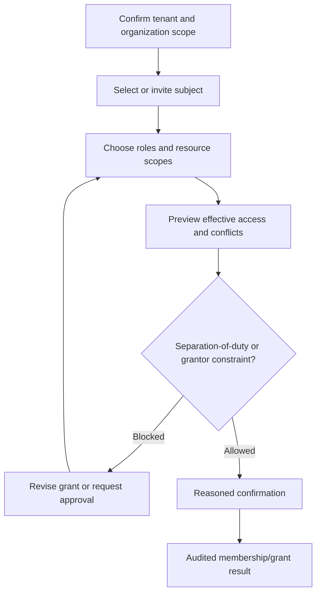
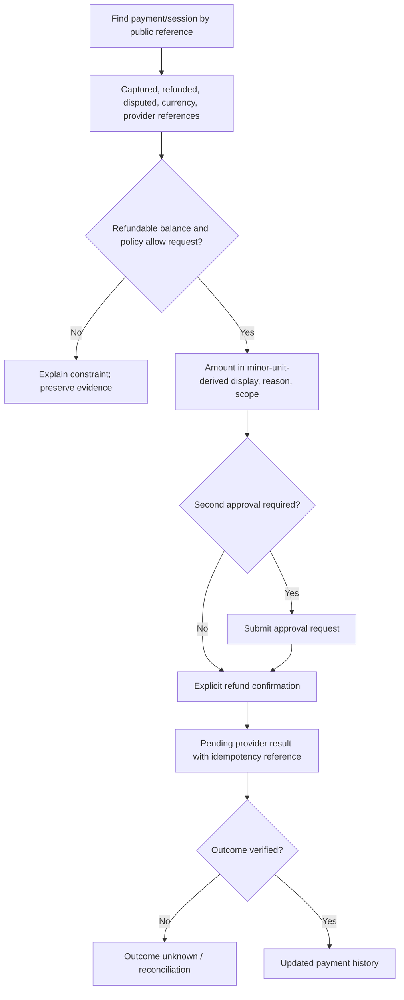

# Administrator User Flows

## Scope

Administrative experiences govern tenants, organizations, network configuration, commercial rules, finance operations, supply/service workflows, content, integrations, and audit. Navigation and actions reflect effective permissions but never replace server-side enforcement.

## Establish or change access

The UI separates membership status, role assignment, resource scope, and platform access grant. It does not display hidden secrets or imply that a role name alone defines access.

## Configure and publish a tariff

1. Create a draft in the active tenant/currency context.
2. Enter dimensions and schedules using canonical units and explicit local time zone rules.
3. Validate completeness, overlaps, conflicts, and unresolved tax/market requirements.
4. Simulate approved examples with an itemized calculation breakdown.
5. Review the immutable version and effective interval.
6. Publish only with the required permission/approval; changes after publication create a new version.
7. Keep prior and scheduled versions visible without presenting drafts as customer-facing truth.

## Investigate and request a refund

Sensitive provider data is masked. A timeout never becomes an automatic retry.

## Reconcile a settlement exception

1. Open an exception from a governed settlement period and currency.
2. Compare immutable platform expectations, provider-reported records, fees, net amounts, and difference.
3. Inspect deterministic match evidence and source lineage.
4. Add a reasoned resolution or correct an allowed mapping through the owning workflow.
5. Submit and approve according to separation-of-duty rules.
6. Reopening retains the earlier resolution and actor evidence.

## Approve procurement or inventory work

- Approval views show requester, organization, supplier/item identities, integer-minor-unit-derived totals, currency, revisions, thresholds, and related evidence.
- Inventory transfer/count decisions show quantities, serial identities, custody, discrepancies, and concurrent-movement warnings.
- Confirmation language names the state transition, not just “Approve”.
- Rejection and cancellation require reason where the domain policy requires it.
- Procurement never directly changes stock; inventory movements remain visible as linked outcomes.

## Publish content or a location

1. Validate active tenant and whether content is platform- or tenant-scoped.
2. Review draft, localization completeness, sanitized preview, linked media, and operational facts composed from owning contexts.
3. Show publication blockers without allowing editable copies of operational truth.
4. Require review/publish permissions and preserve revision history.
5. Scheduled publication shows the governing time zone and resolved UTC instant.

## Tenant lifecycle administration

Provisioning, activation, suspension, closing, and closure are separate guarded states. Before a transition, show impact on driver, workforce, integration, financial closeout, data access, credentials, and retained records. Platform operators must see the purpose and duration of tenant support access at all times.

## Form and review pattern

Long workflows use: context → required facts → validation → review → explicit confirmation → traceable outcome. Unsaved changes are announced before navigation. Server validation is placed beside fields and summarized at the top with focus moved to the summary.

## Deferred decisions

Approval thresholds, separation-of-duty matrices, tenant lifecycle policy, market tariff/tax fields, refund limits, supplier banking, settlement execution, and production support-access controls remain unresolved.
