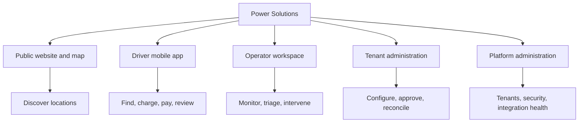

# Information Architecture

## Model

Power Solutions uses one product vocabulary across five experience surfaces, but each surface organizes work around a different user intent. Navigation visibility never grants authorization; server-side permission and tenant/resource scope remain authoritative.



## Global wayfinding rules

- The active tenant and organization/resource scope are persistent in workforce shells.
- Scope changes are explicit and cannot occur inside a pending mutation or confirmation.
- Search is contextual by default. Global search, if adopted, identifies the searched scope and result type.
- Breadcrumbs express ownership hierarchy, not browser history.
- Entity detail uses a stable pattern: identity and state header, current facts, related work, activity/evidence, and allowed actions.
- Operational timestamps show a display time zone and expose the UTC instant where evidence matters.
- Canonical units are converted only at presentation boundaries and always retain a visible unit.

## Public website and map

```text
Home
├─ Charging map
│  ├─ Search and filters
│  ├─ Accessible result list
│  └─ Published location detail
├─ How charging works
├─ Support and contact
├─ Service notices
├─ Legal and privacy
└─ Sign in / app handoff
```

Only explicitly published CMS, location, connector, availability, and tariff summaries appear. Private operational metadata must not be inferred or exposed.

## Driver mobile app

Primary bottom navigation is limited to four stable destinations:

1. **Explore** — map/list discovery, recent locations, filters.
2. **Activity** — active journey first, then session history.
3. **Wallet** — tokenized payment references and billing documents, subject to market decisions.
4. **Account** — profile, notifications, support, accessibility, legal.

An active session is a persistent, elevated task surface available from every destination. It does not become a fifth navigation tab.

## Operator workspace

The operator shell is incident-first and optimized for monitoring:

```text
Operations overview
├─ Live map and network list
├─ Alerts and stale/offline assets
├─ Active sessions and exceptions
├─ Remote command activity
├─ Maintenance dispatch
├─ Support queues
└─ Shift handover / audit trail
```

Contextual drawers may expose asset, connector, session, command, or work-order facts without losing the monitoring position. High-risk actions move into a dedicated confirmation dialog.

## Tenant administration

Navigation groups follow ownership and common governance sequences:

| Group | Destinations |
| --- | --- |
| Network | Locations, assets, connectors, publication readiness |
| Commercial | Tariffs, billing, payments, settlements |
| Supply and service | Procurement, inventory, maintenance |
| Customer operations | Notifications, support, CMS |
| Insights | Reporting, exports, data freshness |
| Organization | Organizations, memberships, roles, integrations, audit |
| Settings | Tenant policy defaults and enabled capabilities |

Destinations appear only when meaningful for effective permissions and enabled capabilities. Deep links still enforce access and show a safe forbidden state.

## Platform administration

Platform-global work is isolated from tenant operations:

```text
Platform status
├─ Tenant lifecycle
├─ Platform identities and access grants
├─ Integration and gateway health
├─ Security and audit
├─ Global CMS/configuration where approved
└─ Support access requests
```

Entering a tenant support scope requires an explicit, time-bounded grant and keeps the original actor, effective scope, purpose, and expiry visible.

## Cross-surface objects

Deep links use public ULIDs and a stable object label. Shared objects include location, asset, connector, charging session, payment intent, invoice, settlement exception, procurement record, stock transfer/count, work order, support case, report/export, and integration delivery. Each link opens in the destination surface only if the subject has effective access.

## Responsive behavior

- Under 768 px, workforce navigation becomes a labeled drawer with the active scope in the header.
- From 768–1199 px, compact rail navigation is preferred for operational views.
- At 1200 px and wider, operator/admin shells use a persistent sidebar and may add a contextual detail pane.
- Dense tables collapse into prioritized rows or cards; they do not become horizontally scrolling unlabeled data by default.

## Deferred decisions

Final menu labels, search scope, command palette, saved views, cross-tenant platform navigation, and tablet information architecture require usability testing with actual role assignments.
