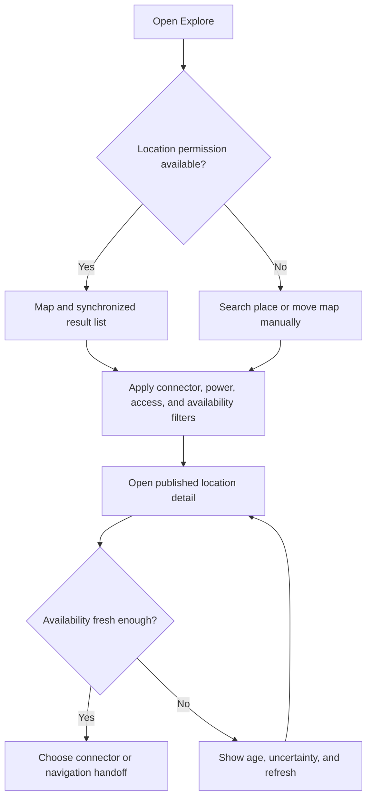
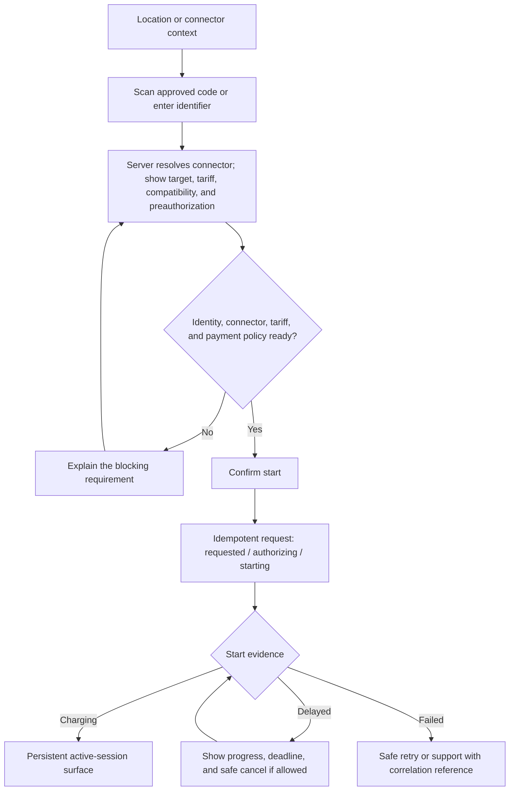
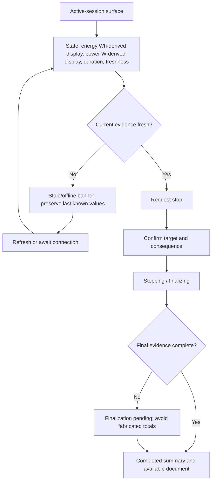

# Mobile User Flows

## Guardrails

Guest charging, provider selection, reservation policy, roaming, tax terminology, and charger-specific recovery remain unresolved product decisions. Authenticated Phase 10 UI presents only server-supplied connector, tariff, preauthorization, payment-status, and document facts.

## Find a suitable connector

Map and list selection remain synchronized. Location denial does not block manual discovery. A stale marker cannot be presented as available.

## Authenticated charging start

The confirmation never guesses final price or charger behavior. Displayed tariff facts must come from the applicable versioned disclosure contract.

## Monitor and stop a session

Leaving the screen never hides a pending stop. Notification handoff and in-app status must lead back to the same session ULID.

## Payment action required

1. Explain that the payment provider requires action without exposing provider secrets or raw card data.
2. Hand off only to an approved hosted/tokenized collection surface.
3. Preserve the payment/session context while the app backgrounds.
4. On return, app resume or push retrieves verified provider state rather than trusting the redirect alone.
5. Show pending or unknown outcomes as pending; do not offer a duplicate attempt until reconciliation rules permit it.

## Review history and get support

1. Activity defaults to the active or most recent session.
2. History distinguishes provisional, final, corrected, and review-required records.
3. A session detail exposes canonical facts, presented units, applicable documents, and support action.
4. Opening support carries only approved public references and a user-authored description.
5. The user can return to the source session without losing a draft support message.

## Offline and interrupted flows

- Cached discovery data shows its age and does not claim live availability.
- Start and stop actions that require network confirmation are disabled with a reason; the app must not queue a duplicate financial or charging command silently.
- Draft non-sensitive form input may survive process interruption according to an approved retention policy.
- Authentication expiry returns through a resumable re-authentication boundary when safe.
- Deep-link, notification, another-device sign-in, and app-restart recovery resolve the latest authoritative state by public ULID.
- Persist only the account-scoped session pointer needed to recover; never persist a tariff, metering, document, or payment projection as authoritative.

## Navigation flow

The four bottom destinations are Explore, Activity, Wallet, and Account. A centered active-session banner appears above the bar when applicable. Back behavior returns through the local task stack; switching tabs preserves only safe, bounded UI state.

## Validation needed

Test with drivers who use assistive technology, low-connectivity environments, unfamiliar charger hardware, and multiple payment outcomes. Navigation provider, guest flow, tariff disclosure content, receipt terminology, and push provider remain open.
