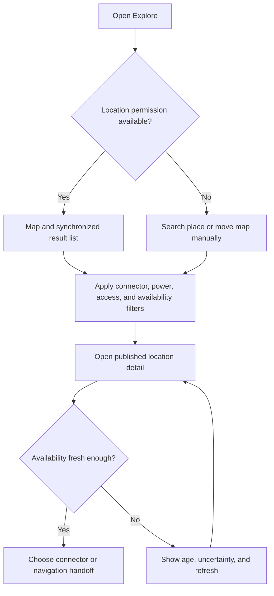
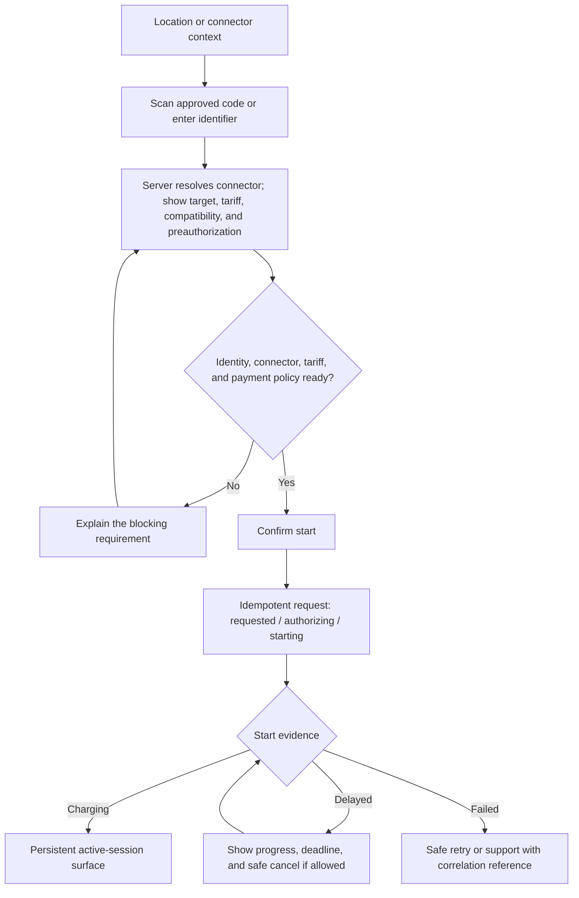
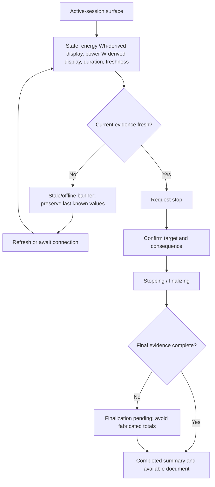

# Mobile User Flows

## Guardrails

The mobile app requires sign-in before browsing. Provider selection, reservation policy, roaming, tax terminology, and charger-specific recovery remain unresolved product decisions. Authenticated Phase 10 UI presents only server-supplied connector, tariff, preauthorization, payment-status, and document facts.

## Sign in before browsing

MOB-AUTH-001: A guest opens Sign in, including on first launch. Registration, password recovery, and email-verification instructions are the only guest destinations. There is no guest continuation or bottom navigation before authentication. Station, charging, KYC, favorites, wallet, and activity links all pass through the same router guard; new screens are protected by default.

An unverified session remains on email verification, with resend, check status, and change-account actions. Verified drivers complete or skip the first-run introduction, then browse. Returning sessions restore into Explore. A successful sign-in after onboarding opens Account, where Identity verification is available. Logout and rejected sessions return to Sign in and remove the browsing back stack. Direct-link targets are not retained through sign-in; the driver opens them again after authentication. Public website discovery and server authorization contracts are unchanged.

## PIN and fingerprint unlock

MOB-AUTH-002: After password sign-in and email verification, open **Account > PIN & fingerprint**. Enter and confirm a separate six-digit app PIN; optionally confirm fingerprint/Face ID through the phone's native prompt. Biometric enrollment is managed in phone settings. Setup is available on Android/iOS only.

When enrolled, reopening or returning to the app shows a locked screen with app PIN, optional biometric unlock and password recovery. Five incorrect PIN attempts remove local setup and require password sign-in. Server expiry, revocation and email verification remain authoritative; an offline device stays locked until it can validate the session. Password fallback removes local setup. To change/remove a PIN, sign out from the security screen and sign in with the account password again. See [ADR-0020](../architecture/decisions/0020-mobile-pin-and-biometric-unlock.md).

## Guided identity verification

MOB-KYC-002: Explain the process before collecting evidence. Show five named stages: consent, personal details, document selection, photos/face check, and final review. The capture checklist identifies each required side, uploaded evidence, and the next unfinished capture.

Document capture uses an in-app camera with a rectangular outline, shaded surroundings, side-specific instructions and passport photo-page guidance. Selfie capture uses a face oval. These are positioning aids, not detection or approval indicators; images are not cropped to the outline. A quality checklist appears before upload, and Retake reopens the camera. Temporary evidence cleanup remains in place.

For optical verification, Open camera only opens the preview. The driver positions their face, then taps **I'm ready — start live check** to request the timed server challenge. An animated head demonstrates the current server-requested turn and stops on hold-still feedback. Blue scanning animation represents a frame being captured/sent/checked; it is not a face-detection result. Only a server `hold_still` response makes the oval green with “Position confirmed”; unclear-face feedback makes it amber. New requests reset green to blue, and stopping, errors or interruption clear confirmation. Color is paired with text and icons, and system reduced-motion settings disable the animations. Green confirms a requested position, not final identity approval. Error codes and bounded correlation references accompany retry guidance for support. Backgrounding stops the camera and requires a fresh start. The processor remains authoritative for actions, acceptance, expiry and completion; automatic approval policy is unchanged.

## Find a suitable connector

```mermaid
flowchart TD
    Start["Open Explore"] --> Permission{"Location permission available?"}
    Permission -->|Yes| Nearby["Map and synchronized result list"]
    Permission -->|No| Search["Search place or move map manually"]
    Nearby --> Filter["Apply connector, power, access, and availability filters"]
    Search --> Filter
    Filter --> Detail["Open published location detail"]
    Detail --> Fresh{"Availability fresh enough?"}
    Fresh -->|Yes| Choose["Choose connector or navigation handoff"]
    Fresh -->|No| Stale["Show age, uncertainty, and refresh"]
    Stale --> Detail
```

Map and list selection remain synchronized. Location denial does not block manual discovery. A stale marker cannot be presented as available.

## Authenticated charging start

```mermaid
flowchart TD
    Entry["Location or connector context"] --> Identify["Scan approved code or enter identifier"]
    Identify --> Validate["Server resolves connector; show target, tariff, compatibility, and preauthorization"]
    Validate --> Ready{"Identity, connector, tariff, and payment policy ready?"}
    Ready -->|No| Resolve["Explain the blocking requirement"]
    Resolve --> Validate
    Ready -->|Yes| Confirm["Confirm start"]
    Confirm --> Starting["Idempotent request: requested / authorizing / starting"]
    Starting --> Outcome{"Start evidence"}
    Outcome -->|Charging| Active["Persistent active-session surface"]
    Outcome -->|Delayed| Wait["Show progress, deadline, and safe cancel if allowed"]
    Outcome -->|Failed| Failed["Safe retry or support with correlation reference"]
    Wait --> Outcome
```

The confirmation never guesses final price or charger behavior. Displayed tariff facts must come from the applicable versioned disclosure contract.

## Monitor and stop a session

```mermaid
flowchart TD
    Active["Active-session surface"] --> Evidence["State, energy Wh-derived display, power W-derived display, duration, freshness"]
    Evidence --> Connectivity{"Current evidence fresh?"}
    Connectivity -->|No| Offline["Stale/offline banner; preserve last known values"]
    Connectivity -->|Yes| Stop["Request stop"]
    Offline --> Refresh["Refresh or await connection"]
    Refresh --> Evidence
    Stop --> Confirm["Confirm target and consequence"]
    Confirm --> Stopping["Stopping / finalizing"]
    Stopping --> Final{"Final evidence complete?"}
    Final -->|Yes| Complete["Completed summary and available document"]
    Final -->|No| Review["Finalization pending; avoid fabricated totals"]
    Review --> Complete
```

Leaving the screen never hides a pending stop. Notification handoff and in-app status must lead back to the same session ULID.

## Payment action required

1. Explain that the payment provider requires action without exposing provider secrets or raw card data.
2. Hand off only to an approved hosted/tokenized collection surface.
3. Preserve the payment/session context while the app backgrounds.
4. On return, app resume or push retrieves verified provider state rather than trusting the redirect alone.
5. Show pending or unknown outcomes as pending; do not offer a duplicate attempt until reconciliation rules permit it.

## Review history and get support

1. Activity defaults to the active or most recent session.
2. History distinguishes provisional, final, corrected, and review-required records.
3. A session detail exposes canonical facts, presented units, applicable documents, and support action.
4. Opening support carries only approved public references and a user-authored description.
5. The user can return to the source session without losing a draft support message.

## Offline and interrupted flows

- Cached discovery data shows its age and does not claim live availability.
- Start and stop actions that require network confirmation are disabled with a reason; the app must not queue a duplicate financial or charging command silently.
- Draft non-sensitive form input may survive process interruption according to an approved retention policy.
- Authentication expiry returns through a resumable re-authentication boundary when safe.
- Deep-link, notification, another-device sign-in, and app-restart recovery resolve the latest authoritative state by public ULID.
- Persist only the account-scoped session pointer needed to recover; never persist a tariff, metering, document, or payment projection as authoritative.

## Navigation flow

The four bottom destinations are Explore, Activity, Wallet, and Account. A centered active-session banner appears above the bar when applicable. Back behavior returns through the local task stack; switching tabs preserves only safe, bounded UI state.

## Validation needed

Test with drivers who use assistive technology, low-connectivity environments, unfamiliar charger hardware, and multiple payment outcomes. Navigation provider, tariff disclosure content, receipt terminology, and push provider remain open.

## Feature review update, 2026-10-08

Signup now collects separate names, date of birth (minimum 18), and a plate or Plate pending. See [staging acceptance](../runbooks/mobile-feature-review-testing.md) and [ADR 0021](../architecture/decisions/0021-driver-onboarding-and-server-garages.md) for account garages, versioned signup, KYC guidance, vehicle filtering, connector status, and deferred payment/queue work.

### Wallet / QR Ph top-up

Wallet shows available/reserved amounts, activity and resumable top-up requests. Create uses an exact PHP amount and stable retry ULID. The detail screen polls backend confirmation, hides expired QR codes, and never accepts a client assertion of payment. Simulated mode clearly labels funds as test-only and has no payable QR. QR Ph on one phone uses screenshot import only where the payment app supports it.
