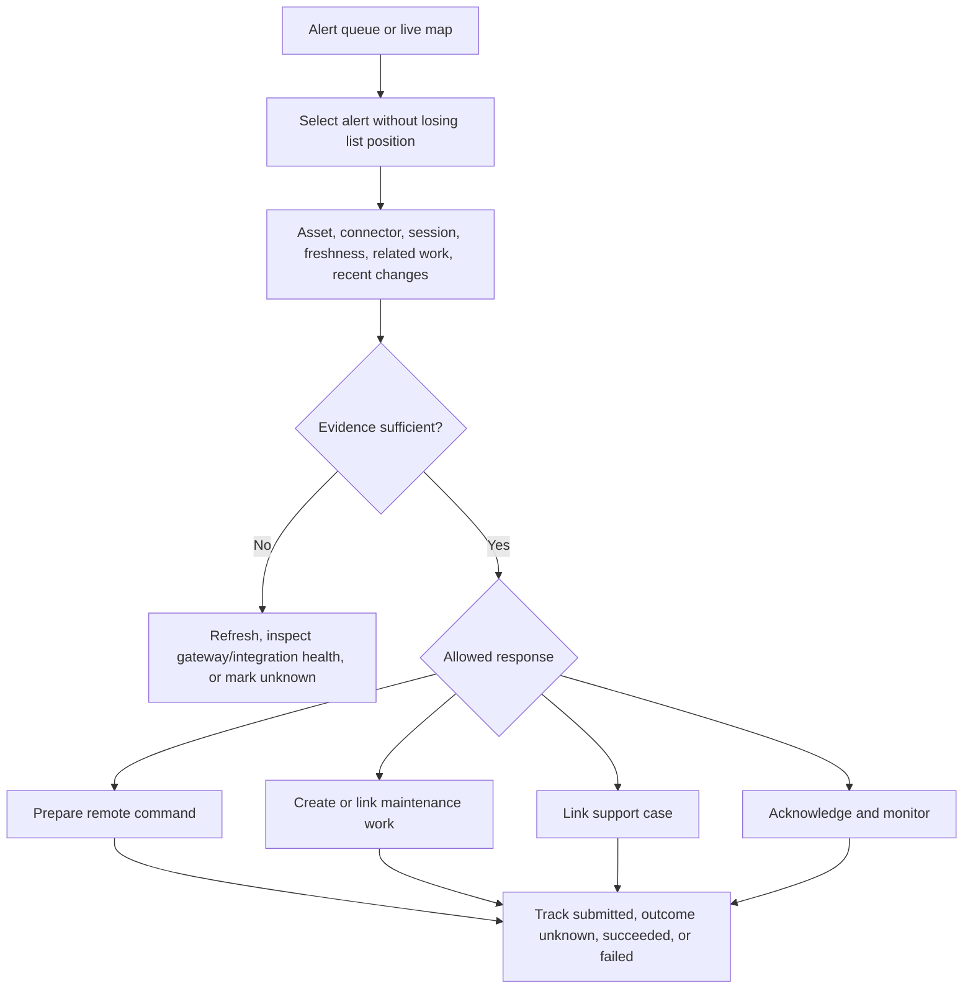
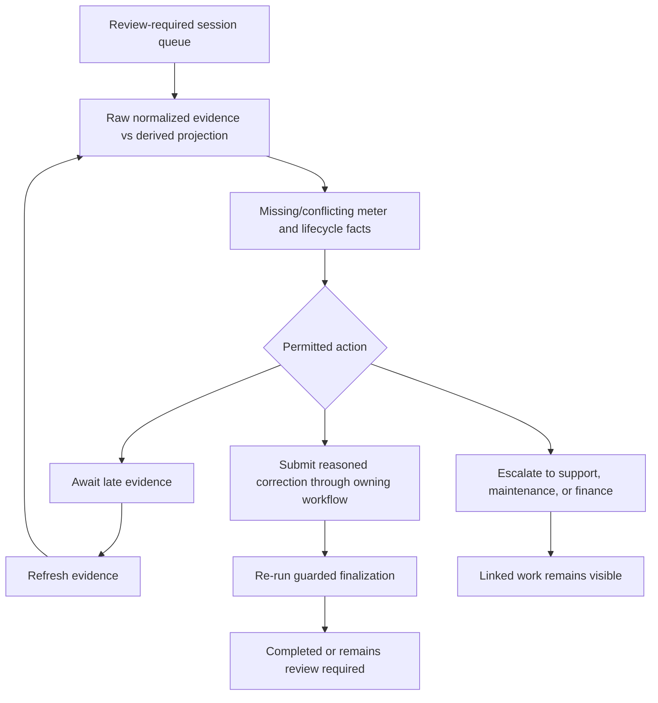

# Operator User Flows

## Operating model

The operator workspace supports network operations controllers, location managers, maintenance dispatchers, technicians, and support roles. Views are tenant- and resource-scoped. The design must keep current state, evidence age, command status, and actor scope distinct.

## Triage a network alert

The queue distinguishes new, acknowledged, assigned, stale, and resolved presentation states without inventing an alert domain state machine.

## Issue a remote command

1. Open the command from a specific charger/session context.
2. Show active tenant, resource scope, target identifiers, latest connectivity, current session state, command type, and expected effect.
3. Validate permission and command preconditions before confirmation.
4. Require a reason or recent authentication when policy demands it.
5. Confirm with explicit action wording; never use a generic “Yes”.
6. Immediately show a correlation/command ID and pending status.
7. Preserve `outcome unknown` as a distinct state after timeout; do not imply failure or invite unsafe duplication.
8. Append verified result and audit evidence without replacing the original request.

## Resolve a session exception

Source facts, derived values, and manual decisions use different labels and visual treatments.

## Dispatch maintenance

1. Filter faults by severity, freshness, access constraints, location, and current assignment.
2. Review asset restriction, active sessions, existing work, required skills, and parts availability.
3. Create or select the owning maintenance workflow; do not edit asset state directly.
4. Assign technician and schedule only after required evidence is present.
5. Track paused reasons such as parts, access, external service, or safety clearance.
6. Verification and return-to-service remain separate when policy requires it.

## Shift handover

- Save a governed view of unresolved alerts, pending/unknown commands, review-required sessions, and high-severity work.
- Each item includes owner, age, latest evidence, next expected event, and links.
- Handover notes do not replace audit events or source records.
- Stale data is labeled before the next operator accepts the view.

## Keyboard and high-density behavior

- Queue rows and map markers share selection state.
- Arrow keys move within composite controls only when announced; Tab moves between controls.
- A detail drawer never traps focus unless it is modal.
- Bulk selection is explicit, countable, reversible before submission, and unavailable for actions requiring item-specific reasons.
- Auto-refresh preserves focus, reading position, open drawers, and user-entered filters.

## Deferred decisions

Alert taxonomy, severity policy, remote-command set, escalation timers, saved views, technician routing, and shift-handover ownership require domain and operational approval.
