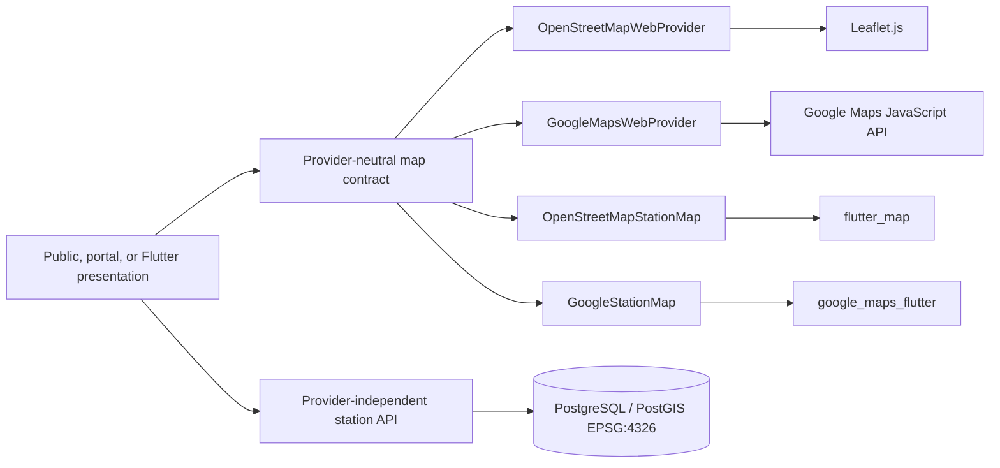

# Map Architecture

## Boundaries

Locations and PostGIS own coordinates, bounding boxes, distance ordering, visibility, and geographic filtering. Rendering belongs to Integrations adapters. Public, portal, and mobile presentation code receives identical station identifiers and WGS84 coordinates.

Leaflet is a browser JavaScript renderer; Flutter therefore uses `flutter_map`, not “Leaflet for Flutter.”

## Common contract

Web adapters implement initialization, destruction, resize, center/zoom, fit bounds, incremental marker replacement, selection, visible bounds, viewport events, user position, and coordinate selection. They clean their listeners and provider objects during Livewire navigation. The factory attempts a requested provider once and OpenStreetMap once; recursive fallback is impossible.

Flutter map models contain only positions, bounds, marker IDs/status, selection, and callbacks. Plugin classes stay inside the two provider widgets. `DiscoveryController`, repositories, and station domain types never expose either plugin. A `DeviceLocationService` requests foreground permission only after an explicit user action and returns a transient provider-neutral position.

## Configuration precedence

Laravel:

1. authorized database-backed platform rendering preference;
2. surface-specific `MAP_PROVIDER_*`;
3. `MAP_PROVIDER_DEFAULT`;
4. hard safe default `openstreetmap`.

Google is resolved only when its surface readiness check passes. Unknown values and missing Google configuration resolve to OpenStreetMap with a structured warning. Cached database settings are invalidated after an audited update.

Flutter:

1. explicit `--dart-define=MAP_PROVIDER=...`;
2. safe `/api/v1/app/config` recommendation when no explicit provider exists;
3. local `openstreetmap` default.

The endpoint may refine non-secret viewport/tile values. An unavailable or malformed endpoint leaves local configuration active.

## Lifecycle and failure

Web page registries prevent duplicate initialization. `livewire:navigating` destroys adapters; `livewire:navigated` boots current DOM nodes. `ResizeObserver`, browser resize, and drawer opening trigger provider resize. Partial provider initialization is destroyed before one OpenStreetMap retry.

Flutter controllers are created once per state object, camera requests are debounced 350 ms, stale repository responses are ignored by generation, and controllers/timers/listeners are disposed. Current location is neither requested at startup nor persisted. A provider or tile failure preserves list discovery.

## Security

- Station names are assigned with `textContent` or escaped before template insertion.
- Tile templates accept HTTPS plus literal `{z}`, `{x}`, and `{y}`; local testing alone may use localhost HTTP.
- The mobile endpoint never returns Google credentials.
- Browser Google keys are emitted only when Google is the resolved web provider.
- Portal station projections remain tenant and site scoped before serialization.
