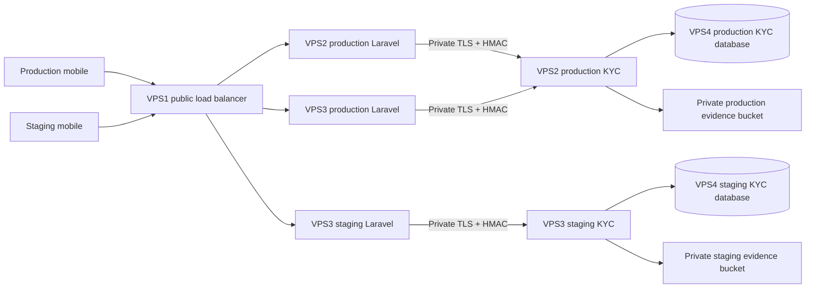

# Private KYC on the four Hostinger VPSs

This is the deployment path for the topology supplied on 24 September 2026. The commands are implemented in the repository; **they have not been run against Hostinger**. Actual private addresses, DNS, certificates, hostnames, secrets, database roles and buckets must be provisioned first.

For testing current source on VPS3 before publishing a release image, use the [staging Docker quickstart](kyc-staging-quickstart.md). It supplies `kyc-staging.sh prepare|models|check|up`, a source-only transfer bundle and a manual-only staging build path. Production continues to use the immutable release procedure below.

| VPS | Role | KYC connection |
| --- | --- | --- |
| VPS1 | Public load balancer | Routes mobile/admin requests to Laravel only; no KYC processor upstream |
| VPS2 | Production App 01 and production jobs | Owns `vtsa-kyc-production` API/worker/beat/Redis/private TLS ingress |
| VPS3 | Production App 02 plus isolated staging app/jobs | Production app calls VPS2 KYC; staging app calls `vtsa-kyc-staging` on VPS3 |
| VPS4 | PostgreSQL | Dedicated `vtsa_kyc_production` and `vtsa_kyc_staging` databases and matching roles, separate from core databases |



## Network and storage prerequisites

Use the existing private network or a provisioned VPN between hosts; Docker bridge networks alone do not connect different VPSs. Supply actual DNS names resolving only to RFC1918 addresses. The processor requires private HTTPS for Laravel callbacks and self-hosted S3-compatible storage. Certificates must match those names, and the supplied CA bundle must validate them. Laravel must also trust the ingress certificate through its normal CA trust store (a publicly trusted certificate with private DNS works). Never disable certificate validation.

The owner confirmed that **VPS3 already has private access to VPS4**. Reuse that authorized route for staging and validate it with `--check`; no firewall change or public database access is needed. Provision dedicated KYC roles with access only to their corresponding databases and TLS `verify-full`. The PostgreSQL backup image targets server version 18, matching the repository; review this if the actual server differs.

Create separate private buckets on the self-hosted S3-compatible service. Block anonymous reads/listing, grant dedicated per-environment credentials only the required bucket operations, enable SSE compatible with the existing storage service, and configure object/noncurrent-version/multipart lifecycle plus backup retention. Do not configure a public bucket URL or proxy `/data` through the load balancer. Images are additionally encrypted by the processor's Fernet key. Back up the key securely; normal rotation cannot discard the old key.

Only the ingress publishes a port, on the supplied private interface (default 8443). Docker's published ports need Docker-aware firewall controls; UFW alone is not sufficient. Restrict traffic to the actual production app nodes for production, and the staging app for staging. The Caddy allowlist uses the actual remote source, not forwarded headers. Include the necessary local Docker source range where Docker NAT requires it. Never use wildcard/public bind addresses. See [Docker port publishing](https://docs.docker.com/engine/network/port-publishing/).

## Prepare each host

After merging, CI publishes `ghcr.io/kernelhubinc/vtsacsms/kyc:sha-<commit>` alongside the other release images. KYC is not automatically deployed by the application rollout. Use the same reviewed release checkout and authenticate Docker to the existing GHCR repository. Install Python 3, Docker Compose v2, `flock`, `ip`, and Git on each host.

Copy `infra/cluster/kyc.env.example` to `/etc/vtsa-csms/kyc-production.env` on VPS2, and to `/etc/vtsa-csms/kyc-staging.env` on VPS3. Set mode 600. Configure every required blank, the matching `KYC_ENVIRONMENT`, and the exact output of `hostname` as `KYC_DEPLOY_HOSTNAME`. Single-quote values containing `$`; this file is parsed as dotenv, never sourced as shell code. Use separate strong request/callback secrets, encryption key, database credentials, bucket and storage credentials for each environment.

Set `KYC_DATABASE_URL` to the dedicated database/role with `sslmode=verify-full&sslrootcert=/run/kyc/ca.pem`; URL-encode credentials. Mount paths in the template are absolute host paths. Use `KYC_MODE=self_hosted` for the selected optical/live workflow. `local` remains OCR-only for older issuer/manual attempts. Mock and third-party provider factories are rejected by this deployment command.

In the existing `/etc/vtsa-csms/production.env` on **both** production app nodes, and `/etc/vtsa-csms/staging.env` on VPS3, add matching request/callback secrets and the corresponding `KYC_SERVICE_URL=https://<private-DNS>:8443`. Supply reviewed consent text/version explicitly covering transient live frames, the retained selfie and the optical assurance limit; retention must match the processor. Select `KYC_ASSURANCE_PROFILE=optical_v1` after the rollout below. Keep `KYC_AUTOMATIC_VERIFICATION_ENABLED=false` until device/spoof evaluation and operational acceptance. Existing cluster Compose passes these settings to platform, workers and scheduler. Set `KYC_ENABLED=true` when ready to expose the workflow. Staging and production app configuration must never share KYC credentials or endpoints.

## Dedicated commands

First deploy the additive core migrations and expanded callback validator to **all** applicable Laravel app nodes, with `KYC_ASSURANCE_PROFILE=issuer_v1` during the mixed-version phase and automatic approval disabled. Deploy the processor below and its Alembic 0002 migration, install/validate models and release the updated mobile client. Then select `optical_v1` in both production app nodes and separately in staging. Older validators reject the new `optical_document` result; older mobile clients cannot perform the live flow and receive `LIVE_CAPTURE_REQUIRED` for still-selfie uploads. Preserve the issuer profile until the mobile rollout is ready.

From the reviewed release checkout on VPS2:

```bash
sudo bash scripts/deploy-kyc.sh production sha-<40-character-commit> --check
sudo bash scripts/deploy-kyc.sh production sha-<40-character-commit>
```

From the same release checkout on VPS3:

```bash
sudo bash scripts/deploy-kyc.sh staging sha-<40-character-commit> --check
sudo bash scripts/deploy-kyc.sh staging sha-<40-character-commit>
```

`--check` validates protected files, hostname/environment selection, private DNS and assigned interface, TLS material, environment-specific database names, matching app secrets and Compose. It pulls the immutable image and runs a disposable read-only connectivity check against PostgreSQL, the storage bucket and Laravel readiness, without replacing services or migrating data. It does not prove storage write/delete privileges or recognition accuracy.

The deployment command shares the app deployment lock, creates a protected pre-migration custom-format database backup, applies Alembic migrations, and starts only that environment's KYC services with health checks. It never changes firewall rules, edits app settings, deletes volumes or fetches/checks out a different Git revision. Review protected backup diagnostics if backup fails; migration will not run. An unsuccessful rollout exits nonzero; investigate and roll forward or select a known compatible release. Additive migrations and evidence must remain intact.

Optional installation of the convenient command name (set `VTSA_REPO_DIR` if your checkout is not `/opt/vtsa-csms`): use a root-owned wrapper invoking this script in your actual checkout. Do not copy the script alone without its companion validator and Compose files.

## Models and current assurance boundary

Provision the versioned models using the repository helper on a trusted machine, then transfer the resulting directory to the appropriate host read-only:

```bash
python3 services/kyc-service/scripts/install_face_models.py /etc/vtsa-csms/kyc-models
python3 services/kyc-service/scripts/install_liveness_model.py /etc/vtsa-csms/kyc-models
```

The helper downloads official OpenCV Zoo YuNet/SFace artifacts pinned to commit `47534e27c9851bb1128ccc0102f1145e27f23f98`, verifies upstream SHA-256 digests, and retains their license files. It sends no applicant data. Configure model paths `/models/yunet.onnx`, `/models/sface.onnx`, the printed hashes, and evaluation-derived `KYC_FACE_ACCEPT_THRESHOLD` / `KYC_FACE_REJECT_THRESHOLD`. There is intentionally no production acceptance threshold default. Review upstream model provenance and evaluate the intended population/devices before use. [OpenCV documents the inference APIs and example benchmark thresholds](https://docs.opencv.org/4.x/d0/dd4/tutorial_dnn_face.html); benchmark thresholds are not a KYC acceptance study.

The liveness installer validates the Open Model Zoo `anti-spoof-mn3` artifact against its upstream SHA-384 and retains the MIT license. Set `KYC_LIVENESS_MODEL=/models/anti-spoof-mn3.onnx` and `KYC_LIVENESS_SHA256=c4c99af04603b62d7e44f6f4daeb33e0daeccc696008c0b1d62f6f5cebbb3262`. Configure evaluated `KYC_LIVENESS_ACCEPT_THRESHOLD`, `KYC_LIVENESS_REJECT_THRESHOLD`, `KYC_LIVENESS_CENTER_TOLERANCE` and `KYC_LIVENESS_TURN_THRESHOLD`. The first pair applies to the model's real-person probability; the second pair applies to the dimensionless nose/eye-line ratio, not degrees. Center tolerance must be lower than turn threshold. No production values are invented. Run `scripts/check_face_models.py` and `scripts/check_liveness_model.py` inside the KYC Python runtime to validate inference compatibility.

**The selected assurance is optical ID checking, face matching and a live camera challenge; government issuance is not verified.** Philippine National ID and license parsers require recognized text headers and fields; Philippine passport parsing requires a TD3 MRZ with valid check digits. Unsupported layouts, foreign issuers, missing/ambiguous fields and document ghost portraits may require manual review. Matching text and MRZ checksums do not detect every forgery. `optical_document` and `document_data` remain separate from the unavailable `document` issuer-authenticity check.

The live flow issues only the current center/turn prompt, rotates tokens per frame, checks server timing, rejects repeated normalized frames, runs local PAD and checks face continuity. It needs two distinct accepted frames per stage. Interrupted/expired/failed sessions require a fresh challenge. Abandoned references expire after two minutes; completed sessions must be submitted within ten minutes. Other frames are processed in memory, and encrypted challenge state is removed after processing. Beat retries reference deletion; existing bucket lifecycle handles crash orphans. See [ADR 0019](../architecture/decisions/0019-optical-kyc-and-live-capture.md) for bounds and limitations.

Before setting `KYC_AUTOMATIC_VERIFICATION_ENABLED=true`, evaluate consenting representative users and actual phones: genuine acceptance, different-person rejection, printed photos, screen/video replay, virtual-camera/injection threats, poor lighting, camera mirroring/orientation, interruptions, retries and accessibility. Record reviewed thresholds and supported document/device coverage. This implementation has no certification or measured accuracy claim. The readiness setting does not itself calibrate or validate models. Automatic approval then requires all selected checks to pass; manual policy still routes successful processing to the review team.

Load-test the live endpoint on the actual CPU and private network. Laravel limits challenge starts and frame requests independently; the processor's `KYC_REQUESTS_PER_MINUTE` is an aggregate service limit (default 120), so size it against measured concurrency. The current single API process serializes OpenCV inference for model thread safety. Do not promise a response-time SLA from unit tests.

## Web admin, mobile and acceptance

Deploy the additive Laravel migrations `2026_09_24_000001_add_kyc_review_settings.php` and `2026_09_24_000002_add_kyc_assurance_profile.php` through the normal core release/migration command. Run `php artisan security:sync-permissions`. Grant `identity.kyc.settings.manage` only to authorized policy administrators. `/admin/kyc-settings` chooses the tenant's manual/automatic policy. `/admin/kyc-verifications` shows the policy/assurance snapshot, processing checks, safe status, evidence and decision history; viewing evidence and making decisions require the existing separate permissions. Settings changes and evidence access are audited. Policies are fixed per attempt; old approved records are not revoked by the migration.

Flutter production builds keep `APP_ENVIRONMENT=production` and the real production `API_BASE_URL`; staging uses its own values. No processor URL or secret belongs in mobile builds. The app collects document photos, then opens a front-camera preview with live server prompts. Audio is disabled, transient capture files are deleted after upload, and camera interruption stops the session. Final OCR/face processing is asynchronous and the screen refreshes pending status; there is no guaranteed latency SLA. Camera permission and trusted HTTPS are required on physical devices/browser previews.

After deployment, verify reachability from allowed Laravel containers, rejection from unapproved hosts, and failure to connect using the VPS public address. Verify the certificate hostname and chain. Run a complete synthetic application, private evidence preview, settings authorization/tenant-isolation tests, manual approval/rejection/resubmission, worker restart and callback reconciliation. Confirm bucket put/get/delete and lifecycle behavior. Test restoring the KYC database backup with the retained key. No real IDs are necessary for deployment connectivity checks. Roll back app exposure with `KYC_ENABLED=false`; keep durable databases, evidence and callback outboxes.
