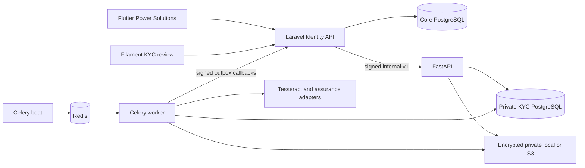
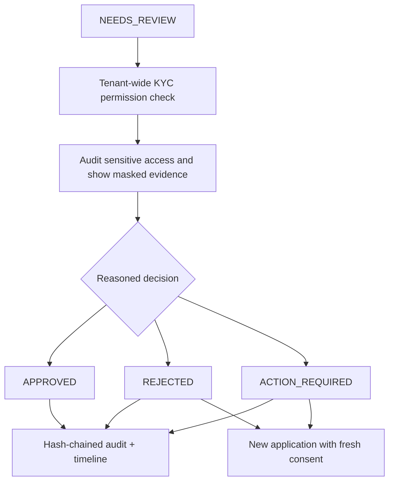
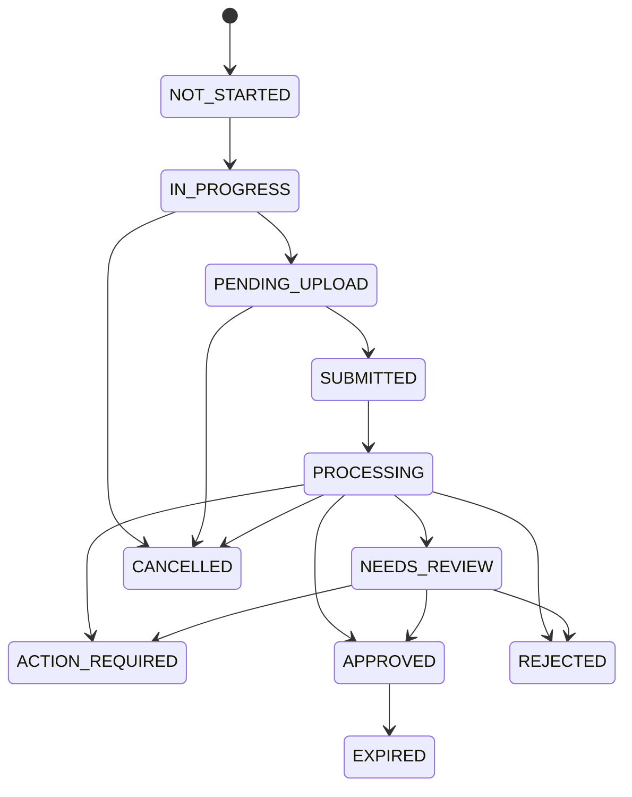

# KYC integration, local operation and staging

For the current VPS2-production / VPS3-staging topology and dedicated deployment command, use [Private KYC on Hostinger](kyc-hostinger.md). The generic staging sequence below predates that topology.

For the legacy local OCR/mock workflow below, explicitly set Laravel `KYC_ASSURANCE_PROFILE=issuer_v1` and keep manual review. New optical attempts require the updated mobile live-capture flow and configured self-hosted models from the Hostinger runbook; they intentionally reject still-selfie uploads. The new live protocol is described in ADR 0019.

## Architecture and ownership

Requirements `KYC-001`–`KYC-008` are implemented within Identity and the isolated Python evidence processor. [Inspection](../architecture/kyc-inspection.md) and [ADR 0017](../architecture/decisions/0017-isolate-kyc-evidence-processing.md) explain the repository fit. No changes are made to map adapters, authentication token issuance, OCPP messages or public charger discovery.



```mermaid
sequenceDiagram
    participant M as Mobile
    participant L as Laravel Identity
    participant K as KYC API
    participant W as Worker
    M->>L: Consent + personal fields + idempotency ULID
    L->>L: Lock subject; create tenant verification
    L->>K: Signed PUT with same verification ULID
    K->>K: Encrypt personal data; idempotent creation
    M->>L: Document and selfie uploads
    L->>K: Signed bounded evidence upload
    K->>K: Validate, normalize, encrypt private objects
    M->>L: Submit
    L->>K: Idempotent submit
    K->>K: Commit durable submitted job
    K-->>L: SUBMITTED
    L-->>M: Accepted + current state
    W->>K: Discover/claim durable job
    W->>W: OCR and assurance checks
```

```mermaid
sequenceDiagram
    participant W as Worker
    participant D as KYC database
    participant L as Laravel
    participant M as Mobile
    W->>D: Result + callback event in one transaction
    W->>L: HMAC callback with nonce, time, event ID and version
    L->>L: Authenticate, establish tenant, deduplicate and apply newer state
    L-->>W: Acknowledgement
    W->>D: Mark delivery successful
    M->>L: Refresh status / resume app
    L-->>M: Authoritative safe status
    Note over W,L: Failed callbacks retry; scheduled Laravel reconciliation repairs loss
```



## Laravel configuration and API

Set `KYC_ENABLED=true` only after service keys/connectivity are configured. Defaults keep all enforcement flags false. Laravel's `KycEligibility` is the public Identity contract; Charging remote start and Payments intent creation call it. Wallet mutation APIs do not yet exist; their eventual owning workflow must call `assertAllowed($subjectId, 'wallet')`. An unimplemented mobile wallet is not represented as a working gated payment system.

Set `KYC_SERVICE_URL`, `KYC_REQUEST_SECRET`, `KYC_CALLBACK_SECRET`, `KYC_CONSENT_VERSION`, reviewed consent text (`KYC_CONSENT_TEXT`), HTTPS `KYC_PRIVACY_URL`, `KYC_TERMS_URL`, `KYC_CONSENT_URL`, `KYC_RETENTION_DAYS`, and `KYC_VALIDITY_DAYS`. Match retention with the processor. `config/kyc.php` owns configurable document requirements; initial types are illustrative PhilSys, driver's license and passport. Review requirements against the documents actually accepted by the business.

Migrate with `php artisan migrate --force`, then `php artisan security:sync-permissions`. Assign tenant-wide `identity.kyc.view`, `identity.kyc.review`, and, separately, `identity.kyc.sensitive_view` through the existing role management. No existing operator or support role silently gains sensitive access. Admin page: `/admin/kyc-verifications`. Self-review is forbidden. Review requires a reason and fresh retained evidence; sensitive fields are never included in list rows, and document numbers remain masked even in details. Laravel stores encrypted review notes, consent version/time, IDs, safe metadata and result codes, not documents or raw submitted identity data.

| Method | Mobile Laravel endpoint | Purpose |
| --- | --- | --- |
| GET | `/api/v1/kyc/status` | Latest verification, enabled flag, configurable documents and consent |
| POST | `/api/v1/kyc/start` | Start with explicit consent and idempotency ULID |
| GET | `/api/v1/kyc/verification/{id}` | Owner-only status |
| POST | `/api/v1/kyc/verification/{id}/document` | Multipart `image` + `kind=front/back` |
| POST | `/api/v1/kyc/verification/{id}/selfie` | Legacy issuer-profile still image; optical attempts require live capture |
| POST | `/api/v1/kyc/verification/{id}/live/start` | Issue a scoped, expiring live camera prompt for an optical attempt |
| POST | `/api/v1/kyc/verification/{id}/live/frame` | Multipart `image` + opaque server `token`; server returns the next prompt |
| POST | `/api/v1/kyc/verification/{id}/submit` | Idempotent submission |
| POST | `/api/v1/kyc/resubmit` | New attempt after rejection/action/expiry/cancellation |
| POST | `/api/v1/kyc/verification/{id}/cancel` | Withdraw consent and schedule evidence deletion |
| POST | `/api/v1/webhooks/kyc` | Internal signed callback; no mobile bearer required |

Mobile endpoints reuse Sanctum, active membership/security-version checks, verified email and server-selected tenant. Requests never accept a mobile-selected subject ID. Errors carry stable codes, safe messages, request/correlation IDs and validation fields. Internal v1 schemas are in [the generated OpenAPI contract](../../packages/contracts/openapi/kyc.internal.v1.json). Full evidence remains behind internal service authentication and explicit admin permissions.

## State, concurrency and restart behavior



Resubmission creates a distinct attempt; old evidence/audit history is not overwritten. A user-row lock and tenant/subject/idempotency unique constraint serialize starts. A worker lease/version handles redelivery. Laravel ignores old processing versions and preserves manual terminal decisions. Callbacks have durable unique event IDs. All cross-service network calls are outside database transactions. A partially created draft can be cancelled and restarted; changing a previously used idempotency payload is a conflict.

Flutter restores status/upload metadata from Laravel when entering or resuming the screen. It polls only while processing. Captured camera files are removed after loading into memory; no identity images or personal fields are written to preferences or token storage. Interrupted Android picker output is discarded on recovery and retaken. In-memory previews are evicted when discarded/backgrounded/disposed. Upload failure permits retry; denied camera permission produces device-settings guidance. Desktop camera support depends on the platform picker; browser capture may present a file chooser. Verify real Android/iOS permission and background behavior on target devices before staging acceptance.

## Signing and reconciliation

Canonical HMAC-SHA256 input is `UPPERCASE_METHOD + "\n" + URL_PATH + "\n" + UNIX_TIMESTAMP + "\n" + NONCE + "\n" + SHA256_HEX(EXACT_BODY)`. Send `X-KYC-Timestamp`, `X-KYC-Nonce` (32 lowercase hex characters), and `X-KYC-Signature`. Reject clock skew beyond 300 seconds and replay nonces for 610 seconds. Internal calls do not follow redirects. Directional secrets are different; TLS validation remains enabled. Rotate secrets with a coordinated drain/restart; mTLS may be added at the private ingress without changing payload schemas.

Callbacks carry event ID/type/schema/time/tenant/aggregate/correlation/causation and a typed safe snapshot. Laravel also runs `kyc:reconcile` every five minutes through the existing scheduler. Start that scheduler in a local setup or invoke the command manually. API status refresh also reconciles active work. Audit records use the existing hash chain. Free-text reviewer reasons are encrypted and excluded from telemetry.

## Local integration commands

For a reproducible test without touching an existing environment, first use the [isolated full-stack smoke test](../../services/kyc-service/README.md#isolated-full-stack-smoke-test). It provides a synthetic driver and authorized reviewer, real PostgreSQL/Redis/workers/callbacks, and automated approval/rejection/resubmission coverage. The commands below connect KYC to an existing local development instance instead.

1. Start the Python stack using [its README](../../services/kyc-service/README.md). Configure `KYC_CALLBACK_URL` for the Laravel instance you will use (`http://host.docker.internal:8000/api/v1/webhooks/kyc` for the standard local Docker stack).
2. Copy the generated directional secret values into the ignored Laravel/local Compose environment without printing them to logs. Set `KYC_SERVICE_URL=http://host.docker.internal:8090` for Docker Desktop, or a private service DNS name on a shared network on Linux. Host Laravel uses `http://127.0.0.1:8090`.
3. For the standard local stack, add the opt-in overlay when starting/rebuilding the platform, worker and scheduler:

```powershell
docker compose --env-file .env -f infra/compose.yaml -f infra/compose.kyc.yaml up -d --build platform worker scheduler
docker compose --env-file .env -f infra/compose.yaml -f infra/compose.kyc.yaml exec platform php artisan migrate --force
docker compose --env-file .env -f infra/compose.yaml -f infra/compose.kyc.yaml exec platform php artisan security:sync-permissions
```

4. Reuse an existing synthetic demo driver from `docs/local/DEMO-CREDENTIALS.md`, or create one through the existing test/demo setup. No new shared password or real identity is seeded. Start Flutter using its existing environment definitions, sign in, open Account → Identity verification, consent and upload synthetic fixtures in browser/mock testing. For a real camera test, use only conspicuously synthetic printed documents and a consenting tester under a reviewed development policy.
5. Grant a dedicated tenant-scoped reviewer the three KYC permissions and access the admin page. Run approved, rejected, manual-review, action-required/resubmission, service outage, duplicate submit, and expired verification scenarios.

The dual local production/staging demonstration labels its Laravel instances `production`/`staging`; those intentionally require HTTPS internal KYC transport. Do not weaken TLS validation to connect them to a plain-HTTP mock. Use a trusted local TLS ingress or the standard `APP_ENV=local` demo for mock development.

## Exact staging deployment sequence

These commands deploy only after the operator supplies the real private DNS name, reachable Laravel HTTPS callback, existing staging application secrets, dedicated encrypted PostgreSQL/storage, S3 IAM, trusted certificates and reviewed consent/retention policy. No production hostnames or credentials are invented.

1. Use the existing staging checkout/image promotion process in [staging-production-deployment.md](staging-production-deployment.md). Back up staging core and KYC metadata. Provision a dedicated private S3 bucket with public access blocked, least-privilege IAM, encryption, finite object/noncurrent-version lifecycle and backup retention. Provide the Fernet key from the secret manager. Deny public access to 5432/6379/8090/8443.
2. On the private KYC host, create a protected `.env.staging` in `services/kyc-service` using `.env.example` as a field guide. Set `KYC_ENVIRONMENT=staging`; select `local` for OCR/manual review using synthetic evidence, or an actually installed `provider` factory. Mock is forbidden. Set PostgreSQL TLS connection options as required by the existing data-network design; the bundled private development PostgreSQL container is not a production database-hardening template.
3. Set `KYC_STORAGE=s3`, the approved bucket/HTTPS endpoint, `KYC_CALLBACK_URL=https://<actual-staging-platform>/api/v1/webhooks/kyc`, directional secrets and reviewed retention. Set `KYC_INTERNAL_HOST` to the provisioned private DNS name, `KYC_PRIVATE_BIND` to its private interface, and `KYC_TLS_CERT`/`KYC_TLS_KEY` to actual provisioned files. Export `KYC_ENV_FILE=.env.staging` so both Compose interpolation and runtime use the same file.

```bash
cd services/kyc-service
export KYC_ENV_FILE=.env.staging
docker compose --env-file .env.staging -f docker-compose.yml -f docker-compose.staging.yml config --quiet
docker compose --env-file .env.staging -f docker-compose.yml -f docker-compose.staging.yml build kyc-api
docker compose --env-file .env.staging -f docker-compose.yml -f docker-compose.staging.yml up -d kyc-api kyc-worker kyc-beat kyc-api-ingress
docker compose --env-file .env.staging -f docker-compose.yml -f docker-compose.staging.yml ps
```

4. On both staging Laravel nodes, add the KYC variables to their existing ignored `.env.app.staging`; use `KYC_SERVICE_URL=https://<actual-private-kyc-host>:8443`. Mount your organization's trusted CA chain through the existing image/host process if needed; never disable certificate checks. Keep enforcement flags false. Include `-f infra/compose.kyc.yaml` with the existing cluster Compose command:

```bash
docker compose --env-file .env.app.staging -f infra/cluster/compose.app.yaml -f infra/compose.kyc.yaml run --rm platform php artisan migrate --force
docker compose --env-file .env.app.staging -f infra/cluster/compose.app.yaml -f infra/compose.kyc.yaml run --rm platform php artisan security:sync-permissions
docker compose --env-file .env.app.staging -f infra/cluster/compose.app.yaml -f infra/compose.kyc.yaml up -d platform worker scheduler
docker compose --env-file .env.app.staging -f infra/cluster/compose.app.yaml -f infra/compose.kyc.yaml exec platform php artisan kyc:reconcile
```

5. Ensure the ingress accepts up to 9 MiB JSON internally, PHP `upload_max_filesize>=6M`, PHP `post_max_size>=8M`, and the public upload reverse proxy at least 8 MiB. Apply rate limits to mobile KYC routes and allow callbacks only from trusted networks where possible.
6. Deploy the Flutter build through the existing staging process. Test login, map/locator, one complete synthetic verification, duplicate/reordered callbacks, manual rejection/resubmission, permission revocation, worker interruption, encryption/retention deletion and safe outage responses. Review provider privacy/legal requirements before real identities. Configure alerts for failed processing, old submitted jobs, callback backlog, worker/beat failure and deletion failures.
7. Roll back application images with `KYC_ENABLED=false` if necessary; preserve additive tables and evidence/outbox volumes. Never run a destructive downgrade or remove volumes to roll back. Reconcile pending callbacks after recovery.

No automatic staging or production deployment is added. Provider commercial onboarding, certified face/liveness assurance, legal retention, IAM/secret provisioning, backup encryption/erasure and physical device camera acceptance remain operator/provider responsibilities.
