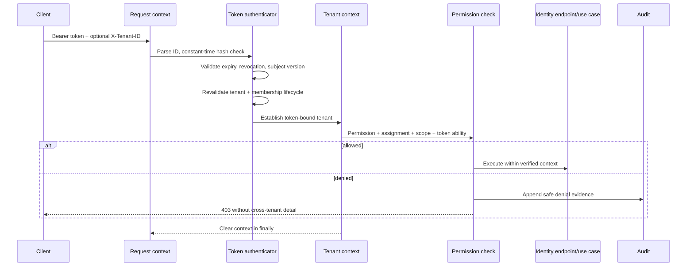

# Phase 3 Security Foundation

**Status:** Implemented expanded foundation; business workflows remain deferred  
**Requirements:** FR-PLT-001, FR-PLT-004, FR-PLT-007–009, FR-IDN-003–005 (partial), FR-TEN-002, FR-TEN-004, FR-ORG-002–004 (foundation), NFR-DAT-006, NFR-TEN-001–004, NFR-SEC-004, NFR-SEC-008, NFR-SEC-010, NFR-OBS-001, NFR-OBS-006

## 1. Delivered Controls

- Global human identities retain an internal Laravel key and receive a stable ULID `public_id`; sequential keys are not returned by the API.
- Tenants use ULIDs and explicit lifecycle status.
- Organizations, memberships, roles, role permissions, assignments, and human API tokens have tenant ownership, tenant-first indexes, and tenant-aware uniqueness.
- Composite foreign keys prevent a role, assignment, membership, or organization parent from referencing the same ULID relationship under a different tenant.
- Tenant-owned Eloquent models apply a fail-closed global scope. With no verified `TenantContext`, queries return no rows. Creates, updates, and deletes reject a different or mutated `tenant_id`.
- API authentication resolves the tenant only from a hashed, tenant-bound token; `X-Tenant-ID` is an optional selector that must match the authenticated binding.
- RBAC decisions re-evaluate tenant, identity, membership, assignment, permission, and resource scope on every request. Token abilities are an additional reduction layer.
- Tokens store only a SHA-256 verifier, have mandatory expiry, support individual revocation, and carry the subject security version for bulk revocation after recovery or compromise.
- Tenant job envelopes carry ULID job, tenant, actor, and correlation identifiers plus schema version. Worker middleware revalidates tenant and actor membership, establishes context, and clears it in `finally`.
- Audit events form a per-tenant SHA-256 hash chain, carry actor/action/target/result/reason/correlation and safe change metadata, and reject update/delete through Eloquent and database triggers.
- First-party mobile authentication uses tenant-bound Sanctum tokens with ULID device identifiers, mandatory expiry, live token-row checks, security-version revocation, and device listing.
- Typed organizations cover platform, CPO, site host, fleet, vendor, and service contractor roles without permitting cross-tenant ownership.
- User invitations, activation, suspension services, signed email verification, password recovery, optional local phone verification, and an MFA provider boundary are available.
- Platform and operator Filament panels have separate permissions, organization eligibility, navigation, and tenant-establishing session middleware.
- Site APIs, policies, reports, and CSV exports share query-time tenant/resource scoping; Filament filters are not an isolation control.

## 2. Request Boundary

Authentication failures return the same safe `401` response for malformed, unknown, expired, revoked, disabled, or stale-version credentials. A mismatched tenant selector returns a non-disclosing `404`. Internal logs may contain a safe failure category but never the token or token hash.

## 3. Query and Bypass Rules

Application use cases use tenant-scoped models after context establishment. `withoutGlobalScopes()` is not a general repository option. Its Phase 3 uses are limited to token lookup by unguessable token material before context exists, followed by explicit tenant/lifecycle verification. Future platform scheduler and emergency-support paths require dedicated contracts and tests before use.

Raw queries must include explicit `tenant_id` conditions on every tenant table and tenant-consistent joins. New tenant-owned models must adopt `BelongsToTenant` or a stricter owning-context repository and receive negative isolation tests.

## 4. Queue Contract

`TenantJobEnvelope` schema version 1 contains:

- `job_id` ULID;
- `tenant_id` ULID;
- actor type and actor ULID;
- correlation ULID and optional causation ULID; and
- schema version.

Phase 3 accepts human actor jobs only. Missing, forged, suspended, closed, disabled, or cross-tenant actor context fails the job before its handler runs. Machine/service actors require the machine identity model and are intentionally rejected for now.

## 5. Audit Integrity and Limits

The ledger serializes tenant audit appends by locking the owning tenant, then hashes a canonical payload with the previous event hash. Database triggers reject updates and deletes for PostgreSQL and SQLite. Ordinary Eloquent operations also throw before mutation.

This is tamper-evident, not independently tamper-proof. A database owner could disable triggers or remove the last event. External anchoring, restricted database audit-writer roles, retention, SIEM export, restore verification, and legal-hold policy remain production decisions.

## 6. Verification Matrix

| Threat/control | Automated proof |
| --- | --- |
| Missing tenant context | Tenant model query returns zero rows |
| Same business identifier in two tenants | Each context returns only its row |
| Cross-tenant direct lookup | Scoped lookup returns no match |
| Forged tenant-owned create | Model rejects before insert |
| Cross-tenant organization parent | Composite foreign key rejects insert |
| Scope escalation | Organization assignment fails for a sibling organization and tenant-level action |
| Delegation escalation | Grantor cannot assign a permission they do not hold |
| Stale membership/assignment | Suspension or expiry denies immediately |
| Token tenant selector tampering | Safe `404`; no tenant data returned |
| Token role removal | Existing token receives `403`; denial is audited |
| Individual/bulk token revocation | Existing token receives `401` immediately |
| Worker carry-over | Sequential tenant jobs see only their tenant; context is empty after each |
| Forged/suspended job envelope | Job fails before handler execution |
| Audit cross-tenant read | Reader returns current tenant only |
| Audit mutation | Eloquent and raw database update are rejected |
| Audit chain completeness | Hash verification succeeds independently per tenant |

## 7. Explicitly Deferred

- Public self-registration, production MFA enrollment/challenge/recovery, step-up authentication, SSO, and account linking.
- Machine/service identities and machine credential issuance.
- Tenant provisioning/lifecycle APIs and built-in role materialization.
- Organization cycle prevention and a full invitation management UI.
- Platform roles, time-bound support grants, emergency access, and impersonation controls.
- PostgreSQL RLS, runtime/migration database role separation, pooling reset proof, and RLS integration tests.
- Permission-cache/Redis design; Phase 3 deliberately evaluates durable assignments live.
- Search, caches, realtime, object storage, general CLI tenant commands, event consumers, and business-domain policies. Their modules must use this foundation and add channel-specific isolation tests when implemented.
- Token rotation/refresh protocol, risk-based device signals, and device secure-storage integration.

## 8. Acceptance Checklist

- [x] Tenant-owned schema has non-null tenant columns and tenant-first access indexes.
- [x] Authorization denies without verified context and rechecks lifecycle on every API request.
- [x] Scoped role assignment constrains grantor authority.
- [x] Tokens expire, revoke, bulk-revoke, and do not store plaintext.
- [x] Job context is versioned, revalidated, and cleared between jobs.
- [x] Sensitive identity/RBAC actions and denials create append-only audit evidence.
- [x] Sanctum mobile credentials, verification, recovery, invitations, device/session revocation, and rate limits are implemented.
- [x] Platform/operator panel access and site/report query boundaries are independently enforced.
- [x] Adversarial tenant, permission, token, queue, and audit tests pass.
- [x] PHP formatting, static analysis, migrations, full tests, and production build are required before handoff.
- [ ] Deferred controls above are not represented as production-ready.
